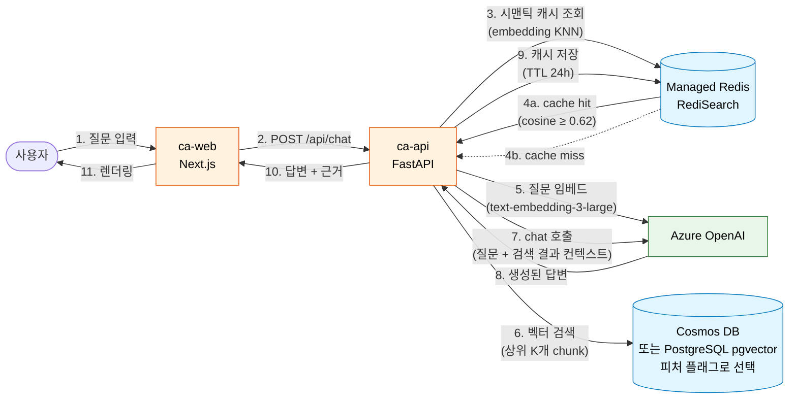
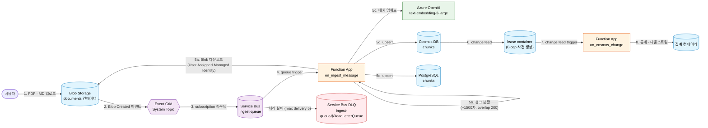
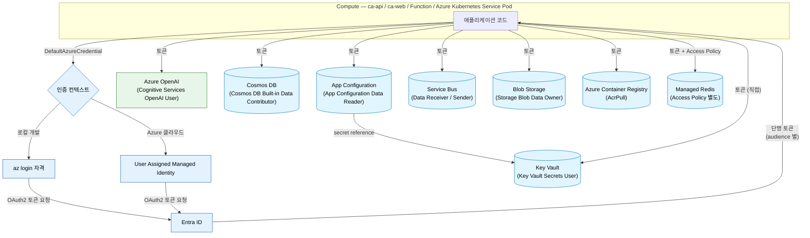
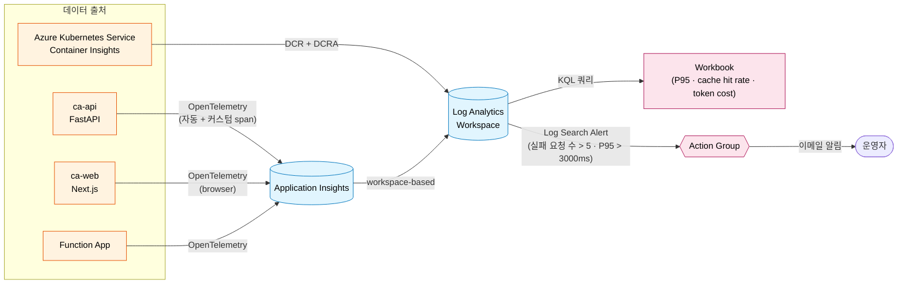

# 아키텍처

본 문서는 챌린지를 모두 완주한 시점의 최종 아키텍처를 시각화합니다. 각 세션이 어떤 자원을 추가하는지는 [README 의 챌린지 로드맵](../README.md#챌린지-로드맵) 을 참고합니다.

> [!NOTE]
> 다이어그램은 [Mermaid](https://mermaid.js.org/) 문법으로 작성됩니다. GitHub 웹 UI 에서 자동 렌더링되며, 로컬 VS Code 에서는 `Markdown Preview Mermaid Support` 확장으로 미리보기를 활성화할 수 있습니다.

---

## 1. 시스템 전체 개요

챌린지 종료 시점의 전체 자원 구성과 의존 관계를 한눈에 보여줍니다.

```mermaid
flowchart TB
  subgraph User[사용자 영역]
    Browser["브라우저"]
    Uploader["문서 업로더<br/>(PDF · Markdown)"]
  end

  subgraph Frontend[프론트엔드 — Azure Container Apps]
    Web["ca-web<br/>Next.js 챗 UI"]
  end

  subgraph Backend[백엔드 — Azure Container Apps]
    Api["ca-api<br/>FastAPI<br/>RAG 파이프라인"]
  end

  subgraph Storage[데이터·인덱스 계층]
    Cosmos[("Cosmos DB<br/>vector container<br/>quantizedFlat · 3072-d")]
    Pg[("PostgreSQL Flex<br/>pgvector<br/>halfvec(3072) HNSW")]
    Redis[("Managed Redis<br/>RediSearch<br/>시맨틱 캐시")]
  end

  subgraph Ingest[비동기 인제스션(ingestion)]
    Blob[("Blob Storage<br/>documents 컨테이너")]
    EG{{"Event Grid<br/>System Topic"}}
    SB{{"Service Bus<br/>ingest-queue"}}
    Func["Function App<br/>(Flex Consumption)<br/>청크 분할 + 임베드"]
  end

  subgraph AI[AI 서비스]
    AOAI["Azure OpenAI<br/>gpt-5-mini · text-embedding-3-large"]
  end

  subgraph Config[설정·시크릿]
    AC[("App Configuration<br/>키/값 · 피처 플래그")]
    KV[("Key Vault<br/>시크릿 · 인증서")]
  end

  subgraph Worker[배치 워커 — Azure Kubernetes Service]
    Aks["embedding-reprocess Job<br/>K8s Workload"]
  end

  subgraph Observability[관측성]
    AppI[("Application Insights")]
    Law[("Log Analytics Workspace")]
    Wb["Workbook · Log Search Alert"]
  end

  Browser -- HTTPS --> Web
  Web -- HTTP --> Api

  Api -- 벡터 검색 --> Cosmos
  Api -- 벡터 검색 --> Pg
  Api -- 시맨틱 캐시 조회 --> Redis
  Api -- chat + embed --> AOAI
  Api -- 설정 · 플래그 폴링 --> AC
  AC -- secret reference 해석 --> KV

  Uploader -- 파일 업로드 --> Blob
  Blob -- Blob Created 이벤트 --> EG
  EG -- subscription --> SB
  SB -- queue trigger --> Func
  Func -- embed --> AOAI
  Func -- upsert --> Cosmos
  Func -- upsert --> Pg

  Aks -- null embedding 재처리 --> Cosmos
  Aks -- embed --> AOAI

  Api -- OpenTelemetry --> AppI
  Func -- OpenTelemetry --> AppI
  Aks -- Container Insights --> Law
  AppI --> Law
  Law --> Wb

  classDef store fill:#e1f5fe,stroke:#0277bd,color:#000
  classDef compute fill:#fff3e0,stroke:#e65100,color:#000
  classDef messaging fill:#f3e5f5,stroke:#6a1b9a,color:#000
  classDef ai fill:#e8f5e9,stroke:#2e7d32,color:#000
  classDef config fill:#fffde7,stroke:#f9a825,color:#000
  classDef obs fill:#fce4ec,stroke:#ad1457,color:#000

  class Cosmos,Pg,Redis,Blob,AC,KV,AppI,Law store
  class Web,Api,Func,Aks compute
  class EG,SB messaging
  class AOAI ai
  class Wb obs
```

---

## 2. 요청 처리 흐름 (동기 RAG 경로)

사용자가 챗 UI 에서 질문을 입력하면 답변까지 어떻게 도달하는지의 동기 경로입니다.



> [!TIP]
> 단계 4a 의 cache hit 경우 5~9 단계가 모두 생략되어 응답 시간이 100ms 미만으로 줄어듭니다. 캐시 미스 시 일반적으로 300~1500ms.

---

## 3. 비동기 인제스션 파이프라인

사용자가 PDF / Markdown 을 업로드하면 자동으로 청크 분할 → 임베드 → Cosmos / PostgreSQL 양쪽 인덱스에 저장되는 비동기 경로입니다.



> [!WARNING]
> **lease container 자동 생성 차단** — Cosmos change feed trigger 를 `create_lease_container_if_not_exists=True` 로 두면, Entra ID(관리 ID) 인증에서는 lease container 생성이 control plane 작업이라 차단되어 함수가 시작하지 못합니다 (`403 Forbidden`). 본 챌린지의 Bicep 은 lease container 를 사전 생성하고 trigger 는 `False` 로 둡니다 ([docs/pitfalls/common.md](./pitfalls/common.md#cosmos-change-feed-lease-container-자동-생성-차단-session-04) 참고).

---

## 4. 인증 · 시크릿 · 설정 흐름

챌린지의 핵심 보안 원칙은 **코드 · 디스크 · git 어디에도 시크릿이 평문으로 존재하지 않음** 입니다. 모든 자원 호출이 Entra ID 토큰 기반으로 동작합니다.



> [!IMPORTANT]
> Cosmos DB 와 Managed Redis 는 **data plane RBAC 가 control plane 과 완전히 별개** 입니다. Cosmos 는 별도의 `Cosmos DB Built-in Data Contributor` 역할이, Managed Redis 는 별도의 access policy 가 필요합니다 ([docs/pitfalls/common.md](./pitfalls/common.md#cosmos-data-plane-rbac--control-plane-session-01session-04) 참고).

---

## 5. 관측성 흐름

모든 자원이 OpenTelemetry 또는 자체 진단 채널을 통해 Log Analytics Workspace 로 수렴합니다.



> [!NOTE]
> RAG 파이프라인의 비즈니스 의미가 담긴 커스텀 span (`rag.retrieve`, `rag.generate`, `cache.lookup`, `tokens.prompt`, `tokens.completion`) 은 [session-06](./sessions/06-observability.md) 에서 추가됩니다. 자동 계측만으로는 "이 호출이 캐시 hit 였나 miss 였나" 같은 RAG 고유 메트릭을 잡을 수 없습니다.

---

## 6. 세션별 자원 추가 매핑

각 세션이 누적적으로 어떤 자원을 시스템에 추가하는지의 매핑입니다.

| 세션 | 추가 자원 | 역할 |
|---|---|---|
| [session-00](./sessions/00-setup.md) | Resource Group · Azure OpenAI · Log Analytics · Application Insights · Key Vault · User Assigned Managed Identity | 챌린지 전체의 기반 |
| [session-01](./sessions/01-rag-mvp.md) | Azure Container Registry · Azure Container Apps Environment · ca-api · ca-web · Cosmos DB (vector) | RAG MVP 동기 호출 경로 |
| [session-02](./sessions/02-pgvector.md) | PostgreSQL Flexible Server (pgvector) | 같은 RAG 를 PostgreSQL 백엔드로 비교 |
| [session-03](./sessions/03-redis-cache.md) | Managed Redis (RediSearch) | 시맨틱 캐시 — 의미 유사 질문 흡수 |
| [session-04](./sessions/04-async-ingestion.md) | Service Bus · Event Grid · Function App · Storage | 비동기 인제스션 파이프라인 |
| [session-05](./sessions/05-app-config-flags.md) | App Configuration · Feature flag | 코드 재배포 없이 동작 토글 |
| [session-06](./sessions/06-observability.md) | Workbook · Action Group · Log Search Alert | 관측성 — 비즈니스 의미 span + 알람 |
| [session-07](./sessions/07-aks.md) | Azure Kubernetes Service · Container Insights | Azure Container Apps 대안 — embedding 재처리 워커 |

---

## 7. 명명 규칙

표준 형식 — `<리소스약어>-ai200challenge-<env>`. 하이픈 금지 자원은 `<약어>ai200challenge<env><고유접미사>`.

| 자원 종류 | 약어 | 예시 |
|---|---|---|
| Resource Group | `rg` | `rg-ai200challenge-dev` |
| Azure OpenAI | `aoai` | `aoai-ai200challenge-dev` |
| Cosmos DB | `cosmos` | `cosmos-ai200challenge-dev` |
| PostgreSQL | `pg` | `pg-ai200challenge-dev` |
| Managed Redis | `redis` | `redis-ai200challenge-dev` |
| Service Bus | `sb` | `sb-ai200challenge-dev` |
| Event Grid 토픽 | `egt` | `egt-ai200challenge-dev` |
| Function App | `func` | `func-ai200challenge-dev` |
| Key Vault | `kv` | `kv-ai200challenge-dev` |
| App Configuration | `ac` | `ac-ai200challenge-dev` |
| Application Insights | `ai` | `ai-ai200challenge-dev` |
| Log Analytics Workspace | `law` | `law-ai200challenge-dev` |
| User Assigned Managed Identity | `id` | `id-ai200challenge-dev` |
| Azure Container Registry | `acr` (하이픈 금지) | `acrai200challengedev<고유접미사>` |
| Storage Account | `st` (하이픈 금지) | `stai200challengedev<고유접미사>` |
| Azure Container Apps Environment | `cae` | `cae-ai200challenge-dev` |
| Azure Container Apps Container App | `ca` | `ca-api-ai200challenge-dev`, `ca-web-ai200challenge-dev` |
| Azure Kubernetes Service | `aks` | `aks-ai200challenge-dev` |

---

## 8. User Assigned Managed Identity 의 역할 배정

본 챌린지에서 공용 User Assigned Managed Identity `id-ai200challenge-dev` 가 각 자원에 보유해야 하는 역할 목록입니다.

| 자원 | 역할 | 부여 세션 |
|---|---|---|
| Azure OpenAI | `Cognitive Services OpenAI User` | session-00 |
| Cosmos DB (data plane) | `Cosmos DB Built-in Data Contributor` | session-01 |
| Key Vault | `Key Vault Secrets User` | session-01 |
| Azure Container Registry | `AcrPull` | session-01 |
| App Configuration | `App Configuration Data Reader` | session-05 |
| Service Bus | `Azure Service Bus Data Receiver` (큐 수신) | session-04 |
| Event Grid System Topic (자체 관리 ID) | `Azure Service Bus Data Sender` (Service Bus 큐로 전달) | session-04 |
| Blob Storage | `Storage Blob Data Owner` · `Storage Queue Data Contributor` | session-04 |
| Managed Redis | Access Policy (RBAC 가 아닌 별도 모델) | session-03 |
| Azure Kubernetes Service (Workload Identity) | Federated Credential (RBAC 가 아닌 별도 모델) | session-07 |
