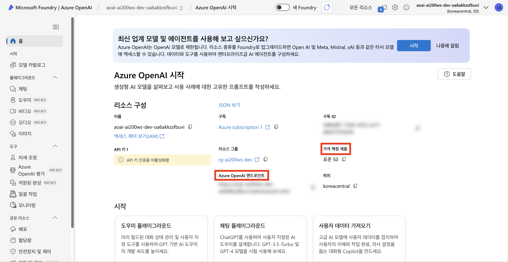
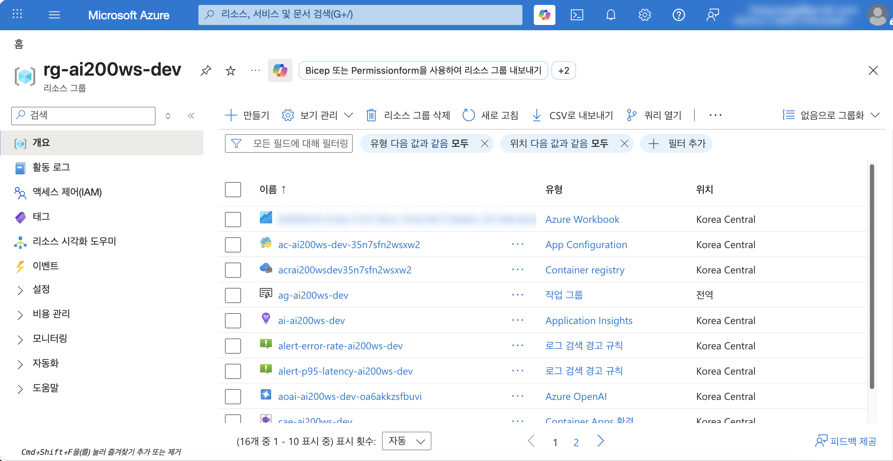
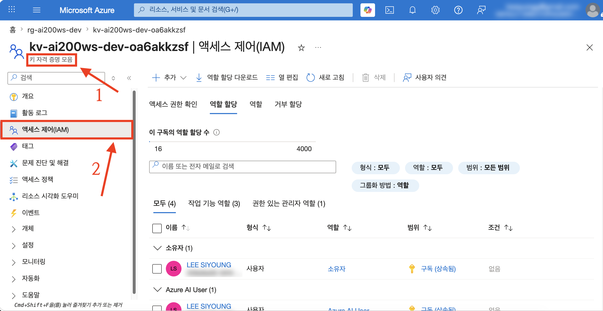
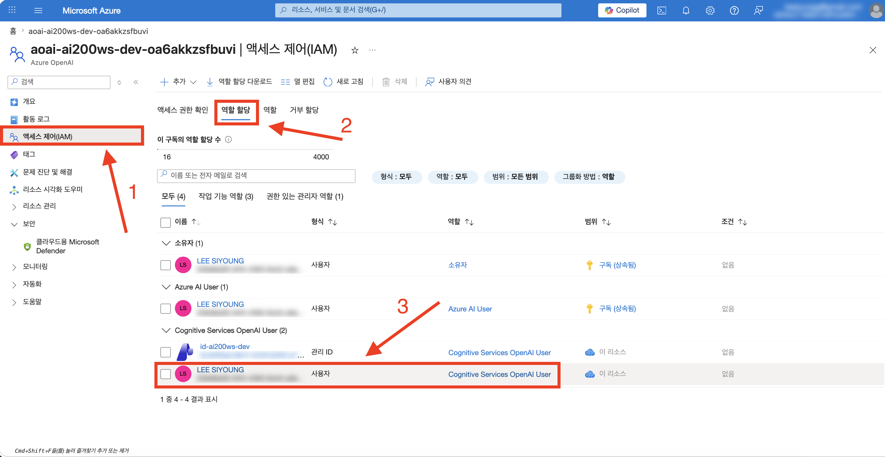

# session-00 (사전 설정 & 구독 준비)

👈 [챌린지 홈](../../README.md)

> [!IMPORTANT]
> **사전 준비 조건**
>
> - [PREREQUISITES.md](../../PREREQUISITES.md) 내용 수행
> - 시작본 코드를 작업 폴더로 받기 — [시작본 코드 받기](#시작본-코드-받기) 참고

---

## 시작본 코드 받기

다음 명령을 그대로 복사해 실행합니다. 작업 폴더 `workshop/` 이 만들어지고, 본 세션의 시작본 코드가 그 안에 풀립니다.

```bash
# Linux · macOS · WSL
mkdir -p workshop && \
  cp -a save-points/session-00/start/. workshop/
```

```powershell
# Windows PowerShell
New-Item -ItemType Directory -Force -Path workshop | Out-Null
Copy-Item -Path save-points/session-00/start/* -Destination workshop -Recurse -Force
```

이후 본 세션의 모든 명령은 `workshop/` 안에서 실행한다고 가정합니다.

시작본의 `infra/sessions/00-setup/main.bicep` 을 열어보면, 파라미터·공용 태그·자원 이름 변수는 이미 채워져 있고 **8개 모듈 호출 블록과 출력 블록이 한국어 주석으로 비어 있습니다**. 호출할 모듈 본체 (`infra/modules/session-00/*.bicep`) 는 완성되어 있으므로 수정하지 않습니다. [2단계 · Bicep 모듈 조립](#2단계--bicep-모듈-조립) 에서 이 빈 블록을 순서대로 채웁니다.

---

## 1단계 · 도구 점검

### 1.1 환경 점검

다음 명령을 한 줄씩 실행해 필요한 도구가 모두 설치되어 있는지 확인합니다. 하나가 실패해도 나머지 점검은 이어서 진행합니다.

```bash
# Python
python3 --version
```

```bash
# Node.js
node --version
```

```bash
# Azure CLI
az --version | head -1
```

```bash
# Bicep
az bicep version
```

```bash
# Azure Functions Core Tools
func --version
```

```bash
# Git
git --version
```

```bash
# Docker — 데몬이 실행 중이면 Docker OK 가 출력됩니다
docker info >/dev/null && echo "Docker OK"
```

> [!NOTE]
> - 모두 [PREREQUISITES.md](../../PREREQUISITES.md) 의 최소 버전 이상이어야 합니다.
> - macOS 기본 환경에는 `python` 명령이 없고 `python3` 만 있습니다. 위 점검도 `python3 --version` 을 사용합니다
> - 본 세션 (session-00) 에서는 Docker 를 사용하지 않으므로 `Docker OK` 가 출력되지 않아도 진행할 수 있습니다. 다만 컨테이너 이미지를 빌드하는 session-01 전까지는 Docker 를 실행해두어야 합니다

### 1.2 Azure 로그인 (개인 계정 사용)

> [!IMPORTANT]
> 본 챌린지은 Azure 구독을 제공하지 않습니다. 학습자가 **본인의 개인 Azure 계정** 으로 로그인해 본인 구독에 배포합니다. 회사·학교 계정으로 잘못 로그인하면 조직 정책 (Conditional Access, 리전 제한, 비용 정책 등) 에 막힐 수 있습니다.

개인 계정으로 로그인합니다.

```bash
# 기존 로그인 세션 초기화 (필요 시)
az logout
```

```bash
# 개인 계정으로 새로 로그인 (브라우저가 열립니다)
az login
```

```bash
# 본인 구독이 active 인지 확인
az account show --query "{sub:name, id:id, user:user.name, tenant:tenantId}" -o jsonc
```

> [!WARNING]
> 출력의 `user` 가 본인의 개인 계정 (예: `@gmail.com`, `@outlook.com`, 또는 본인이 Azure 가입에 사용한 계정) 인지 반드시 확인합니다. 회사 이메일로 로그인되어 있다면 `az login --use-device-code` 또는 브라우저 시크릿 모드로 다시 로그인합니다.

구독이 여러 개라면 본인 챌린지용 구독을 명시적으로 선택합니다.

```bash
az account list --output table
az account set --subscription "<본인-개인-구독-이름-또는-ID>"
```

### 1.3 본인 objectId 메모

```bash
# 이 값은 본 챌린지 전반에서 역할 할당 등에 반복 사용합니다.
az ad signed-in-user show --query id -o tsv
```

> [!CAUTION]
> 이 objectId 는 `bicepparam` 파일에 작성해두지 않습니다. git history 에 영구히 남아 포트폴리오 공개 시 개인 정보가 노출됩니다. 배포 명령을 실행할 때마다 `--parameters userObjectId=$OID` 형태로 명령어 인자에 직접 넘겨주는 방식으로만 전달합니다.

---

## 2단계 · Bicep 모듈 조립

`workshop/infra/sessions/00-setup/main.bicep` 을 열고, 아래 순서대로 각 주석을 찾아 바로 아래에 코드를 추가합니다. 모듈은 위에서부터 아래로 의존 관계를 따라 이어지므로 순서대로 채우는 것을 권장합니다.

### 2.1 호출할 모듈 한눈에 보기

`infra/modules/session-00/` 에 완성되어 있는 모듈입니다.

```text
infra/modules/session-00/
├── resource-group.bicep            # Resource Group 자체 (subscription scope 에서 생성)
├── log-analytics.bicep             # 챌린지 전체 중앙 로그
├── application-insights.bicep      # workspace-based Application Insights
├── key-vault.bicep                 # 역할 기반 접근 (RBAC) 전용, Standard 등급
├── user-assigned-identity.bicep    # 공용 User Assigned Managed Identity
├── aoai-account.bicep              # Azure OpenAI account (S0)
├── aoai-deployment.bicep           # 모델 deployment 하나 (chat·embedding 에 두 번 재사용)
└── role-assignment-aoai-user.bicep # Cognitive Services OpenAI User 역할 부여
```

### 2.2 Resource Group

`// -------- 1) Resource Group 모듈 호출하기 (subscription scope)` 주석을 찾아 바로 아래에 추가합니다. 이 모듈만 Resource Group 자체를 만들므로 `scope` 를 지정하지 않습니다 (subscription scope 에서 동작).

```bicep
module rg '../../modules/session-00/resource-group.bicep' = {
  name: 'rg-${env}'
  params: {
    name: rgName
    location: location
    tags: commonTags
  }
}
```

### 2.3 Log Analytics + Application Insights

`// -------- 2) Log Analytics + Application Insights 모듈 호출하기` 주석 아래에 추가합니다. 두 모듈 모두 `scope: resourceGroup(rgName)` 으로 Resource Group 안에 만들고, Resource Group 모듈이 먼저 끝나도록 `dependsOn` 을 둡니다. Application Insights 는 Log Analytics 의 출력값 (`law.outputs.id`) 을 받아 workspace-based 로 연결됩니다.

```bicep
module law '../../modules/session-00/log-analytics.bicep' = {
  scope: resourceGroup(rgName)
  name: 'law'
  params: {
    name: lawName
    location: location
    tags: commonTags
  }
  dependsOn: [
    rg
  ]
}

module appInsights '../../modules/session-00/application-insights.bicep' = {
  scope: resourceGroup(rgName)
  name: 'appInsights'
  params: {
    name: aiName
    location: location
    workspaceResourceId: law.outputs.id
    tags: commonTags
  }
}
```

### 2.4 Key Vault

`// -------- 3) Key Vault 모듈 호출하기` 주석 아래에 추가합니다. 개발 환경이라도 purge protection 을 켜두면 soft-delete 충돌을 피할 수 있습니다.

```bicep
module kv '../../modules/session-00/key-vault.bicep' = {
  scope: resourceGroup(rgName)
  name: 'kv'
  params: {
    name: kvName
    location: location
    tags: commonTags
    // dev 라도 purge protection 켜두는 게 좋습니다 (7일 충돌 회피 목적)
    enablePurgeProtection: true
  }
  dependsOn: [
    rg
  ]
}
```

### 2.5 User Assigned Managed Identity

`// -------- 4) User Assigned Managed Identity 모듈 호출하기` 주석 아래에 추가합니다. 후속 세션의 Azure Container Apps · Azure Functions 가 공용으로 사용합니다.

```bicep
module uami '../../modules/session-00/user-assigned-identity.bicep' = {
  scope: resourceGroup(rgName)
  name: 'uami'
  params: {
    name: uamiName
    location: location
    tags: commonTags
  }
  dependsOn: [
    rg
  ]
}
```

### 2.6 Azure OpenAI account

`// -------- 5) Azure OpenAI account 모듈 호출하기` 주석 아래에 추가합니다. `disableLocalAuth: true` 로 API 키 인증을 끄고 Managed Identity 기반 접근만 허용합니다. 모델 가용성 문제로 리전을 분리할 수 있도록 `location` 은 `aoaiLocation` 파라미터를 받습니다.

```bicep
module aoai '../../modules/session-00/aoai-account.bicep' = {
  scope: resourceGroup(rgName)
  name: 'aoai'
  params: {
    name: aoaiName
    location: aoaiLocation
    tags: commonTags
    disableLocalAuth: true
  }
  dependsOn: [
    rg
  ]
}
```

### 2.7 Azure OpenAI deployment 두 개 (순차 생성)

`// -------- 6) Azure OpenAI deployment 2개 모듈 호출하기 (순차 생성)` 주석 아래에 추가합니다. 같은 모듈 (`aoai-deployment.bicep`) 을 chat·embedding 두 번 호출합니다. 같은 Azure OpenAI account 에 두 deployment 를 동시에 생성하면 409 Conflict 가 발생하므로, embedding 모듈의 `dependsOn` 에 chat 모듈을 명시해 **하나가 끝난 후 다음 하나를** 만들게 합니다.

한 가지 차이에 주의합니다 — chat 모델인 `gpt-5-mini` 를 비롯한 gpt-5 계열은 리전 단위 `Standard` SKU 배포를 지원하지 않습니다. 그래서 chat 모듈 호출에만 `skuName: 'GlobalStandard'` 를 추가하고, embedding 모듈은 모듈 기본값인 `Standard` 를 그대로 사용합니다.

```bicep
module aoaiChat '../../modules/session-00/aoai-deployment.bicep' = {
  scope: resourceGroup(rgName)
  name: 'aoaiChat'
  params: {
    accountName: aoai.outputs.name
    deploymentName: chatDeploymentName
    modelName: chatModelName
    modelVersion: chatModelVersion
    capacity: chatCapacityK
    // gpt-5 계열은 리전 Standard SKU 미지원 — GlobalStandard 로 배포.
    skuName: 'GlobalStandard'
  }
}

module aoaiEmbed '../../modules/session-00/aoai-deployment.bicep' = {
  scope: resourceGroup(rgName)
  name: 'aoaiEmbed'
  params: {
    accountName: aoai.outputs.name
    deploymentName: embedDeploymentName
    modelName: embedModelName
    modelVersion: embedModelVersion
    capacity: embedCapacityK
  }
  // 같은 Azure OpenAI account 에 동시에 생성하면 409 Conflict 발생 (chat이 끝난 후에 embed 생성 필요)
  dependsOn: [
    aoaiChat
  ]
}
```

### 2.8 역할 할당 — User Assigned Managed Identity 에 OpenAI 접근 권한

`// -------- 7) 역할 할당 — User Assigned Managed Identity 에 Cognitive Services OpenAI User 부여` 주석 아래에 추가합니다. 두 deployment 가 모두 생성된 후에 역할을 부여하도록 `dependsOn` 에 둘 다 명시합니다. Managed Identity 는 서비스 주체이므로 `principalType` 은 `ServicePrincipal` 입니다.

```bicep
module aoaiUserRole '../../modules/session-00/role-assignment-aoai-user.bicep' = {
  scope: resourceGroup(rgName)
  name: 'aoaiUserRole-uami'
  params: {
    aoaiAccountName: aoai.outputs.name
    principalId: uami.outputs.principalId
    principalType: 'ServicePrincipal'
  }
  dependsOn: [
    aoaiChat
    aoaiEmbed
  ]
}
```

### 2.9 (선택) 본인 계정에도 OpenAI 접근 권한

`// -------- 8) (선택) 사용자 계정에도 Cognitive Services OpenAI User 부여` 주석 아래에 추가합니다. `if (!empty(userObjectId))` 조건부 배포라, 배포 명령에 `userObjectId` 를 넘기지 않으면 건너뜁니다. 로컬 개발 시 본인 `az login` 자격으로 Azure OpenAI 를 호출할 수 있게 합니다. 이때 `principalType` 은 `User` 입니다.

```bicep
module aoaiUserRoleUser '../../modules/session-00/role-assignment-aoai-user.bicep' = if (!empty(userObjectId)) {
  scope: resourceGroup(rgName)
  name: 'aoaiUserRole-user'
  params: {
    aoaiAccountName: aoai.outputs.name
    principalId: userObjectId
    principalType: 'User'
  }
  dependsOn: [
    aoaiChat
    aoaiEmbed
  ]
}
```

### 2.10 출력값 — 후속 세션이 참조

`// -------- 출력 — 후속 세션이 참조` 주석 아래에 추가합니다. session-01 부터 이 출력값들을 받아 자원을 연결합니다.

```bicep
output rgName string = rg.outputs.name
output lawId string = law.outputs.id
output appInsightsConnectionString string = appInsights.outputs.connectionString
output keyVaultName string = kv.outputs.name
output keyVaultUri string = kv.outputs.vaultUri
output uamiId string = uami.outputs.id
output uamiPrincipalId string = uami.outputs.principalId
output uamiClientId string = uami.outputs.clientId
output aoaiName string = aoai.outputs.name
output aoaiEndpoint string = aoai.outputs.endpoint
output chatDeploymentName string = chatDeploymentName
output embedDeploymentName string = embedDeploymentName
```

### 2.11 조립 검증 — 컴파일

모듈을 모두 채운 뒤, 배포 전에 Bicep 이 오류 없이 빌드되는지 확인합니다.

```bash
az bicep build --file infra/sessions/00-setup/main.bicep --stdout > /dev/null && echo "BUILD OK"
```

`BUILD OK` 가 출력되면 조립이 완료된 것입니다. 오류가 난다면 채운 블록의 중괄호·들여쓰기·`dependsOn` 항목을 다시 확인합니다.

> [!TIP]
> 진행 중 막혔다면 완성본 코드를 그대로 덮어쓰고 어디가 달랐는지 직접 비교할 수 있습니다.
>
> ```bash
> cp -a save-points/session-00/complete/. workshop/
> ```

---

## 3단계 · Bicep 배포

### 3.1 변경사항 미리보기

```bash
# 본인 objectId 를 환경변수로 저장
OID=$(az ad signed-in-user show --query id -o tsv)

# 무엇이 만들어지는지 먼저 확인
az deployment sub what-if \
  --location koreacentral \
  --template-file infra/sessions/00-setup/main.bicep \
  --parameters infra/sessions/00-setup/main.bicepparam \
  --parameters userObjectId=$OID
```

### 3.2 실제 배포

```bash
az deployment sub create \
  --location koreacentral \
  --template-file infra/sessions/00-setup/main.bicep \
  --parameters infra/sessions/00-setup/main.bicepparam \
  --parameters userObjectId=$OID
```

> [!NOTE]
> Azure OpenAI deployment 두 개를 순차적으로 (하나가 끝난 후 다음 하나를) 만들기 때문에 약 **5~8분** 소요됩니다. 진행되는 동안 [4단계 · Azure Portal UI 에서 확인](#4단계--azure-portal-ui-에서-확인) 의 Portal 경로를 미리 익혀둡니다.

> [!WARNING]
> Azure OpenAI deployment 를 동시에 생성하면 409 Conflict 가 발생합니다. [2.7 Azure OpenAI deployment 두 개 (순차 생성)](#27-azure-openai-deployment-두-개-순차-생성) 에서 embedding 모듈의 `dependsOn` 에 chat 모듈을 넣었는지 다시 확인합니다.

### 3.3 배포 완료 확인

```bash
# 본 챌린지 Resource Group 의 Azure OpenAI account 이름을 조회
ACCOUNT=$(az cognitiveservices account list -g rg-ai200ws-dev --query "[0].name" -o tsv)
```

```bash
# 두 모델 deployment 가 보여야 합니다
az cognitiveservices account deployment list \
  -n $ACCOUNT \
  -g rg-ai200ws-dev \
  --query "[].{name:name, model:properties.model.name, sku:sku.name}" -o table
```

기대 출력.

```
Name                       Model                       Sku
-------------------------  --------------------------  --------------
gpt-5-mini                 gpt-5-mini                  GlobalStandard
text-embedding-3-large     text-embedding-3-large      Standard
```

`gpt-5-mini` 의 SKU 가 `GlobalStandard` 인지 확인합니다 — [2.7 Azure OpenAI deployment 두 개 (순차 생성)](#27-azure-openai-deployment-두-개-순차-생성) 에서 chat 모듈에만 `skuName` 을 지정한 결과입니다.

---

## 4단계 · Azure Portal UI 에서 확인

[Azure Portal](https://portal.azure.com) 에서 다음 경로를 직접 클릭합니다.

1. **Azure AI Foundry** ([ai.azure.com](https://ai.azure.com))에 접속하여 `gpt-5-mini` 와 `text-embedding-3-large` 두 deployment 가 모두 보이는지 확인합니다.

   

2. **Resource Group `rg-ai200ws-dev`** → **Overview** → 자원 목록
   - Azure OpenAI account + Azure OpenAI deployment (Cognitive Services 카테고리)
   - Log Analytics Workspace
   - Application Insights
   - Key Vault
   - User Assigned Managed Identity

   

   자원 목록에 Azure OpenAI account · Log Analytics Workspace · Application Insights · Key Vault · User Assigned Managed Identity 가 모두 보이는지 확인합니다.

3. **Key Vault** → **Access control (IAM)** → **Role assignments** 탭 → User Assigned Managed Identity 가 어떤 역할도 갖지 않음 (session-01 에서 부여 예정)

   

   **Role assignments** 탭에 User Assigned Managed Identity 가 아직 어떤 역할도 갖고 있지 않은 상태인지 확인합니다. `Key Vault Secrets User` 역할은 session-01 에서 부여됩니다.

4. **Azure OpenAI account** → **Access control (IAM)** → User Assigned Managed Identity 에 `Cognitive Services OpenAI User` 가 보임

   

   **Role assignments** 목록에서 User Assigned Managed Identity 에 `Cognitive Services OpenAI User` 역할이 부여되어 있는지 확인합니다.

---

## 마무리

- **save-point** — 본 세션의 모든 변경은 `save-points/session-00/complete/` 와 일치합니다. 다음 세션으로 넘어가려면 `workshop/` 을 그대로 두고 `cp -a save-points/session-01/start/. workshop/` 를 실행합니다 (다음 세션의 시작본이 위에 덮입니다)
- **자원 정리** — 이 세션의 자원들은 후속 세션 전부에서 재사용됩니다. **정리하지 않습니다** (챌린지 끝에 한 번에 정리)
- **다음 세션 미리보기** — session-01 에서는 방금 만든 Azure OpenAI · Key Vault · User Assigned Managed Identity 를 묶어 Azure Container Apps 위에 RAG MVP 를 올립니다

---

[session-01](./01-rag-mvp.md) 👉