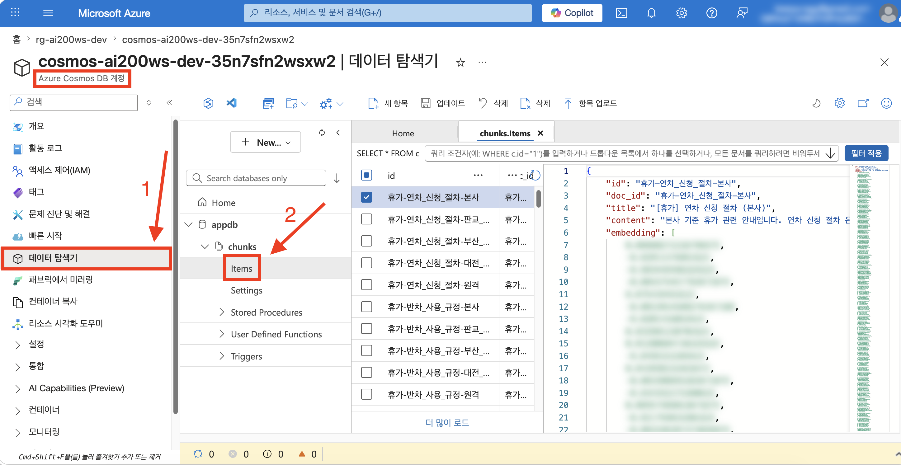
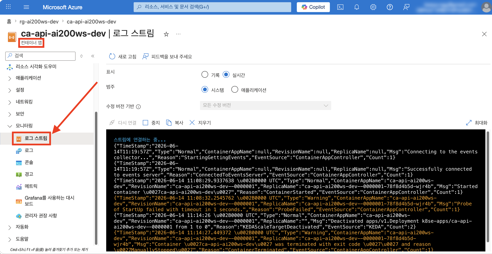
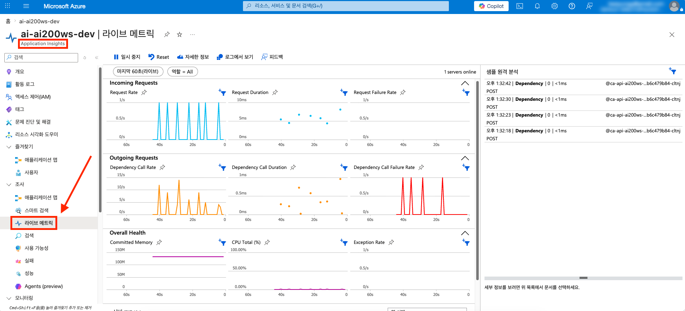
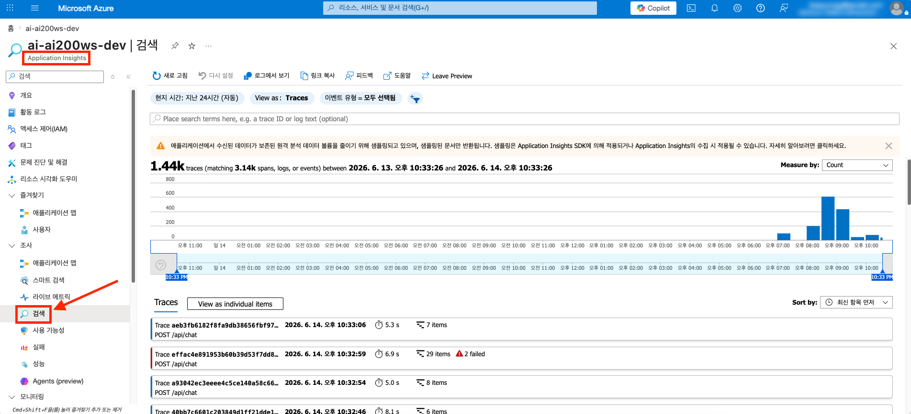
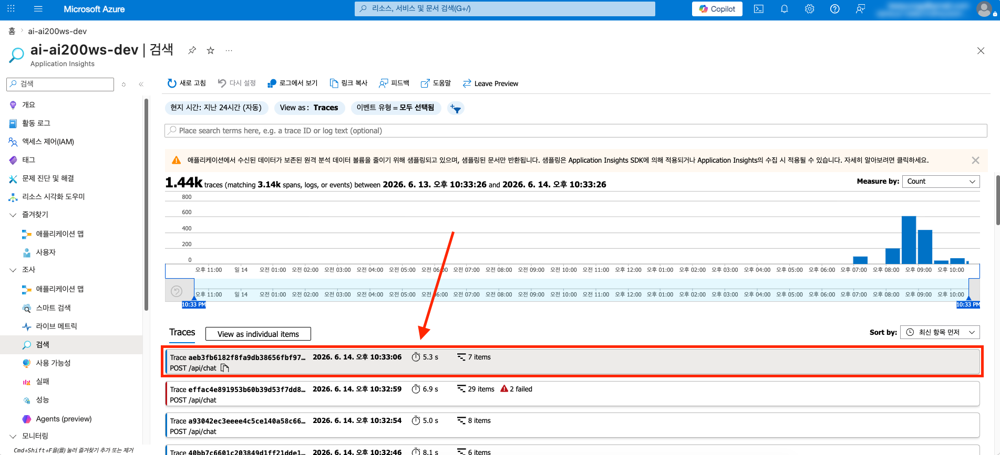
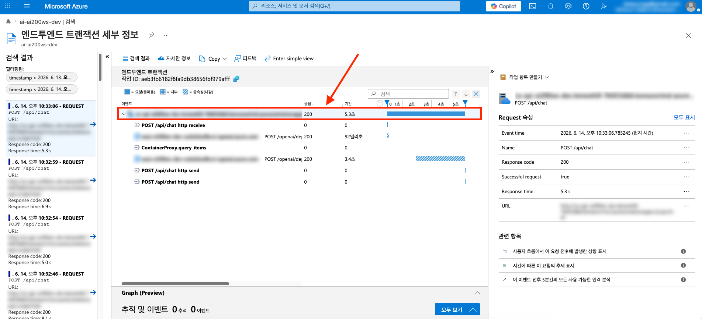
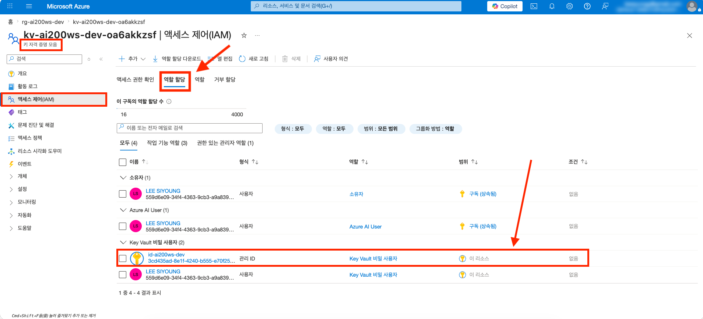
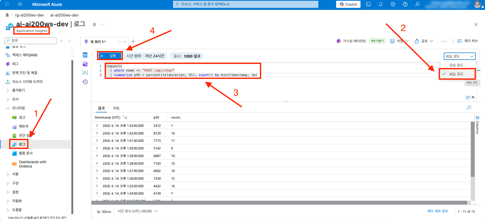
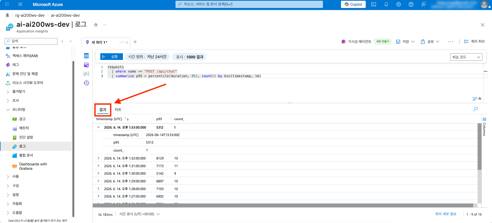
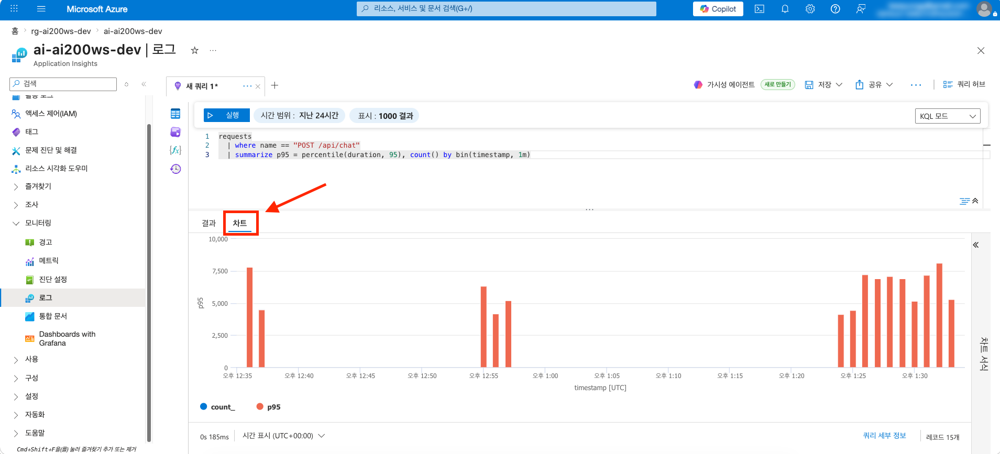

# session-01 (RAG MVP on Azure Container Apps + Key Vault + OpenTelemetry)

👈 [챌린지 홈](../../README.md)

> [!IMPORTANT]
> **사전 준비 조건**
>
> - [session-00](./00-setup.md) 완료 — Resource Group · Azure OpenAI · Log Analytics Workspace · Application Insights · Key Vault · User Assigned Managed Identity 가 본인 구독에 존재
> - 시작본 코드를 작업 폴더로 받기 — [시작본 코드 받기](#시작본-코드-받기) 참고

---

## 시작본 코드 받기

다음 명령을 그대로 복사해 실행합니다. session-00 에서 만든 작업 폴더 `workshop/` 위에 본 세션의 시작본 코드가 덮입니다.

```bash
# Linux · macOS · WSL
cp -a save-points/session-01/start/. workshop/
```

```powershell
# Windows PowerShell
Copy-Item -Path save-points/session-01/start/* -Destination workshop -Recurse -Force
```

이후 본 세션의 모든 명령은 `workshop/` 안에서 실행한다고 가정합니다.

시작본을 열어보면 다음 두 종류의 빈칸이 비어 있습니다. 본 세션에서 순서대로 채웁니다.

- `infra/sessions/01-rag-mvp/main.bicep` — 모듈 호출 블록 8개와 출력 블록이 한국어 힌트 주석으로 비어 있습니다. 호출할 모듈 본체 (`infra/modules/session-01/*.bicep`) 는 완성되어 있으므로 수정하지 않습니다
- `apps/api/src/**/*.py`, `apps/web/app/**` — RAG 파이프라인 핵심 함수들이 `raise NotImplementedError` 와 힌트 주석으로 비어 있습니다
- `scripts/seed_cosmos.py` — Cosmos 시드 스크립트는 완성본으로 제공되므로 채울 필요가 없습니다

---

## 1단계 · Bicep 모듈 조립

`workshop/infra/sessions/01-rag-mvp/main.bicep` 을 열고, 아래 순서대로 각 힌트 주석을 찾아 그 자리를 코드로 교체합니다. 모듈은 위에서부터 아래로 의존 관계를 따라 이어지므로 순서대로 채우는 것을 권장합니다.

### 1.1 호출할 모듈 한눈에 보기

`infra/modules/session-01/` 에 완성되어 있는 모듈입니다.

```text
infra/modules/session-01/
├── acr.bicep                                       # Azure Container Registry (Basic 등급, admin user disabled)
├── container-apps-env.bicep                        # Log Analytics Workspace 와 연결된 Azure Container Apps Environment
├── cosmos-account.bicep                            # capacityMode: 'Serverless', disableLocalAuth=true
├── cosmos-sql-database.bicep                       # 데이터베이스
├── cosmos-sql-container.bicep                      # vector policy 포함 컨테이너
├── key-vault-secret.bicep                          # Azure OpenAI endpoint secret
├── role-assignment-acrpull.bicep                   # User Assigned Managed Identity 가 Azure Container Registry 에서 이미지 pull
├── role-assignment-cosmos-data-contributor.bicep   # User Assigned Managed Identity 가 Cosmos DB data plane 호출
├── role-assignment-keyvault-secrets-user.bicep     # User Assigned Managed Identity 가 Key Vault Secret 읽기
└── container-app.bicep                             # Container App (ca-api · ca-web 에 두 번 재사용). 빈 containerImage 면 placeholder 로 생성 후 az containerapp update 로 교체
```

> [!NOTE]
> 시작본의 `main.bicep` 상단에는 파라미터 · 공용 태그 · 자원 이름 변수와 session-00 자원의 `existing` 참조 (Log Analytics Workspace · User Assigned Managed Identity · Azure OpenAI · Key Vault · Application Insights) 가 이미 채워져 있습니다. 아래 블록은 그 `existing` 참조 (`law`, `uami`, `aoai`, `kv`, `appInsights`) 와 변수 (`acrName`, `caeName` 등) 를 그대로 사용합니다.

### 1.2 Azure Container Registry

`// -------- 1) Azure Container Registry 모듈 호출하기` 힌트 주석을 찾아 다음으로 교체합니다. 이미지를 받을 레지스트리이므로 다른 모든 자원보다 먼저 만들어집니다.

```bicep
// -------- 1) Azure Container Registry -------------------------------------------

module acr '../../modules/session-01/acr.bicep' = {
  name: 'acr'
  params: {
    name: acrName
    location: location
    skuName: 'Basic'
    tags: commonTags
  }
}
```

### 1.3 Azure Container Apps Environment

`// -------- 2) Azure Container Apps Environment 모듈 호출하기` 힌트 주석을 찾아 다음으로 교체합니다. 환경은 Log Analytics Workspace 의 `customerId` 와 shared key 를 받아 로그를 연결합니다. shared key 는 상단 변수 `logAnalyticsSharedKey` (= `law.listKeys().primarySharedKey`) 로 이미 준비되어 있습니다.

```bicep
// -------- 2) Azure Container Apps Environment -----------------------------------

module cae '../../modules/session-01/container-apps-env.bicep' = {
  name: 'cae'
  params: {
    name: caeName
    location: location
    logAnalyticsCustomerId: law.properties.customerId
    logAnalyticsSharedKey: logAnalyticsSharedKey
    tags: commonTags
  }
}
```

### 1.4 Cosmos DB account · database · container

`// -------- 3) Cosmos DB account · database · container 모듈 호출하기` 힌트 주석을 찾아 다음 세 모듈로 교체합니다. database 는 account 의 출력 (`cosmos.outputs.name`) 을, container 는 database 의 출력을 받아 순서대로 이어집니다. 컨테이너 모듈에 vector policy 파라미터 (`vectorPath` · `vectorDataType` · `vectorDistanceFunction` · `vectorIndexType`) 를 전달하는 것이 RAG 검색의 핵심입니다.

```bicep
// -------- 3) Cosmos DB account · database · container --------------------------

module cosmos '../../modules/session-01/cosmos-account.bicep' = {
  name: 'cosmos'
  params: {
    name: cosmosName
    location: location
    capacityMode: 'Serverless'
    disableLocalAuth: true
    tags: commonTags
  }
}

module cosmosDatabase '../../modules/session-01/cosmos-sql-database.bicep' = {
  name: 'cosmosDatabase'
  params: {
    accountName: cosmos.outputs.name
    name: cosmosDatabaseName
  }
}

module cosmosChunksContainer '../../modules/session-01/cosmos-sql-container.bicep' = {
  name: 'cosmosChunksContainer'
  params: {
    accountName: cosmos.outputs.name
    databaseName: cosmosDatabase.outputs.name
    name: cosmosChunksContainerName
    partitionKeyPath: '/doc_id'
    vectorDimensions: vectorDimensions
    vectorPath: '/embedding'
    vectorDataType: 'float32'
    vectorDistanceFunction: 'cosine'
    vectorIndexType: 'quantizedFlat'
  }
}
```

> [!CAUTION]
> **Cosmos serverless 는 capability 가 아니라 `capacityMode`** — `cosmos-account.bicep` 모듈은 `capacityMode: 'Serverless'` 로 serverless 를 지정합니다. API 버전 `2024-05-15-preview` 이후로는 `EnableServerless` capability 지정이 거부됩니다 ([함정 모음](../pitfalls/common.md) 참고).

### 1.5 Key Vault Secret — Azure OpenAI endpoint URL

`// -------- 4) Key Vault Secret — Azure OpenAI endpoint URL 모듈 호출하기` 힌트 주석을 찾아 다음으로 교체합니다. endpoint URL 자체는 시크릿이 아니지만, Key Vault 에 저장하고 코드에서 SDK 로 읽어오는 **Key Vault reference 패턴** 을 학습하기 위해 한 개를 저장합니다.

```bicep
// -------- 4) Key Vault Secret — Azure OpenAI endpoint URL ----------------------

module aoaiEndpointSecret '../../modules/session-01/key-vault-secret.bicep' = {
  name: 'aoaiEndpointSecret'
  params: {
    keyVaultName: kv.name
    name: 'aoai-endpoint'
    value: aoai.properties.endpoint
    contentType: 'text/plain'
  }
}
```

### 1.6 역할 할당 — User Assigned Managed Identity

`// -------- 5) 역할 할당 — UAMI 가 ACR · Cosmos · Key Vault 에 접근 모듈 호출하기` 힌트 주석을 찾아 다음 세 모듈로 교체합니다. Container App 이 이미지를 pull 하고 (ACR) · Cosmos DB data plane 을 호출하고 · Key Vault Secret 을 읽기 위해 필요한 세 가지 역할입니다. Managed Identity 는 서비스 주체이므로 `principalType` 은 `ServicePrincipal` 입니다.

```bicep
// -------- 5) 역할 할당 — UAMI 가 ACR · Cosmos · Key Vault 에 접근 ----------------

module acrPullRoleUami '../../modules/session-01/role-assignment-acrpull.bicep' = {
  name: 'acrPullRole-uami'
  params: {
    acrName: acr.outputs.name
    principalId: uami.properties.principalId
    principalType: 'ServicePrincipal'
  }
}

module cosmosDataRoleUami '../../modules/session-01/role-assignment-cosmos-data-contributor.bicep' = {
  name: 'cosmosDataRole-uami'
  params: {
    cosmosAccountName: cosmos.outputs.name
    principalId: uami.properties.principalId
  }
}

module kvSecretsRoleUami '../../modules/session-01/role-assignment-keyvault-secrets-user.bicep' = {
  name: 'kvSecretsRole-uami'
  params: {
    keyVaultName: kv.name
    principalId: uami.properties.principalId
    principalType: 'ServicePrincipal'
  }
}
```

### 1.7 (필수) 사용자 계정에도 Cosmos data plane · Key Vault Secrets 부여

`// -------- 6) 사용자에게도 Cosmos data plane · Key Vault Secrets 부여 모듈 호출하기` 힌트 주석을 찾아 다음 두 모듈로 교체합니다. 이 블록은 **본인 계정**에 Cosmos 데이터플레인 (`Cosmos DB Built-in Data Contributor`) 권한을 부여합니다. [4단계 · Cosmos 시드](#4단계--cosmos-시드) 가 본인 `az login` 자격으로 Cosmos 에 쓰고 6단계 Data Explorer 도 같은 권한을 요구하므로 **필수**이며, 그래서 표준 배포 (3단계) 가 항상 `userObjectId` 를 넘깁니다. Bicep 의 `if (!empty(userObjectId))` 는 값을 안 넘기면 건너뛰는 조건부 모듈일 뿐이니, 워크샵에서는 반드시 채워 배포합니다. (함께 부여되는 Key Vault Secrets 권한은 본인이 시크릿을 직접 읽어볼 때만 쓰는 보너스입니다.) 사용자 계정이므로 `principalType` 은 `User` 입니다.

```bicep
// -------- 6) 사용자에게도 Cosmos data plane · Key Vault Secrets 부여 -----------

module cosmosDataRoleUser '../../modules/session-01/role-assignment-cosmos-data-contributor.bicep' = if (!empty(userObjectId)) {
  name: 'cosmosDataRole-user'
  params: {
    cosmosAccountName: cosmos.outputs.name
    principalId: userObjectId
  }
}

module kvSecretsRoleUser '../../modules/session-01/role-assignment-keyvault-secrets-user.bicep' = if (!empty(userObjectId)) {
  name: 'kvSecretsRole-user'
  params: {
    keyVaultName: kv.name
    principalId: userObjectId
    principalType: 'User'
  }
}
```

### 1.8 Azure Container Apps — FastAPI (ca-api)

`// -------- 7) Azure Container Apps — FastAPI (ca-api) 모듈 호출하기` 힌트 주석을 찾아 다음으로 교체합니다. 이 Container App 이 RAG 백엔드입니다. `envVars` 로 Azure OpenAI · Cosmos · Application Insights 연결 정보를 주입하고, `dependsOn` 에 1.6 의 RBAC 모듈 3개를 명시해 Container App 이 시작하기 전에 역할 부여가 끝나도록 보장합니다.

`containerImage` 는 `empty(apiImageTag) ? '' : 'api:${apiImageTag}'` 로 전달합니다. `main.bicepparam` 의 `apiImageTag` 기본값이 빈 문자열이므로, 첫 배포에서는 빈 이미지가 넘어가 `container-app.bicep` 이 placeholder 이미지로 Container App 을 만듭니다. 실제 `api` 이미지는 [5단계 · 빌드 · 배포 · 호출](#5단계--빌드--배포--호출) 에서 빌드 · push 한 뒤 `az containerapp update --image` 로 교체합니다.

```bicep
// -------- 7) Azure Container Apps — FastAPI (ca-api) ----------------------------

module caApi '../../modules/session-01/container-app.bicep' = {
  name: 'caApi'
  params: {
    name: caApiName
    location: location
    environmentId: cae.outputs.id
    userAssignedIdentityId: uami.id
    userAssignedIdentityClientId: uami.properties.clientId
    acrLoginServer: acr.outputs.loginServer
    containerImage: empty(apiImageTag) ? '' : 'api:${apiImageTag}'
    targetPort: 8000
    externalIngress: true
    minReplicas: 0
    maxReplicas: 3
    cpu: '0.5'
    memory: '1Gi'
    envVars: [
      {
        name: 'AZURE_OPENAI_ENDPOINT'
        value: aoai.properties.endpoint
      }
      {
        name: 'AZURE_OPENAI_CHAT_DEPLOYMENT'
        value: 'gpt-5-mini'
      }
      {
        name: 'AZURE_OPENAI_EMBED_DEPLOYMENT'
        value: 'text-embedding-3-large'
      }
      {
        name: 'AZURE_OPENAI_API_VERSION'
        value: '2024-08-01-preview'
      }
      {
        name: 'COSMOS_ENDPOINT'
        value: cosmos.outputs.endpoint
      }
      {
        name: 'COSMOS_DATABASE'
        value: cosmosDatabaseName
      }
      {
        name: 'COSMOS_CHUNKS_CONTAINER'
        value: cosmosChunksContainerName
      }
      {
        name: 'APPLICATIONINSIGHTS_CONNECTION_STRING'
        value: appInsights.properties.ConnectionString
      }
    ]
    tags: commonTags
  }
  dependsOn: [
    acrPullRoleUami
    cosmosDataRoleUami
    kvSecretsRoleUami
  ]
}
```

### 1.9 Azure Container Apps — Next.js (ca-web)

`// -------- 8) Azure Container Apps — Next.js (ca-web) 모듈 호출하기` 힌트 주석을 찾아 다음으로 교체합니다. 같은 `container-app.bicep` 모듈을 다시 호출하되, `envVars` 는 ca-api 의 외부 FQDN 을 가리키는 `API_BASE_URL` 한 개입니다. `dependsOn` 에 `caApi` 를 두어 ca-api 가 먼저 만들어져 FQDN 출력이 준비되도록 합니다.

ca-api 와 마찬가지로 `containerImage` 를 `empty(webImageTag) ? '' : 'web:${webImageTag}'` 로 전달합니다. 첫 배포는 빈 태그라 placeholder 이미지로 생성되고, 5단계에서 실제 `web` 이미지로 교체합니다.

```bicep
// -------- 8) Azure Container Apps — Next.js (ca-web) ----------------------------

module caWeb '../../modules/session-01/container-app.bicep' = {
  name: 'caWeb'
  params: {
    name: caWebName
    location: location
    environmentId: cae.outputs.id
    userAssignedIdentityId: uami.id
    userAssignedIdentityClientId: uami.properties.clientId
    acrLoginServer: acr.outputs.loginServer
    containerImage: empty(webImageTag) ? '' : 'web:${webImageTag}'
    targetPort: 3000
    externalIngress: true
    minReplicas: 0
    maxReplicas: 3
    cpu: '0.25'
    memory: '0.5Gi'
    envVars: [
      {
        // Next.js 서버 사이드에서 ca-api 를 호출. ACA 내부 통신 가능하나 학습 단순화를 위해 external FQDN 사용.
        name: 'API_BASE_URL'
        value: 'https://${caApi.outputs.fqdn}'
      }
    ]
    tags: commonTags
  }
  dependsOn: [
    acrPullRoleUami
    caApi
  ]
}
```

### 1.10 출력값 — 후속 세션이 참조

`// -------- 출력 — 후속 세션이 참조 모듈 호출하기` 힌트 주석을 찾아 다음 출력 블록으로 교체합니다. session-02 이후 세션이 이 출력값을 받아 자원을 연결합니다.

```bicep
// -------- 출력 — 후속 세션이 참조 ------------------------------------------------

output acrName string = acr.outputs.name
output acrLoginServer string = acr.outputs.loginServer
output caeName string = cae.outputs.name
output caApiFqdn string = caApi.outputs.fqdn
output caWebFqdn string = caWeb.outputs.fqdn
output cosmosName string = cosmos.outputs.name
output cosmosEndpoint string = cosmos.outputs.endpoint
output cosmosDatabaseName string = cosmosDatabaseName
output cosmosChunksContainerName string = cosmosChunksContainerName
```

### 1.11 조립 검증 — 컴파일

모듈을 모두 채운 뒤, 배포 전에 Bicep 이 오류 없이 빌드되는지 확인합니다.

```bash
az bicep build --file infra/sessions/01-rag-mvp/main.bicep --stdout > /dev/null && echo "BUILD OK"
```

`BUILD OK` 가 출력되면 조립이 완료된 것입니다. 오류가 난다면 채운 블록의 중괄호 · 들여쓰기 · `dependsOn` 항목을 다시 확인합니다.

> [!TIP]
> 진행 중 막혔다면 완성본 코드를 그대로 덮어쓰고 어디가 달랐는지 직접 비교할 수 있습니다.
>
> ```bash
> cp -a save-points/session-01/complete/. workshop/
> ```

---

## 2단계 · 앱 코드 채우기

Bicep 조립과 별개로, FastAPI 백엔드의 RAG 파이프라인 빈칸을 완성본 기준으로 채웁니다. 먼저 본 챌린지가 왜 `.env` 가 아니라 Key Vault + Managed Identity 를 쓰는지 짚고, 그 원칙이 코드로 어떻게 표현되는지 따라갑니다.

> [!NOTE]
> `apps/api/src/main.py` 최상단의 OpenTelemetry 자동 계측 블록은 시작본에 이미 완성되어 제공됩니다. 학습자가 채우는 부분은 `lifespan` 의 Azure 클라이언트 초기화와 `/api/chat` 핸들러 본문뿐입니다 ([2.5 FastAPI 엔트리](#25-fastapi-엔트리--appsapisrcmainpy) 참고).

### 2.1 왜 `.env` 가 아니라 Key Vault + Managed Identity 인가

같은 작업 (Azure OpenAI 호출) 을 두 가지 방식으로 비교합니다.

#### 방식 A — `.env` (본 챌린지에서 사용하지 않음, 비교용)

```bash
# 1) 키를 꺼냄
az cognitiveservices account keys list \
  -n aoai-ai200ws-dev \
  -g rg-ai200ws-dev \
  --query key1 -o tsv

# 2) 디스크에 평문으로 저장
cat <<EOF >> apps/api/.env
AZURE_OPENAI_API_KEY=sk-...
AZURE_OPENAI_ENDPOINT=https://aoai-ai200ws-dev.openai.azure.com/
EOF
```

```python
# 3) 코드 — 키를 직접 전달
from openai import AzureOpenAI

client = AzureOpenAI(
    api_key=os.getenv("AZURE_OPENAI_API_KEY"),
    azure_endpoint=os.getenv("AZURE_OPENAI_ENDPOINT"),
    api_version="2024-08-01-preview",
)
```

문제점은 다음과 같습니다 :

- 키가 디스크에 평문으로 남음 : 실수로 `git add` 하면 즉시 노출. GitHub 시크릿 스캔이 곧바로 알람
- 키 회전 시 모든 환경 (로컬 · CI · Azure Container Apps) 의 `.env` 를 수동으로 갱신
- 누가 언제 키를 썼는지 감사 로그 없음
- Entra ID · RBAC 거버넌스를 우회 — 키만 있으면 누구나 호출

#### 방식 B — Key Vault + Managed Identity (본 챌린지 채택)

```python
# 키 없음 — Entra ID 가 토큰을 즉석에서 발급
from azure.identity import DefaultAzureCredential, get_bearer_token_provider
from openai import AsyncAzureOpenAI

token_provider = get_bearer_token_provider(
    DefaultAzureCredential(),
    "https://cognitiveservices.azure.com/.default",
)

client = AsyncAzureOpenAI(
    azure_endpoint=os.getenv("AZURE_OPENAI_ENDPOINT"),   # 비밀이 아님 (endpoint URL 만)
    azure_ad_token_provider=token_provider,
    api_version="2024-08-01-preview",
)
```

이점은 다음과 같습니다 :

- 코드 · 디스크 · git 어디에도 키 없음
- 키 회전은 Azure 가 자동 처리
- Entra ID 감사 로그에 모든 호출 기록
- 로컬과 클라우드 인증 방식 동일 — "로컬은 다르게" 가 사라짐

### 2.2 Azure OpenAI 클라이언트 — `apps/api/src/clients/aoai.py`

방식 B 가 코드로 그대로 표현되는 모듈입니다. 세 함수의 `raise NotImplementedError` 와 힌트 주석을 다음으로 채웁니다.

먼저 `build_aoai_client` 의 빈 본문을 채웁니다. `DefaultAzureCredential` 이 환경별 자격을 자동 선택하고, `get_bearer_token_provider` 가 매 요청마다 토큰을 발급하며, `AsyncAzureOpenAI` 가 그 토큰을 Authorization 헤더에 자동 부착합니다.

```python
def build_aoai_client(settings: Settings) -> AsyncAzureOpenAI:
    credential = DefaultAzureCredential()
    token_provider = get_bearer_token_provider(
        credential,
        "https://cognitiveservices.azure.com/.default",
    )
    return AsyncAzureOpenAI(
        azure_endpoint=settings.azure_openai_endpoint,
        azure_ad_token_provider=token_provider,
        api_version=settings.azure_openai_api_version,
    )
```

다음으로 `embed_text` 를 채웁니다. `text-embedding-3-large` 는 3072 차원 벡터를 반환하며, 이 차원이 Cosmos `chunks` 컨테이너의 vector policy 차원과 일치해야 합니다.

```python
async def embed_text(client: AsyncAzureOpenAI, settings: Settings, text: str) -> list[float]:
    response = await client.embeddings.create(
        model=settings.azure_openai_embed_deployment,
        input=text,
    )
    return response.data[0].embedding
```

마지막으로 `chat_with_context` 를 채웁니다. 시스템 메시지로 RAG 규칙을 고정하고, 사용자 메시지에 컨텍스트와 질문을 분리해 전달합니다.

```python
async def chat_with_context(
    client: AsyncAzureOpenAI,
    settings: Settings,
    question: str,
    context: str,
) -> str:
    system_prompt = (
        "당신은 사내 문서를 근거로 답변하는 AI 어시스턴트입니다. "
        "주어진 컨텍스트만을 사용해 한국어로 간결하게 답변하세요. "
        "컨텍스트에 답이 없다면 '관련 문서를 찾을 수 없습니다' 라고 답하세요."
    )
    user_prompt = f"# 컨텍스트\n{context}\n\n# 질문\n{question}"

    response = await client.chat.completions.create(
        model=settings.azure_openai_chat_deployment,
        messages=[
            {"role": "system", "content": system_prompt},
            {"role": "user", "content": user_prompt},
        ],
        max_completion_tokens=2048,
    )
    return response.choices[0].message.content or ""
```

> [!CAUTION]
> **gpt-5-mini 는 `max_tokens` · 커스텀 `temperature` 미지원** — 일반적인 chat 모델과 달리 gpt-5 계열 reasoning 모델은 커스텀 `temperature` 와 `max_tokens` 를 거부합니다. `temperature` 는 생략 (기본값 `1` 만 허용) 하고, 토큰 상한은 `max_tokens` 대신 `max_completion_tokens` 로 줍니다. 이때 reasoning 토큰이 출력 토큰과 함께 차감되므로 상한을 여유 있게 둡니다 ([함정 모음](../pitfalls/common.md) 참고).

### 2.3 Cosmos DB 벡터 검색 — `apps/api/src/stores/cosmos_store.py`

RAG 의 검색 단계를 담당합니다. 비동기 인증과 `VectorDistance()` 기반 KNN 검색이 핵심입니다.

먼저 `build_cosmos_client` 를 채웁니다. `azure.identity.aio.DefaultAzureCredential` (비동기 버전) 을 사용하고, 클라이언트와 credential 을 함께 반환해 호출자 (`main.py` 의 lifespan) 가 종료 시 정리하게 합니다.

```python
def build_cosmos_client(settings: Settings) -> tuple[CosmosClient, DefaultAzureCredential]:
    credential = DefaultAzureCredential()
    client = CosmosClient(url=settings.cosmos_endpoint, credential=credential)
    return client, credential
```

다음으로 `get_chunks_container` 를 채웁니다. database 핸들을 거쳐 `chunks` 컨테이너 핸들을 반환합니다.

```python
async def get_chunks_container(client: CosmosClient, settings: Settings) -> ContainerProxy:
    database = client.get_database_client(settings.cosmos_database)
    return database.get_container_client(settings.cosmos_chunks_container)
```

`vector_search` 를 채웁니다. `VectorDistance()` 함수와 `ORDER BY` · `TOP N` 으로 KNN 검색을 표현하고, 파라미터 바인딩 `@embedding` 으로 SQL injection 을 회피합니다. cosine distance 를 0~1 점수로 클램프해 `Source` 로 변환합니다.

```python
async def vector_search(
    container: ContainerProxy,
    query_embedding: list[float],
    top_k: int,
) -> list[Source]:
    sql = """
        SELECT TOP @topK
            c.doc_id,
            c.title,
            VectorDistance(c.embedding, @embedding) AS similarity
        FROM c
        ORDER BY VectorDistance(c.embedding, @embedding)
    """
    parameters = [
        {"name": "@topK", "value": top_k},
        {"name": "@embedding", "value": query_embedding},
    ]

    sources: list[Source] = []
    # enable_cross_partition_query=True — 학습 단계에서는 partition 전수 스캔 허용.
    # 운영 환경에서는 partition_key 를 명시해 RU 폭주를 막기 필요.
    async for item in container.query_items(
        query=sql,
        parameters=parameters,
    ):
        sources.append(
            Source(
                doc_id=item["doc_id"],
                title=item.get("title"),
                # VectorDistance 는 cosine distance (0 = 동일, 2 = 반대).
                # 유사도 점수로 보여주려면 1 - distance/2 같은 정규화를 적용해도 좋다.
                # 본 챌린지는 학습 단순화를 위해 distance 자체를 score 로 보고 0~1 로 고정한다.
                score=max(0.0, min(1.0, 1.0 - item["similarity"])),
            )
        )
    return sources
```

마지막으로 `fetch_chunk_content` 를 채웁니다. 검색된 `doc_id` 가 partition key 이므로 `partition_key=doc_id` 를 명시해 단일 partition 조회를 수행합니다.

```python
async def fetch_chunk_content(container: ContainerProxy, doc_id: str) -> str:
    sql = "SELECT VALUE c.content FROM c WHERE c.doc_id = @docId"
    parameters = [{"name": "@docId", "value": doc_id}]

    async for item in container.query_items(
        query=sql,
        parameters=parameters,
        partition_key=doc_id,
    ):
        return item
    return ""
```

> [!CAUTION]
> **비동기 인증은 `aiohttp` 가 필요** — `azure.identity.aio.DefaultAzureCredential` 은 async HTTP transport 로 `aiohttp` 를 요구합니다. 시작본의 `apps/api/pyproject.toml` 에는 이미 `aiohttp>=3.10.0` 이 포함되어 있으므로 추가하지 않아도 됩니다. 만약 직접 의존성을 손볼 일이 있다면 이 항목을 지우지 않습니다 ([함정 모음](../pitfalls/common.md) 참고).

### 2.4 RAG 파이프라인 조립 — `apps/api/src/rag/chain.py`

`run_rag_chain` 의 `raise NotImplementedError` 를 채웁니다. 2.2 · 2.3 에서 채운 함수들을 embed → retrieve → generate 순으로 호출합니다.

```python
async def run_rag_chain(
    question: str,
    aoai_client: AsyncAzureOpenAI,
    cosmos_container: ContainerProxy,
    settings: Settings,
) -> ChatResponse:
    """질문 한 건을 RAG 파이프라인 전체에 통과시켜 답변과 출처를 반환."""

    # 1) embed — 질문을 임베딩 벡터로 변환
    query_embedding = await embed_text(aoai_client, settings, question)

    # 2) retrieve — Cosmos 에서 가장 가까운 chunk 들의 메타데이터 검색
    sources: list[Source] = await vector_search(
        cosmos_container,
        query_embedding,
        top_k=settings.retrieval_top_k,
    )

    if not sources:
        return ChatResponse(
            answer="관련 문서를 찾을 수 없습니다.",
            sources=[],
        )

    # 검색된 chunk 들의 본문을 가져와 컨텍스트로 묶음
    contents: list[str] = []
    for source in sources:
        content = await fetch_chunk_content(cosmos_container, source.doc_id)
        if content:
            heading = source.title or source.doc_id
            contents.append(f"## {heading}\n{content}")
    context = "\n\n".join(contents)

    # 3) generate — gpt-5-mini 가 컨텍스트 기반 답변 생성
    answer = await chat_with_context(aoai_client, settings, question, context)

    return ChatResponse(answer=answer, sources=sources)
```

### 2.5 FastAPI 엔트리 — `apps/api/src/main.py`

이 파일에서 학습자가 채우는 부분은 `lifespan` 의 빈 본문과 `/api/chat` 핸들러의 `raise NotImplementedError` 입니다. 파일 최상단의 OpenTelemetry 자동 계측 블록은 시작본에 이미 완성되어 있으므로 수정하지 않습니다.

먼저 그 계측 블록을 살펴봅니다. 모든 다른 import 보다 앞, 즉 `app = FastAPI()` 가 만들어지기 전에 계측을 활성화합니다.

```python
import os

from azure.monitor.opentelemetry import configure_azure_monitor

if os.environ.get("APPLICATIONINSIGHTS_CONNECTION_STRING"):
    # connection string 은 환경변수에서 자동으로 읽는다.
    configure_azure_monitor()
    # azure-monitor-opentelemetry 가 자동 활성화하지 않는 async HTTP 클라이언트 계측을
    # 명시적으로 켜, Azure OpenAI(httpx) · Cosmos(aiohttp) 호출이 dependency span 으로 남게 한다.
    from opentelemetry.instrumentation.aiohttp_client import AioHttpClientInstrumentor
    from opentelemetry.instrumentation.httpx import HTTPXClientInstrumentor

    HTTPXClientInstrumentor().instrument()
    AioHttpClientInstrumentor().instrument()

from contextlib import asynccontextmanager  # noqa: E402

from fastapi import FastAPI, HTTPException  # noqa: E402
# ... (나머지 import 도 # noqa: E402)
```

`configure_azure_monitor` 를 `app = FastAPI()` 생성 전에 호출하는 이유가 있습니다. FastAPI 자동 계측은 `FastAPI.__init__` 을 패치하는 방식이라, 이미 만들어진 app 인스턴스에는 적용되지 않습니다. 계측을 `lifespan` (app 생성 후) 에서 켜면 요청 span (`requests` 테이블) 이 기록되지 않으므로, import 최상단에서 활성화합니다. 또한 `azure-monitor-opentelemetry` 는 httpx · aiohttp 를 자동 계측하지 않으므로, 두 instrumentation 을 명시적으로 켜야 Azure OpenAI · Cosmos 호출이 dependency span 으로 남습니다.

> [!NOTE]
> 두 계측 패키지 `opentelemetry-instrumentation-httpx` · `opentelemetry-instrumentation-aiohttp-client` 는 시작본의 `apps/api/pyproject.toml` 에 이미 포함되어 있으므로 추가 설치가 필요 없습니다.

이제 `lifespan` 을 채웁니다. 계측은 이미 최상단에서 활성화되었으므로, lifespan 은 Azure 클라이언트를 초기화해 `app.state` 에 보관하고 종료 시 각 클라이언트를 닫는 역할만 합니다.

```python
@asynccontextmanager
async def lifespan(app: FastAPI):
    """앱 시작 시점에 Azure 클라이언트 초기화, 종료 시 정리.

    클라이언트는 `app.state` 에 보관해 요청 핸들러가 가져다 쓴다.
    """
    settings = get_settings()

    aoai_client = build_aoai_client(settings)
    cosmos_client, cosmos_credential = build_cosmos_client(settings)
    cosmos_container = await get_chunks_container(cosmos_client, settings)

    app.state.settings = settings
    app.state.aoai_client = aoai_client
    app.state.cosmos_client = cosmos_client
    app.state.cosmos_credential = cosmos_credential
    app.state.cosmos_container = cosmos_container

    try:
        yield
    finally:
        # 종료 시점 정리 — 토큰 갱신 백그라운드 스레드 등을 안전하게 종료
        await aoai_client.close()
        await cosmos_client.close()
        await cosmos_credential.close()
```

`/api/chat` 핸들러는 `run_rag_chain` 을 호출하고, 실패 시 OpenTelemetry exception 으로 기록되도록 500 으로 묶습니다.

```python
@app.post("/api/chat", response_model=ChatResponse)
async def chat(request: ChatRequest) -> ChatResponse:
    try:
        return await run_rag_chain(
            question=request.q,
            aoai_client=app.state.aoai_client,
            cosmos_container=app.state.cosmos_container,
            settings=app.state.settings,
        )
    except Exception as exc:
        # 운영 환경에서는 더 정교한 에러 분류와 재시도 정책이 필요하다.
        # 학습 단계에서는 500 으로 묶고 OpenTelemetry exception 으로 기록.
        raise HTTPException(status_code=500, detail=f"RAG pipeline failed: {exc}") from exc
```

### 2.6 프론트엔드 — `apps/web`

프론트엔드도 두 곳에 빈칸이 있습니다. 두 파일 모두 시작본에 단계별 힌트 주석이 달려 있어 그대로 따라 채웁니다.

먼저 `apps/web/app/api/chat/route.ts` 입니다. 브라우저 요청을 ca-api 의 `/api/chat` 으로 프록시하는 Next.js API Route 로, `API_BASE_URL` (서버 사이드 전용) 을 읽어 본문을 검증한 뒤 upstream 응답을 그대로 전달합니다. `POST` 핸들러의 `501` 스텁을 다음으로 교체합니다.

```ts
export async function POST(request: Request) {
  const apiBaseUrl = process.env.API_BASE_URL;
  if (!apiBaseUrl) {
    return NextResponse.json(
      { error: "API_BASE_URL 환경변수가 설정되지 않았습니다." },
      { status: 500 },
    );
  }

  let body: ChatRequestBody;
  try {
    body = (await request.json()) as ChatRequestBody;
  } catch {
    return NextResponse.json({ error: "잘못된 JSON 본문입니다." }, { status: 400 });
  }

  if (typeof body.q !== "string" || body.q.trim().length === 0) {
    return NextResponse.json(
      { error: "`q` 필드는 비어있지 않은 문자열이어야 합니다." },
      { status: 400 },
    );
  }

  const sessionId = typeof body.session_id === "string" ? body.session_id : null;

  // ca-api 호출
  const upstream = await fetch(`${apiBaseUrl}/api/chat`, {
    method: "POST",
    headers: { "Content-Type": "application/json" },
    body: JSON.stringify({ q: body.q, session_id: sessionId }),
    // 운영 환경에서는 timeout / 재시도 정책 추가 필요
    cache: "no-store",
  });

  const payload = await upstream.text();

  return new NextResponse(payload, {
    status: upstream.status,
    headers: { "Content-Type": "application/json" },
  });
}
```

다음으로 `apps/web/app/page.tsx` 입니다. 질문 입력 폼과 답변 · 출처 표시 UI 로, `handleSubmit` 안의 `fetch("/api/chat", ...)` 호출 부분을 채웁니다.

```tsx
// 브라우저 → Next.js API Route (/api/chat) → ca-api 의 /api/chat 으로 프록시.
// ca-api FQDN 같은 환경변수는 서버 사이드 (API Route) 에서만 접근 가능.
const res = await fetch("/api/chat", {
  method: "POST",
  headers: { "Content-Type": "application/json" },
  body: JSON.stringify({ q: trimmed, session_id: sessionId }),
});

if (!res.ok) {
  const detail = await res.text();
  throw new Error(`백엔드 응답 ${res.status}: ${detail}`);
}

const data: ChatResponse = await res.json();
setResponse(data);
```

> [!TIP]
> 막혔다면 완성본 (`save-points/session-01/complete/apps/web/...`) 을 덮어써 [1.11 조립 검증 — 컴파일](#111-조립-검증--컴파일) 의 비교 방법으로 한 번에 맞출 수 있습니다.

---

## 3단계 · Bicep 배포

### 3.1 변경사항 미리보기

```bash
OID=$(az ad signed-in-user show --query id -o tsv)

az deployment group what-if \
  --resource-group rg-ai200ws-dev \
  --template-file infra/sessions/01-rag-mvp/main.bicep \
  --parameters infra/sessions/01-rag-mvp/main.bicepparam \
  --parameters userObjectId=$OID
```

> [!NOTE]
> `what-if` 출력에서 `AcrPull` 역할 할당이 `Unsupported` 로 표기되는 경우가 있습니다. 해당 경우는 정상이며, 실제 배포는 성공합니다.

### 3.2 실제 배포

```bash
az deployment group create \
  --resource-group rg-ai200ws-dev \
  --template-file infra/sessions/01-rag-mvp/main.bicep \
  --parameters infra/sessions/01-rag-mvp/main.bicepparam \
  --parameters userObjectId=$OID
```

> [!NOTE]
> Cosmos DB account 생성이 가장 오래 걸려 약 **8~10분** 소요됩니다. 진행되는 동안 [4단계 · Cosmos 시드](#4단계--cosmos-시드) 의 환경변수 구성과 실행 명령을 미리 정독합니다.

> [!NOTE]
> **placeholder revision 이 `ActivationFailed` 로 보여도 정상**
>
> 배포 직후 두 Container App 은 아직 자체 이미지가 없어 placeholder 이미지 (`mcr.microsoft.com/k8se/quickstart:latest`) 로 생성됩니다. 이 placeholder 이미지는 본 챌린지가 지정한 포트 (api 8000 · web 3000) 를 듣지 않으므로 첫 revision 이 `ActivationFailed` 로 표시될 수 있습니다. deployment 자체는 `Succeeded` 이며, [5단계 · 빌드 · 배포 · 호출](#5단계--빌드--배포--호출) 의 `az containerapp update --image` 로 실제 이미지를 올리면 새 revision 이 `Healthy` 가 됩니다. 배포 실패로 오해하지 않습니다 ([docs/pitfalls/common.md](../pitfalls/common.md) 참고).

### 3.3 배포 완료 확인

자원 이름은 `uniqueString` 접미사가 붙어 구독마다 다릅니다. CLI 로 실제 이름을 조회한 뒤 상태를 확인합니다.

```bash
# 본 챌린지 Resource Group 의 Cosmos DB account 이름을 조회한 뒤 준비 상태 확인
COSMOS=$(az cosmosdb list -g rg-ai200ws-dev --query "[0].name" -o tsv)

az cosmosdb show \
  --name $COSMOS \
  --resource-group rg-ai200ws-dev \
  --query "{state:provisioningState, kind:kind}" -o jsonc
```

```bash
# Azure Container Apps Environment 가 준비되었는지
az containerapp env show \
  --name cae-ai200ws-dev \
  --resource-group rg-ai200ws-dev \
  --query "{state:properties.provisioningState}" -o tsv
```

다음과 비슷한 출력이 표시됩니다.

```
{
  "kind": "GlobalDocumentDB",
  "state": "Succeeded"
}
Succeeded
```

Cosmos DB 와 Azure Container Apps Environment 양쪽 모두 `Succeeded` 인지 확인합니다.

---

## 4단계 · Cosmos 시드

배포가 끝났어도 `chunks` 컨테이너는 비어 있습니다. RAG 가 의미 있는 답변을 내려면 검색 대상이 되는 chunk 가 먼저 적재되어야 합니다. 완성본으로 제공되는 `scripts/seed_cosmos.py` 가 학습용 사내 문서 약 120건을 만들어 `text-embedding-3-large` 로 임베딩하고 Cosmos `chunks` 컨테이너에 적재합니다.

> [!IMPORTANT]
> 시드 스크립트는 본인 `az login` 자격으로 Azure OpenAI 와 Cosmos DB 를 호출합니다. 따라서 본인 계정에 Azure OpenAI 의 `Cognitive Services OpenAI User` (session-00 에서 부여) 와 Cosmos 의 `Cosmos DB Built-in Data Contributor` (본 세션 [1.7 (필수) 사용자 계정에도 Cosmos data plane · Key Vault Secrets 부여](#17-필수-사용자-계정에도-cosmos-data-plane--key-vault-secrets-부여) 블록을 채우고 `userObjectId` 를 넘겨 배포) 가 필요합니다.

먼저 시드 스크립트가 읽는 환경변수를 설정합니다. 자원 이름은 CLI 로 조회해 채웁니다.

```bash
# Cosmos DB account 이름 · endpoint 조회
COSMOS=$(az cosmosdb list -g rg-ai200ws-dev --query "[0].name" -o tsv)
export COSMOS_ENDPOINT=$(az cosmosdb show -n $COSMOS -g rg-ai200ws-dev --query documentEndpoint -o tsv)
export COSMOS_DATABASE=appdb
export COSMOS_CHUNKS_CONTAINER=chunks

# Azure OpenAI endpoint 조회
OPENAI=$(az cognitiveservices account list -g rg-ai200ws-dev --query "[0].name" -o tsv)
export AZURE_OPENAI_ENDPOINT=$(az cognitiveservices account show -n $OPENAI -g rg-ai200ws-dev --query properties.endpoint -o tsv)
export AZURE_OPENAI_EMBED_DEPLOYMENT=text-embedding-3-large
export AZURE_OPENAI_API_VERSION=2024-08-01-preview
```

환경변수를 설정한 뒤 시드 스크립트를 실행합니다. `apps/api` 의 의존성 환경을 그대로 사용합니다.

```bash
uv run --project apps/api python scripts/seed_cosmos.py
```

> [!NOTE]
> **macOS 에서 `SSLCertVerificationError` 가 나면 certifi CA 번들을 지정** — macOS 의 Python 은 시스템 CA 번들을 찾지 못해 시드 스크립트가 `azure.core.exceptions.ServiceRequestError: ... SSLCertVerificationError: [SSL: CERTIFICATE_VERIFY_FAILED] unable to get local issuer certificate` 로 실패할 수 있습니다. `az` CLI 는 영향이 없는데 Python 의 `aiohttp` 만 실패하는 경우입니다. 실행 전에 다음 명령어로 certifi 의 CA 번들 경로를 환경변수에 지정한 뒤 다시 실행합니다 ([docs/pitfalls/common.md](../pitfalls/common.md) 참고).
>
> ```bash
> export SSL_CERT_FILE=$(uv run --project apps/api python -c "import certifi; print(certifi.where())")
> ```

다음과 비슷한 출력이 표시됩니다.

```
코퍼스 120 건 임베딩 중...
Cosmos DB chunks 컨테이너에 적재 중...
완료 — 120 건 적재.
```

`완료 — 120 건 적재.` 가 출력되면 시드가 끝난 것입니다. 적재 건수는 다음 명령으로도 확인할 수 있습니다.

```bash
az cosmosdb sql container show \
  --account-name $COSMOS \
  --database-name appdb \
  --name chunks \
  --resource-group rg-ai200ws-dev \
  --query "name" -o tsv
```

> [!NOTE]
> **`quantizedFlat` 인덱스 비동기 빌드** — 시드 직후 잠깐 동안은 벡터 인덱스가 백그라운드로 빌드되어 벡터 검색이 0개 결과를 반환할 수 있습니다. 에러가 아니라 정상이므로, 검색 결과가 비면 잠시 후 다시 호출합니다 ([docs/pitfalls/common.md](../pitfalls/common.md) 참고).

---

## 5단계 · 빌드 · 배포 · 호출

앱 코드를 채웠으니, 컨테이너 이미지를 빌드해 Azure Container Registry 에 push 하고 Container App revision 을 갱신한 뒤 호출합니다. 3단계 배포에서 두 Container App 은 placeholder 이미지로 만들어졌으므로, 아래 4) 의 `az containerapp update --image` 가 placeholder 를 방금 push 한 실제 이미지로 교체하면서 새 revision 을 띄웁니다.

```bash
# 1) Azure Container Registry 로그인
ACR_NAME=$(az acr list -g rg-ai200ws-dev --query "[0].name" -o tsv)
az acr login --name $ACR_NAME
```

```bash
# 2) API 이미지 빌드 — ARM Mac 환경에서도 amd64 노드와 일치하도록 --platform 필수
docker build --platform linux/amd64 -t $ACR_NAME.azurecr.io/api:s01 apps/api
docker push $ACR_NAME.azurecr.io/api:s01
```

```bash
# 3) web 이미지 빌드
docker build --platform linux/amd64 -t $ACR_NAME.azurecr.io/web:s01 apps/web
docker push $ACR_NAME.azurecr.io/web:s01
```

```bash
# 4) Azure Container Apps revision 업데이트
az containerapp update \
  --name ca-api-ai200ws-dev \
  --resource-group rg-ai200ws-dev \
  --image $ACR_NAME.azurecr.io/api:s01

az containerapp update \
  --name ca-web-ai200ws-dev \
  --resource-group rg-ai200ws-dev \
  --image $ACR_NAME.azurecr.io/web:s01
```

```bash
# 5) API 외부 FQDN 가져오기
API_FQDN=$(az containerapp show \
  -n ca-api-ai200ws-dev \
  -g rg-ai200ws-dev \
  --query "properties.configuration.ingress.fqdn" -o tsv)
```

```bash
# 6) 호출
curl -X POST "https://$API_FQDN/api/chat" \
  -H "Content-Type: application/json" \
  -d '{"q": "연차 휴가 신청 방법 알려줘"}' | jq
```

다음과 비슷한 출력이 표시됩니다.

```
{
  "answer": "연차 신청은 사내 포털에서 진행하며, 승인권자는 팀장입니다. 처리 기한과 필요 서류는 휴가 정책 문서를 따릅니다.",
  "sources": [
    { "doc_id": "휴가-연차_신청_절차-본사", "title": "[휴가] 연차 신청 절차 (본사)", "score": 0.612 },
    { "doc_id": "휴가-연차_신청_절차-판교_지사", "title": "[휴가] 연차 신청 절차 (판교 지사)", "score": 0.598 }
  ]
}
```

`answer` 에 시드된 문서를 근거로 한 답변이, `sources` 에 검색된 chunk 목록이 채워졌는지 확인합니다. `sources` 가 빈 배열이고 `answer` 가 "관련 문서를 찾을 수 없습니다." 라면 시드가 안 됐거나 벡터 인덱스 빌드가 끝나지 않은 상태이므로 [4단계 · Cosmos 시드](#4단계--cosmos-시드) 를 다시 확인합니다.

> [!NOTE]
> **질문이 코퍼스와 동떨어지면 "관련 문서를 찾을 수 없습니다" 가 정상** — 시드된 코퍼스는 휴가 · 보안 · 근태 · 복지 · 장비의 신청 절차 위주이므로, 코퍼스에 근거가 없는 질문에는 gpt-5-mini 가 지어내지 않고 정직하게 `관련 문서를 찾을 수 없습니다` 를 반환합니다. 이는 환각을 막는 RAG 의 정상 동작입니다. 답변을 받고 싶다면 `노트북을 분실하면 어떻게 신고해?` 처럼 코퍼스 항목 (`[보안] 노트북 분실 신고`) 과 맞는 질문을 사용합니다.

> [!TIP]
> Next.js 프런트엔드를 브라우저로도 확인할 수 있습니다. ca-web 의 FQDN (`az containerapp show -n ca-web-ai200ws-dev -g rg-ai200ws-dev --query "properties.configuration.ingress.fqdn" -o tsv`) 을 열어 질문을 입력하면 답변과 근거 출처가 화면에 표시됩니다.

---

## 6단계 · Azure Portal UI 에서 확인

[Azure Portal](https://portal.azure.com) 에서 다음 경로를 직접 클릭합니다.

> [!TIP]
> Live Metrics 와 Logs 의 KQL 집계는 요청이 여러 건 쌓여 있을수록 그래프와 통계가 또렷합니다. 캡쳐 직전 `/api/chat` 을 몇 번 더 호출해 트래픽을 만든 뒤 확인하는 것을 권장합니다.
>
> ```bash
> # API_FQDN 은 5단계에서 가져온 값을 그대로 사용합니다
> for i in $(seq 1 10); do
>   curl -s -o /dev/null -X POST "https://$API_FQDN/api/chat" \
>     -H "Content-Type: application/json" \
>     -d '{"q": "연차 휴가 신청 방법 알려줘"}'
> done
> ```
>
> Live Metrics 는 실시간이라 이 호출이 도는 동안 화면을 열어 둔 채 확인합니다. Transaction search 와 Logs 는 Application Insights 수집까지 1~2분 걸리므로 잠시 뒤 확인합니다.

1. **Cosmos DB account** → **Data Explorer** → `appdb` → `chunks` 컨테이너 → **Items** 에 시드된 chunk (id · content · embedding 필드) 노출

   

   **Items** 목록에서 시드된 chunk 항목을 열어 `id` · `doc_id` · `content` · `embedding` 필드가 채워져 있는지 확인합니다. `embedding` 은 3072 개의 float 배열입니다.

2. **Azure Container Apps `ca-api-ai200ws-dev`** → **Log stream** → 방금 `curl` 한 요청이 FastAPI 로그에 실시간으로 노출

   

   방금 실행한 `curl` 요청의 `POST /api/chat` 로그가 실시간으로 흐르는지 확인합니다.

3. **Application Insights** → **Live Metrics** → 요청 그래프에 `/api/chat` 호출이 즉시 반영. Server response time 도 측정됨

   

   요청 그래프에 `/api/chat` 호출이 즉시 반영되는지, **Server response time** 차트에 응답 시간이 함께 측정되는지 확인합니다.

4. **Application Insights** → **Transaction search** → 한 요청 안에 (HTTP 인입 → Cosmos query → Azure OpenAI 호출) span 트리 노출

   
   
   

   한 요청 안에 HTTP 인입 → Cosmos query → Azure OpenAI 호출 순서의 span 트리가 노출되는지 확인합니다.

5. **Key Vault** → **Access control (IAM)** → User Assigned Managed Identity 가 `Key Vault Secrets User` 역할 보유 확인

   

   **Role assignments** 목록에서 User Assigned Managed Identity 가 `Key Vault Secrets User` 역할을 보유하는지 확인합니다.

6. (선택) **Application Insights** → **Logs** 에서 다음 KQL 실행

   ```kusto
   requests
   | where name == "POST /api/chat"
   | summarize p95 = percentile(duration, 95), count() by bin(timestamp, 1m)
   ```

   
   
   

   결과 표에 분 단위로 집계된 `p95` 와 `count_` 값이 표시되는지 확인합니다. 방금 호출한 `/api/chat` 요청이 집계에 포함됩니다.

> [!WARNING]
> Cosmos DB Data Explorer 진입 시 401 응답이 나오는 경우가 있습니다. **Cosmos data plane RBAC 가 부여되지 않은 상태** 입니다. 본인에게 임시로 `Cosmos DB Built-in Data Contributor` 역할을 부여하는 방법은 [docs/pitfalls/common.md](../pitfalls/common.md#cosmos-data-plane-rbac--control-plane-session-01session-04) 를 참고합니다.

---

> [!TIP]
> 진행 중 막혔다면 완성본 코드를 그대로 덮어쓰고 어디가 달랐는지 직접 비교할 수 있습니다.
>
> ```bash
> cp -a save-points/session-01/complete/. workshop/
> ```

---

## 마무리

- **save-point** — 본 세션의 모든 변경은 `save-points/session-01/complete/` 와 일치합니다. 다음 세션으로 넘어가려면 `workshop/` 을 그대로 두고 `cp -a save-points/session-02/start/. workshop/` 를 실행합니다 (다음 세션의 시작본이 `workshop/` 위에 덮입니다)
- **자원 정리** — 이 세션의 자원들은 session-02 이후에서 계속 사용됩니다. 정리하지 않습니다
- **다음 세션 미리보기** — session-02 에서는 Cosmos DB 만으로는 알 수 없는 PostgreSQL pgvector 의 강점 (표준 SQL 디버깅, `EXPLAIN ANALYZE`) 을 같은 데이터로 직접 비교합니다

---

👈 [session-00](./00-setup.md) | [session-02](./02-pgvector.md) 👉
