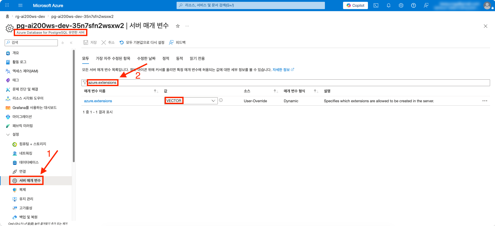
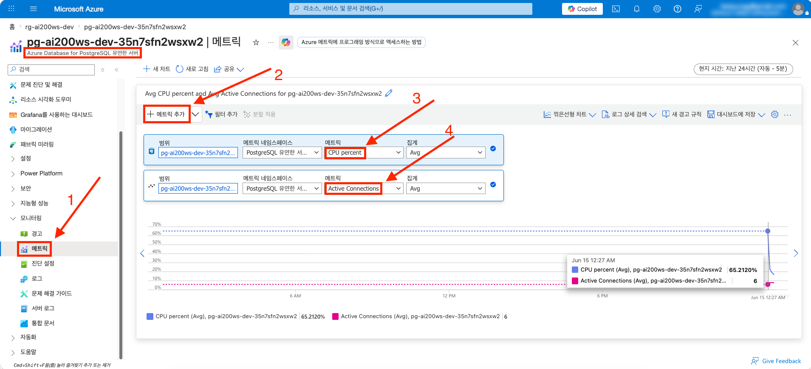

# session-02 (PostgreSQL pgvector 비교)

👈 [session-01](./01-rag-mvp.md)

> [!IMPORTANT]
> **사전 준비 조건**
>
> - [session-00](./00-setup.md), [session-01](./01-rag-mvp.md) 완료 — Resource Group · Azure OpenAI · Cosmos DB (벡터 인덱스 + 시드 데이터) · User Assigned Managed Identity 가 본인 구독에 존재
> - 시작본 코드를 작업 폴더로 받기 — [시작본 코드 받기](#시작본-코드-받기) 참고

---

## 시작본 코드 받기

다음 명령을 그대로 복사해 실행합니다. [session-01](./01-rag-mvp.md) 의 결과물이 들어 있는 작업 폴더 `workshop/` 위에 본 세션의 시작본 코드가 덮입니다.

```bash
# Linux · macOS · WSL
cp -a save-points/session-02/start/. workshop/
```

```powershell
# Windows PowerShell
Copy-Item -Path save-points/session-02/start/* -Destination workshop -Recurse -Force
```

이후 본 세션의 모든 명령은 `workshop/` 안에서 실행합니다. 터미널을 `workshop/` 로 이동합니다.

```bash
# Linux · macOS · WSL
cd workshop
```

```powershell
# Windows PowerShell
Set-Location workshop
```

시작본에서 학습자가 채우는 파일은 세 개입니다 : `infra/sessions/02-pgvector/main.bicep` (모듈 조립), `apps/api/src/stores/pg_store.py` (PostgreSQL 스토어 구현), `scripts/seed_both.py` (비교 측정). 나머지는 완성되어 제공됩니다.

---

## 1 단계 : PostgreSQL 프로비저닝

`infra/sessions/02-pgvector/main.bicep` 을 열고, 아래 순서대로 각 주석을 찾아 바로 아래에 코드를 추가합니다.

### 1.1 호출할 모듈 한눈에 보기

`infra/modules/session-02/` 에 완성되어 있는 모듈입니다.

```text
infra/modules/session-02/
├── postgres-flexible-server.bicep   # Burstable B1ms 등급, Entra ID 전용 인증 (passwordAuth 비활성)
├── postgres-aad-admin.bicep         # Entra ID 관리자 부여
├── postgres-server-config.bicep     # azure.extensions = VECTOR 사전 허용
├── postgres-firewall-rule.bicep     # 본인 PC IP 허용
└── postgres-database.bicep          # appdb 데이터베이스
```

> [!WARNING]
> PostgreSQL Flexible Server 는 서버 상태를 바꾸는 자식 자원 (관리자 · 서버 파라미터 · firewall rule · 데이터베이스) 을 동시에 생성하면 409 Conflict (server busy) 가 발생합니다. 아래 조립에서 각 모듈의 `dependsOn` 으로 하나가 끝난 후 다음 하나를 만들도록 순차 처리합니다.

### 1.2 PostgreSQL Flexible Server

`// -------- 1) PostgreSQL Flexible Server 모듈 호출하기` 주석 아래에 추가합니다.

```bicep
module postgres '../../modules/session-02/postgres-flexible-server.bicep' = {
  name: 'postgres'
  params: {
    name: pgName
    location: location
    version: postgresVersion
    skuName: 'Standard_B1ms'
    skuTier: 'Burstable'
    storageSizeGB: 32
    tags: commonTags
  }
}
```

### 1.3 Entra ID 관리자 — 배포 사용자

`// -------- 2) Entra ID 관리자 (배포 사용자) 모듈 호출하기` 주석 아래에 추가합니다. 비밀번호 인증이 꺼진 서버는 Entra ID 관리자가 최소 한 명 있어야 접속이 가능합니다.

```bicep
module aadAdminUser '../../modules/session-02/postgres-aad-admin.bicep' = if (!empty(userObjectId)) {
  name: 'aadAdminUser'
  params: {
    serverName: postgres.outputs.name
    principalObjectId: userObjectId
    principalName: userPrincipalName
    principalType: 'User'
  }
}
```

### 1.4 Entra ID 관리자 — User Assigned Managed Identity

`// -------- 3) Entra ID 관리자 (User Assigned Managed Identity) 모듈 호출하기` 주석 아래에 추가합니다. `ca-api` 가 `STORE_BACKEND=pg` 로 PostgreSQL 에 접속할 때 User Assigned Managed Identity 토큰을 사용하므로, 이 신원도 관리자로 부여합니다. 관리자를 동시에 생성하면 충돌하므로 `dependsOn` 으로 사용자 관리자 뒤에 직렬화합니다.

```bicep
module aadAdminUami '../../modules/session-02/postgres-aad-admin.bicep' = {
  name: 'aadAdminUami'
  params: {
    serverName: postgres.outputs.name
    principalObjectId: uami.properties.principalId
    principalName: uamiName
    principalType: 'ServicePrincipal'
  }
  dependsOn: [
    aadAdminUser
  ]
}
```

### 1.5 서버 파라미터 — azure.extensions = VECTOR

`// -------- 4) 서버 파라미터 azure.extensions=VECTOR 모듈 호출하기` 주석 아래에 추가합니다. 이 allowlist 에 등록되어 있어야 데이터베이스에서 `CREATE EXTENSION vector` 가 동작합니다.

```bicep
module serverConfig '../../modules/session-02/postgres-server-config.bicep' = {
  name: 'serverConfig'
  params: {
    serverName: postgres.outputs.name
    configName: 'azure.extensions'
    value: 'VECTOR'
  }
  dependsOn: [
    aadAdminUami
  ]
}
```

### 1.6 firewall rule — 본인 PC IP

`// -------- 5) firewall rule (본인 PC IP) 모듈 호출하기` 주석 아래에 추가합니다.

```bicep
module firewallRule '../../modules/session-02/postgres-firewall-rule.bicep' = {
  name: 'firewallRule'
  params: {
    serverName: postgres.outputs.name
    name: 'dev-client-ip'
    startIpAddress: devClientIpAddress
  }
  dependsOn: [
    serverConfig
  ]
}
```

### 1.7 데이터베이스 appdb + 출력값

`// -------- 6) 데이터베이스 appdb 모듈 호출하기` 주석 아래에 데이터베이스 모듈을, 그리고 `// -------- 출력` 주석 아래에 출력값을 추가합니다.

```bicep
module database '../../modules/session-02/postgres-database.bicep' = {
  name: 'database'
  params: {
    serverName: postgres.outputs.name
    name: databaseName
  }
  dependsOn: [
    firewallRule
  ]
}
```

```bicep
output postgresName string = postgres.outputs.name
output postgresFqdn string = postgres.outputs.fqdn
output databaseName string = databaseName
```

### 1.8 조립 검증 — 컴파일

배포 전에 Bicep 이 오류 없이 빌드되는지 확인합니다.

```bash
# Linux · macOS · WSL
az bicep build --file infra/sessions/02-pgvector/main.bicep --stdout > /dev/null && echo "BUILD OK"
```

`BUILD OK` 가 출력되면 조립이 완료된 것입니다.

> [!NOTE]
> **한국어 Windows PowerShell 은 `--stdout` 대신 `--outfile` 을 사용합니다**
>
> `--stdout` 은 컴파일된 JSON 을 콘솔에 출력하는데, 한국어 Windows 콘솔 인코딩 (cp949) 이 JSON 안의 일부 문자를 인코딩하지 못해 `UnicodeEncodeError` 로 멈출 수 있습니다. `--outfile` 로 파일에 바로 쓰면 콘솔을 거치지 않고 UTF-8 로 저장되므로 이 문제가 없습니다. 출력 파일은 검증용 임시 산출물이라 그대로 두거나 삭제하면 됩니다.
>
> ```powershell
> # Windows PowerShell — $env:TEMP 는 Windows 가 항상 제공하는 임시 폴더
> az bicep build --file infra/sessions/02-pgvector/main.bicep --outfile $env:TEMP\main.json
> if ($?) { "BUILD OK" }
> ```

### 1.9 변경사항 미리보기

```bash
# 본인 식별 정보를 환경변수로 저장 — 배포 명령 인자로 직접 전달
OID=$(az ad signed-in-user show --query id -o tsv)
UPN=$(az ad signed-in-user show --query userPrincipalName -o tsv)
MY_IP=$(curl -s ifconfig.me)

az deployment group what-if \
  --resource-group rg-ai200ws-dev \
  --template-file infra/sessions/02-pgvector/main.bicep \
  --parameters infra/sessions/02-pgvector/main.bicepparam \
  --parameters userObjectId=$OID userPrincipalName=$UPN devClientIpAddress=$MY_IP
```

```powershell
# Windows PowerShell
$OID = (az ad signed-in-user show --query id -o tsv)
$UPN = (az ad signed-in-user show --query userPrincipalName -o tsv)
$MY_IP = (Invoke-RestMethod -Uri "https://ifconfig.me")

az deployment group what-if `
  --resource-group rg-ai200ws-dev `
  --template-file infra/sessions/02-pgvector/main.bicep `
  --parameters infra/sessions/02-pgvector/main.bicepparam `
  --parameters userObjectId=$OID userPrincipalName=$UPN devClientIpAddress=$MY_IP
```

> [!CAUTION]
> `userObjectId`, `userPrincipalName`, `devClientIpAddress` 는 `bicepparam` 파일에 작성해두지 않습니다. git history 에 영구히 남아 포트폴리오 공개 시 본인 식별 정보가 노출됩니다. 배포 명령을 실행할 때마다 `--parameters key=value` 인자로 직접 넘겨주는 방식으로 전달합니다.

### 1.10 실제 배포

```bash
az deployment group create \
  --resource-group rg-ai200ws-dev \
  --template-file infra/sessions/02-pgvector/main.bicep \
  --parameters infra/sessions/02-pgvector/main.bicepparam \
  --parameters userObjectId=$OID userPrincipalName=$UPN devClientIpAddress=$MY_IP
```

```powershell
# Windows PowerShell
az deployment group create `
  --resource-group rg-ai200ws-dev `
  --template-file infra/sessions/02-pgvector/main.bicep `
  --parameters infra/sessions/02-pgvector/main.bicepparam `
  --parameters userObjectId=$OID userPrincipalName=$UPN devClientIpAddress=$MY_IP
```

> [!NOTE]
> PostgreSQL Flexible Server 생성에 약 **5분** 소요됩니다.

### 1.11 배포 완료 확인

서버 이름은 글로벌 unique 보장을 위해 접미사가 붙으므로 (예: `pg-ai200ws-dev-xxxxx`), 이름과 도메인을 조회해 환경변수에 담아둡니다.

```bash
PG_NAME=$(az postgres flexible-server list -g rg-ai200ws-dev --query "[0].name" -o tsv)
PG_HOST=$(az postgres flexible-server list -g rg-ai200ws-dev --query "[0].fullyQualifiedDomainName" -o tsv)

az postgres flexible-server show \
  --name $PG_NAME \
  --resource-group rg-ai200ws-dev \
  --query "{state:state, version:version}" -o jsonc
```

```powershell
# Windows PowerShell
$PG_NAME = (az postgres flexible-server list -g rg-ai200ws-dev --query "[0].name" -o tsv)
$PG_HOST = (az postgres flexible-server list -g rg-ai200ws-dev --query "[0].fullyQualifiedDomainName" -o tsv)

az postgres flexible-server show `
  --name $PG_NAME `
  --resource-group rg-ai200ws-dev `
  --query "{state:state, version:version}" -o jsonc
```

기대 — `state: Ready`.

---

## 2 단계 : 복붙으로 경험해보기

### 2.1 PostgreSQL 데이터베이스 초기화

Entra ID 토큰을 비밀번호로 사용해 `psql` 로 접속합니다. ([1.11](#111-배포-완료-확인) 의 `PG_HOST`, `UPN` 환경변수를 사용합니다.)

```bash
PGPASSWORD=$(az account get-access-token \
  --resource https://ossrdbms-aad.database.windows.net \
  --query accessToken -o tsv) \
psql "host=$PG_HOST port=5432 dbname=appdb user=$UPN sslmode=require"
```

```powershell
# Windows PowerShell
$env:PGPASSWORD = (az account get-access-token `
  --resource https://ossrdbms-aad.database.windows.net `
  --query accessToken -o tsv)
psql "host=$PG_HOST port=5432 dbname=appdb user=$UPN sslmode=require"
```

접속한 `psql` 안에서 다음 SQL 을 그대로 복사해 실행합니다.

```sql
-- 1) pgvector extension 활성화
--    azure.extensions 서버 파라미터에 VECTOR 가 사전 허용되어 있어야 동작합니다 (Bicep 에서 설정 완료).
CREATE EXTENSION IF NOT EXISTS vector;
```

```sql
-- 2) chunks 테이블 — text-embedding-3-large 는 3072 차원.
--    vector(3072) 는 HNSW 의 2000 차원 한계에 막히므로 halfvec(3072) 를 사용합니다.
CREATE TABLE IF NOT EXISTS chunks (
  id         TEXT PRIMARY KEY,
  doc_id     TEXT NOT NULL,
  title      TEXT,
  content    TEXT NOT NULL,
  embedding  halfvec(3072) NOT NULL,
  metadata   JSONB,
  created_at TIMESTAMPTZ DEFAULT NOW()
);
```

```sql
-- 3) HNSW 인덱스 — halfvec 전용 코사인 거리 ops 클래스 사용
CREATE INDEX IF NOT EXISTS chunks_embedding_hnsw
  ON chunks USING hnsw (embedding halfvec_cosine_ops)
  WITH (m = 16, ef_construction = 64);
```

```sql
-- 4) 메타데이터 필터를 위한 보조 인덱스 (선택)
CREATE INDEX IF NOT EXISTS chunks_doc_id_idx ON chunks (doc_id);
```

### 2.2 PostgreSQL 스토어 구현

`apps/api/src/stores/pg_store.py` 의 `PgVectorStore` 메서드 본체가 비어 있습니다. 각 메서드의 주석을 찾아 아래 코드를 채웁니다.

`open` — Entra 토큰을 비밀번호 자리에 넣어 연결 풀을 엽니다.

```python
        token = await self._credential.get_token(_PG_AAD_SCOPE)
        conninfo = (
            f"host={self._settings.postgres_host} "
            f"port={self._settings.postgres_port} "
            f"dbname={self._settings.postgres_database} "
            f"user={self._settings.postgres_user} "
            f"password={token.token} "
            f"sslmode=require"
        )
        self._pool = AsyncConnectionPool(
            conninfo,
            min_size=1,
            max_size=self._settings.postgres_pool_max_size,
            open=False,
            configure=_configure_connection,
        )
        await self._pool.open()
```

`vector_search` — `SET LOCAL hnsw.ef_search` 로 정확도를 조절한 뒤 코사인 거리로 검색합니다.

```python
        assert self._pool is not None, "open() 을 먼저 호출해야 합니다."
        ef_search = self._settings.hnsw_ef_search

        sources: list[Source] = []
        async with self._pool.connection() as conn:
            # SET LOCAL 은 트랜잭션 안에서만 유효 — 풀로 반환된 연결에 설정이 새지 않는다.
            async with conn.transaction():
                if ef_search is not None:
                    await conn.execute(f"SET LOCAL hnsw.ef_search = {int(ef_search)}")  # SET LOCAL 은 파라미터 바인딩 불가 — int 직접 삽입
                cur = await conn.execute(_SEARCH_SQL, (HalfVector(query_embedding), top_k))
                rows = await cur.fetchall()

        for doc_id, title, distance in rows:
            sources.append(
                Source(
                    doc_id=doc_id,
                    title=title,
                    score=max(0.0, min(1.0, 1.0 - float(distance))),
                )
            )
        return sources
```

`fetch_content` 와 `close` 를 마저 채웁니다.

```python
    async def fetch_content(self, doc_id: str) -> str:
        assert self._pool is not None, "open() 을 먼저 호출해야 합니다."
        async with self._pool.connection() as conn:
            cur = await conn.execute(_CONTENT_SQL, (doc_id,))
            row = await cur.fetchone()
        return row[0] if row else ""

    async def close(self) -> None:
        if self._pool is not None:
            await self._pool.close()
        await self._credential.close()
```

> [!WARNING]
> `register_vector_async` 는 데이터베이스에 `vector` extension 이 이미 있어야 동작합니다. 풀 초기화 콜백에서 호출하므로, [2.1](#21-postgresql-데이터베이스-초기화) 의 `CREATE EXTENSION vector` 를 먼저 실행하지 않으면 풀이 열리지 않습니다 (PoolTimeout 후 종료).

### 2.3 비교 실행

`scripts/seed_both.py` 의 `_load_cosmos` · `_search_cosmos` · `_load_pg` · `_search_pg` 함수가 비어 있습니다. 각 함수의 주석을 찾아 아래 코드를 채웁니다.

`_load_cosmos` — Cosmos DB 에 corpus 를 upsert 합니다.

```python
async def _load_cosmos(
    credential: DefaultAzureCredential,
    corpus: list[tuple[str, str, str]],
    embeddings: list[list[float]],
) -> None:
    client = CosmosClient(url=_env("COSMOS_ENDPOINT"), credential=credential)
    db = client.get_database_client(_env("COSMOS_DATABASE", "appdb"))
    container = db.get_container_client(_env("COSMOS_CHUNKS_CONTAINER", "chunks"))
    for (doc_id, title, content), emb in zip(corpus, embeddings, strict=True):
        await container.upsert_item(
            {"id": doc_id, "doc_id": doc_id, "title": title, "content": content, "embedding": emb}
        )
    await client.close()
```

`_search_cosmos` — VectorDistance 로 top-k doc_id 를 가져옵니다.

```python
async def _search_cosmos(
    credential: DefaultAzureCredential, query_emb: list[float]
) -> list[str]:
    client = CosmosClient(url=_env("COSMOS_ENDPOINT"), credential=credential)
    db = client.get_database_client(_env("COSMOS_DATABASE", "appdb"))
    container = db.get_container_client(_env("COSMOS_CHUNKS_CONTAINER", "chunks"))
    sql = (
        "SELECT TOP @topK c.doc_id, VectorDistance(c.embedding, @e) AS d "
        "FROM c ORDER BY VectorDistance(c.embedding, @e)"
    )
    params = [{"name": "@topK", "value": TOP_K}, {"name": "@e", "value": query_emb}]
    got = [item["doc_id"] async for item in container.query_items(query=sql, parameters=params)]
    await client.close()
    return got
```

`_load_pg` — extension · 테이블 · HNSW 인덱스를 idempotent 하게 만든 뒤 적재합니다.

```python
async def _load_pg(
    credential: DefaultAzureCredential,
    corpus: list[tuple[str, str, str]],
    embeddings: list[list[float]],
) -> None:
    token = (await credential.get_token(_PG_AAD_SCOPE)).token
    # 첫 연결은 register 없이 — vector extension 이 아직 없을 수 있으므로 (chicken-and-egg).
    async with await psycopg.AsyncConnection.connect(_pg_conninfo(token), autocommit=True) as conn:
        await conn.execute("CREATE EXTENSION IF NOT EXISTS vector")
        await conn.execute(
            "CREATE TABLE IF NOT EXISTS chunks ("
            "id TEXT PRIMARY KEY, doc_id TEXT NOT NULL, title TEXT, content TEXT NOT NULL, "
            "embedding halfvec(3072) NOT NULL, metadata JSONB, created_at TIMESTAMPTZ DEFAULT NOW())"
        )
        await conn.execute(
            "CREATE INDEX IF NOT EXISTS chunks_embedding_hnsw "
            "ON chunks USING hnsw (embedding halfvec_cosine_ops) WITH (m = 16, ef_construction = 64)"
        )
        # extension 이 생긴 뒤에 register — 이제 halfvec 어댑터를 쓸 수 있다.
        await register_vector_async(conn)
        for (doc_id, title, content), emb in zip(corpus, embeddings, strict=True):
            await conn.execute(
                "INSERT INTO chunks (id, doc_id, title, content, embedding) "
                "VALUES (%s, %s, %s, %s, %s) ON CONFLICT (id) DO UPDATE SET embedding = EXCLUDED.embedding",
                (doc_id, doc_id, title, content, HalfVector(emb)),
            )
```

`_search_pg` — SET LOCAL hnsw.ef_search 로 정확도를 조절한 뒤 코사인 거리로 검색합니다.

```python
async def _search_pg(
    credential: DefaultAzureCredential, query_emb: list[float], ef_search: int
) -> list[str]:
    token = (await credential.get_token(_PG_AAD_SCOPE)).token
    async with await psycopg.AsyncConnection.connect(_pg_conninfo(token)) as conn:
        await register_vector_async(conn)
        async with conn.transaction():
            await conn.execute(f"SET LOCAL hnsw.ef_search = {int(ef_search)}")  # SET LOCAL 은 파라미터 바인딩 불가 — int 직접 삽입
            cur = await conn.execute(
                "SELECT doc_id, embedding <=> %s AS d FROM chunks ORDER BY d LIMIT %s",
                (HalfVector(query_emb), TOP_K),
            )
            rows = await cur.fetchall()
    return [r[0] for r in rows]
```

실행 전 필요한 환경변수를 설정합니다. ([1.11](#111-배포-완료-확인) 의 `PG_NAME` · `PG_HOST` 환경변수를 사용합니다.)

```bash
# Linux · macOS · WSL
export AZURE_OPENAI_ENDPOINT=$(az cognitiveservices account list -g rg-ai200ws-dev --query "[0].properties.endpoint" -o tsv)
export AZURE_OPENAI_EMBED_DEPLOYMENT="text-embedding-3-large"
export AZURE_OPENAI_API_VERSION="2024-08-01-preview"
export COSMOS_ENDPOINT=$(az cosmosdb list -g rg-ai200ws-dev --query "[0].documentEndpoint" -o tsv)
export COSMOS_DATABASE="appdb"
export COSMOS_CHUNKS_CONTAINER="chunks"
export POSTGRES_HOST=$PG_HOST
export POSTGRES_DATABASE="appdb"
export POSTGRES_USER=$(az ad signed-in-user show --query userPrincipalName -o tsv)
```

```powershell
# Windows PowerShell
$env:AZURE_OPENAI_ENDPOINT = (az cognitiveservices account list -g rg-ai200ws-dev --query "[0].properties.endpoint" -o tsv)
$env:AZURE_OPENAI_EMBED_DEPLOYMENT = "text-embedding-3-large"
$env:AZURE_OPENAI_API_VERSION = "2024-08-01-preview"
$env:COSMOS_ENDPOINT = (az cosmosdb list -g rg-ai200ws-dev --query "[0].documentEndpoint" -o tsv)
$env:COSMOS_DATABASE = "appdb"
$env:COSMOS_CHUNKS_CONTAINER = "chunks"
$env:POSTGRES_HOST = $PG_HOST
$env:POSTGRES_DATABASE = "appdb"
$env:POSTGRES_USER = (az ad signed-in-user show --query userPrincipalName -o tsv)
```

```bash
# apps/api 의 의존성 환경으로 실행 (psycopg · pgvector · azure-cosmos 포함)
uv run --project apps/api python scripts/seed_both.py
```

기대 출력 형태.

```
| backend          | docs | p50 (ms) | p95 (ms) | recall@5 |
|------------------|------|----------|----------|----------|
| cosmos           |  120 |       45 |       78 |     1.00 |
| pg (ef=100)      |  120 |       18 |       33 |     1.00 |
| pg (ef=20)       |  120 |       12 |       24 |     0.95 |
| pg (ef=4)        |  120 |        8 |       17 |     0.78 |
```

> [!TIP]
> **ef_search 와 recall 의 트레이드오프** — `hnsw.ef_search` 를 낮추면 HNSW 가 탐색하는 후보 수가 줄어 검색은 빨라지지만, 정답 top-5 를 놓칠 확률이 올라가 recall 이 떨어집니다. 데이터가 수백 건 수준으로 작으면 쿼리 플래너가 인덱스 대신 순차 스캔 (정확 검색) 을 골라 recall 이 항상 1.00 으로 보일 수 있습니다 — 이때 `ef_search` 를 아주 낮게 (예: 4) 주면 근사 검색의 recall 저하가 드러납니다.

---

## 3 단계 : Azure Portal · psql 로 확인

1·2번은 [Azure Portal](https://portal.azure.com) 에서, 3번은 psql 터미널에서 확인합니다.

1. **PostgreSQL Flexible Server** → **Server parameters** → 검색창에 `azure.extensions` 입력 → 값에 `VECTOR` 가 포함되어 있는지 확인

   

   `azure.extensions` 파라미터의 **VALUE** 에 `VECTOR` 가 포함되어 있는지 확인합니다. 이 allowlist 에 없으면 `CREATE EXTENSION vector` 가 실패합니다.

2. **PostgreSQL Flexible Server** → **Metrics** → 두 메트릭 추가
   - `CPU percent` — seed 실행 직후 스파이크
   - `Active Connections` — 풀 크기 만큼 일시적으로 증가

   

   seed 실행 직후 `CPU percent` 가 스파이크를 그리는지, `Active Connections` 가 연결 풀 크기만큼 일시적으로 증가했다가 내려오는지 확인합니다.

3. psql 터미널에서 `EXPLAIN ANALYZE` 로 벡터 검색 실행 계획 확인

   `EXPLAIN ANALYZE` 는 Azure Portal 의 기능이 아니라 PostgreSQL 의 SQL 명령어로, 쿼리가 실제로 어떤 실행 계획을 거쳤는지 보여줍니다. [2.1](#21-postgresql-데이터베이스-초기화) 에서 접속한 psql 세션을 그대로 사용하거나, 같은 방식으로 다시 접속해 다음 쿼리를 복사·실행합니다. `chunks` 의 첫 행을 기준 벡터로 삼아 자기 자신을 검색하므로 별도 파라미터 없이 그대로 동작합니다.

   ```sql
   EXPLAIN ANALYZE
   SELECT id, title, embedding <=> (SELECT embedding FROM chunks LIMIT 1) AS distance
   FROM chunks ORDER BY distance LIMIT 5;
   ```

   다음과 비슷한 출력이 표시됩니다.

   ```
                                                           QUERY PLAN
   --------------------------------------------------------------------------------------------------------------------------
    Limit  (cost=10.56..10.57 rows=5 width=86) (actual time=2.444..2.447 rows=5 loops=1)
      InitPlan 1 (returns $0)
        ->  Limit  (cost=0.00..0.07 rows=1 width=18) (actual time=0.009..0.010 rows=1 loops=1)
              ->  Seq Scan on chunks chunks_1  (cost=0.00..8.20 rows=120 width=18) ...
      ->  Sort  (cost=10.49..10.79 rows=120 width=86) (actual time=2.442..2.443 rows=5 loops=1)
            Sort Key: ((chunks.embedding <=> $0))
            Sort Method: top-N heapsort  Memory: 25kB
            ->  Seq Scan on chunks  (cost=0.00..8.50 rows=120 width=86) (actual time=0.179..2.330 rows=120 loops=1)
    Planning Time: 2.043 ms
    Execution Time: 2.576 ms
   ```

   실행 계획에 `Seq Scan on chunks` 가 보이는데, 이는 본 챌린지 데이터가 120 건으로 작아 플래너가 HNSW 인덱스 대신 순차 스캔 (정확 검색) 을 고른 것이며 정상입니다 ([2.3](#23-비교-실행) 의 TIP · [함정 모음](../pitfalls/common.md) 참고). 데이터가 커지거나 같은 세션에서 `SET LOCAL enable_seqscan = off` 로 순차 스캔을 강제하면 `Index Scan using chunks_embedding_hnsw` 가 실행 계획에 나타납니다.

---

> [!TIP]
> 진행 중 막혔다면 완성본 코드를 그대로 덮어쓰고 어디가 달랐는지 직접 비교할 수 있습니다.
>
> ```bash
> cp -a save-points/session-02/complete/. workshop/
> ```
>
> ```powershell
> # Windows PowerShell
> Copy-Item -Path save-points/session-02/complete/* -Destination workshop -Recurse -Force
> ```

---

## 마무리

- **save-point** — 본 세션의 모든 변경은 `save-points/session-02/complete/` 와 일치합니다. 다음 세션으로 넘어가려면 `workshop/` 을 그대로 두고 bash: `cp -a save-points/session-03/start/. workshop/` · PowerShell: `Copy-Item -Path save-points/session-03/start/* -Destination workshop -Recurse -Force` 를 실행합니다 (다음 세션의 시작본이 위에 덮입니다)
- **자원 정리** — PostgreSQL Flexible Server 는 컴퓨트 비용이 시간당 누적되므로, 본 세션 검증을 마치면 정리하는 것을 권장합니다. [session-03](./03-redis-cache.md) · [session-04](./04-async-ingestion.md) 에서 다시 사용할 때는 `infra/sessions/02-pgvector/main.bicep` 을 다시 배포해 재생성합니다. 정리 방법은 [docs/cleanup.md](../cleanup.md) 를 참고합니다
- **다음 세션 미리보기** — [session-03](./03-redis-cache.md) 에서는 같은 질문을 두 번 호출하면 두 번째 응답을 빠르게 돌려주는 Managed Redis 시맨틱 캐시를 도입합니다

---

👈 [session-01](./01-rag-mvp.md) | [session-03](./03-redis-cache.md) 👉
