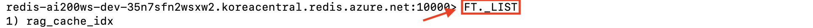
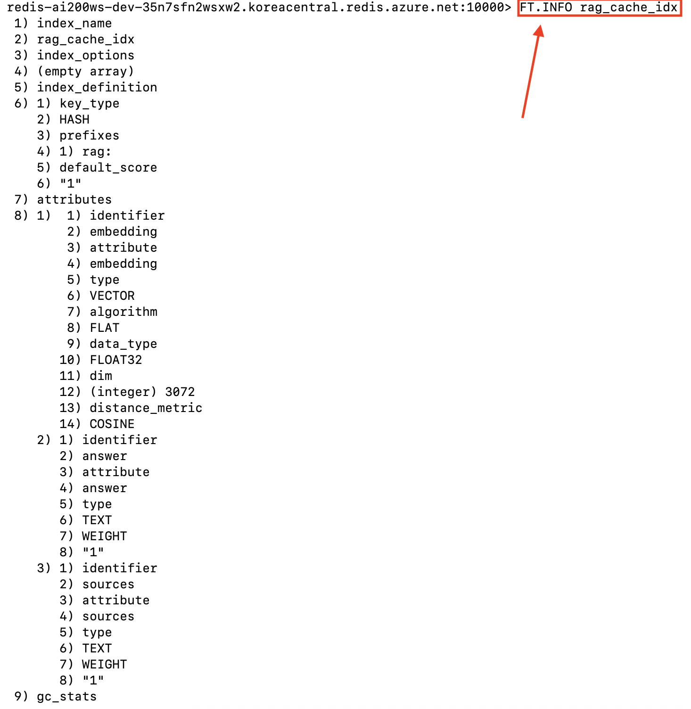
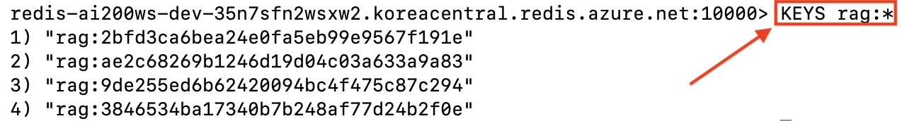
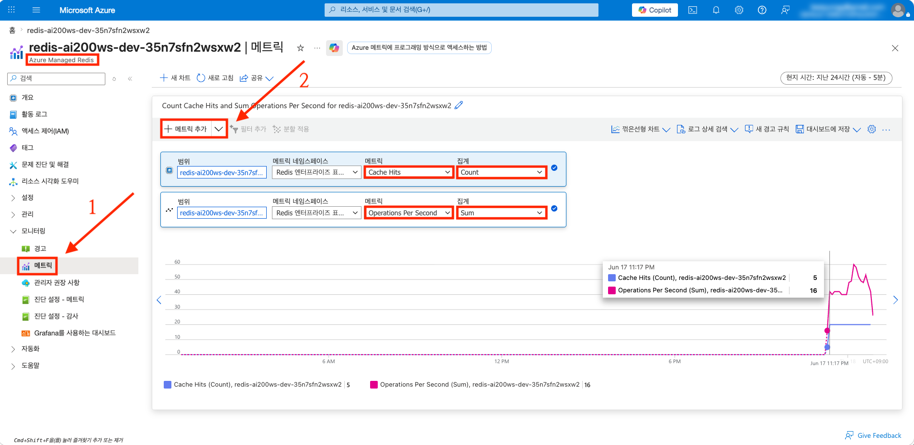
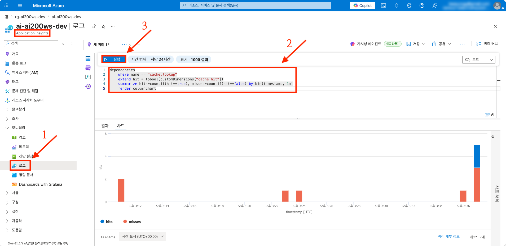
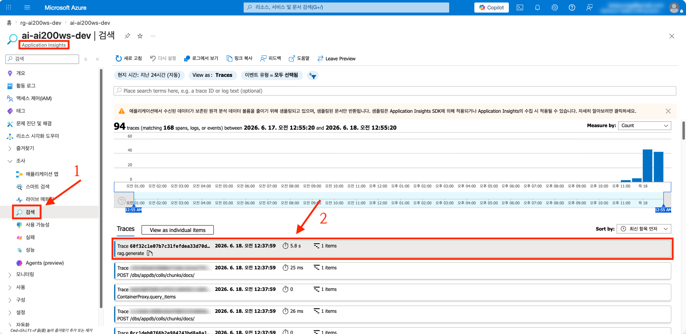
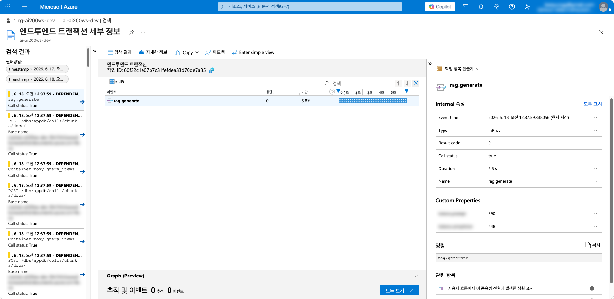

# session-03 (Managed Redis 시맨틱 캐시)

👈 [session-02](./02-pgvector.md)

> [!IMPORTANT]
> **사전 준비 조건**
>
> - [session-00](./00-setup.md), [session-01](./01-rag-mvp.md) 완료 — Azure OpenAI · Azure Container Apps · User Assigned Managed Identity · Application Insights 가 본인 구독에 존재
> - (선택) [session-02](./02-pgvector.md) 완료 — 두 벡터 백엔드의 latency 베이스라인이 있으면 캐시 효과 비교가 풍부함
> - 시작본 코드를 작업 폴더로 받기 — [시작본 코드 받기](#시작본-코드-받기) 참고

---

## 시작본 코드 받기

[session-02](./02-pgvector.md) 의 결과물이 들어 있는 작업 폴더 `workshop/` 위에 본 세션의 시작본 코드가 덮입니다.

```bash
# Linux · macOS · WSL
cp -a save-points/session-03/start/. workshop/
```

```powershell
# Windows PowerShell
Copy-Item -Path save-points/session-03/start/* -Destination workshop -Recurse -Force
```

이후 본 세션의 모든 명령은 `workshop/` 안에서 실행한다고 가정합니다.

학습자가 채우는 파일은 세 개입니다 : `infra/sessions/03-redis-cache/main.bicep` (모듈 조립), `apps/api/src/cache/redis_client.py` (Redis 클라이언트), `apps/api/src/cache/semantic.py` (시맨틱 캐시). 나머지는 완성되어 제공됩니다.

---

## 1 단계 : 프로비저닝

`workshop/infra/sessions/03-redis-cache/main.bicep` 을 열고, 아래 순서대로 각 주석을 찾아 코드를 채웁니다.

### 1.1 호출할 모듈 한눈에 보기

`infra/modules/session-03/` 에 완성되어 있는 모듈입니다.

```text
infra/modules/session-03/
├── redis-enterprise.bicep                # Azure Managed Redis 클러스터 (Balanced_B0)
├── redis-enterprise-database.bicep       # RediSearch 모듈 + evictionPolicy=NoEviction + Entra 전용 인증
└── redis-access-policy-assignment.bicep  # Entra principal 을 기본 access policy 에 부여
```

### 1.2 클러스터 + 데이터베이스

`// -------- 1) Azure Managed Redis 클러스터 모듈 호출하기` 와 `// -------- 2) 데이터베이스 default 모듈 호출하기` 주석 아래에 각각 추가합니다.

```bicep
module redis '../../modules/session-03/redis-enterprise.bicep' = {
  name: 'redis'
  params: {
    name: redisName
    location: location
    skuName: 'Balanced_B0'
    tags: commonTags
  }
}

module redisDatabase '../../modules/session-03/redis-enterprise-database.bicep' = {
  name: 'redisDatabase'
  params: {
    clusterName: redis.outputs.name
  }
}
```

### 1.3 access policy assignment (User Assigned Managed Identity + 사용자)

`// -------- 3) ...` 과 `// -------- 4) ...` 주석 아래에 각각 추가합니다. access policy assignment 를 동시에 만들면 클러스터가 Updating 상태라 충돌할 수 있으므로 `dependsOn` 으로 직렬화합니다.

```bicep
module accessUami '../../modules/session-03/redis-access-policy-assignment.bicep' = {
  name: 'accessUami'
  params: {
    clusterName: redis.outputs.name
    principalObjectId: uami.properties.principalId
  }
  dependsOn: [
    redisDatabase
  ]
}

module accessUser '../../modules/session-03/redis-access-policy-assignment.bicep' = if (!empty(userObjectId)) {
  name: 'accessUser'
  params: {
    clusterName: redis.outputs.name
    principalObjectId: userObjectId
  }
  dependsOn: [
    accessUami
  ]
}
```

### 1.4 출력값

`// -------- 출력` 주석 아래에 추가합니다.

```bicep
output redisName string = redis.outputs.name
output redisHostName string = redis.outputs.hostName
output redisPort int = redisDatabase.outputs.port
```

### 1.5 조립 검증 + 배포

```bash
az bicep build --file infra/sessions/03-redis-cache/main.bicep --outfile /tmp/main.json && echo "BUILD OK"
```

```bash
OID=$(az ad signed-in-user show --query id -o tsv)

az deployment group what-if `
  --resource-group rg-ai200ws-dev `
  --template-file infra/sessions/03-redis-cache/main.bicep `
  --parameters infra/sessions/03-redis-cache/main.bicepparam `
  --parameters userObjectId=$OID
```

what-if 결과가 의도대로면 `what-if` 를 `create` 로 바꿔 배포합니다.

> [!NOTE]
> Azure Managed Redis 클러스터 생성에 약 **8~12분** 소요됩니다. 본 챌린지에서 가장 오래 걸리는 배포 중 하나입니다.

> [!CAUTION]
> **비용 안내** — Managed Redis 는 본 챌린지에서 가장 비싼 idle 자원입니다 (최소 등급 Balanced_B0 라도 시간당 누적). 세션을 마친 뒤에는 즉시 [자원 정리](../cleanup.md) 를 수행하는 것을 권장합니다.

### 1.6 배포 완료 확인

클러스터 이름은 글로벌 unique 보장을 위해 접미사가 붙으므로 (예: `redis-ai200ws-dev-xxxxx`), 이름과 호스트를 조회해 환경변수에 담아둡니다.

```bash
REDIS_NAME=$(az redisenterprise list -g rg-ai200ws-dev --query "[0].name" -o tsv)
REDIS_HOST=$(az redisenterprise list -g rg-ai200ws-dev --query "[0].hostName" -o tsv)

az redisenterprise show -n $REDIS_NAME -g rg-ai200ws-dev \
  --query "{state:resourceState, sku:sku.name, host:hostName}" -o jsonc
```

기대 — `state: Running`, `sku: Balanced_B0`.

---

## 2 단계 : 복붙으로 경험해보기

### 2.1 Redis 클라이언트 구현

`apps/api/src/cache/redis_client.py` 의 `build_redis_client` 본체가 비어 있습니다. 주석 아래에 채웁니다. 저수준으로 토큰을 비밀번호에 넣는 대신 `redis-entraid` 의 credential provider 를 써서 토큰 발급·갱신·TLS 를 캡슐화합니다.

```python
    credential_provider = create_from_default_azure_credential(
        (_REDIS_AAD_SCOPE,),
    )
    return Redis(
        host=settings.redis_host,
        port=settings.redis_port,
        ssl=True,
        credential_provider=credential_provider,
        decode_responses=False,
        protocol=2,
    )
```

> [!CAUTION]
> **`protocol=2` (RESP2) 를 반드시 명시** — Azure Managed Redis 는 `redis-py` 8.x 와 기본적으로 RESP3 로 협상합니다. 그런데 `redis-py` 의 고수준 `ft().search()` 결과 파서가 RESP3 응답(`{'total_results': ..., 'results': [...]}`)을 처리하지 못해 `result.docs` 가 **항상 빈 리스트**가 됩니다. 그러면 인덱스·데이터가 멀쩡하고 `FT.SEARCH` 를 raw 로 실행하면 매칭이 나오는데도, 코드 상으로는 **임계값과 무관하게 캐시가 영원히 miss** 합니다. `protocol=2` 로 고정하면 정상 파싱됩니다. (디버깅 팁: `FT.INFO` 의 `num_docs` 는 증가하는데 앱은 계속 miss 면 이 문제를 의심합니다.)

### 2.2 시맨틱 캐시 구현

RAG 응답 캐싱은 질문 문자열이 조금만 달라도 다른 키가 되는 문자열 매칭만으로는 hit 율이 너무 낮으므로, 질문 임베딩의 cosine 유사도가 임계값 이상이면 같은 질문으로 보는 **임베딩 기반 시맨틱 캐시**를 사용합니다. 본 챌린지는 **임계값 0.62 + TTL 24h** 를 채택합니다.

`apps/api/src/cache/semantic.py` 의 `SemanticCache` 메서드를 채웁니다.

`ensure_index` — RediSearch **FLAT** 벡터 인덱스를 (없으면) 생성합니다. 캐시 엔트리 수가 수백~수천이라 FLAT (정확 최근접) 이 적합합니다.

```python
        try:
            await self._r.ft(_INDEX_NAME).info()
            return  # 이미 존재
        except ResponseError:
            pass

        schema = (
            VectorField(
                "embedding",
                "FLAT",
                {"TYPE": "FLOAT32", "DIM": self._dim, "DISTANCE_METRIC": "COSINE"},
            ),
            TextField("answer"),
            TextField("sources"),
        )
        definition = IndexDefinition(prefix=[_KEY_PREFIX], index_type=IndexType.HASH)
        await self._r.ft(_INDEX_NAME).create_index(schema, definition=definition)
```

`lookup` — 질문 임베딩으로 KNN(1) 검색. RediSearch 의 COSINE 은 distance(0~2) 를 반환하므로 `similarity = 1 - distance` 로 환산해 임계값과 비교합니다.

```python
        with _tracer.start_as_current_span("cache.lookup") as span:
            vec = _to_float32_bytes(query_embedding)
            query = (
                Query("*=>[KNN 1 @embedding $vec AS dist]")
                .sort_by("dist")
                .return_fields("answer", "sources", "dist")
                .dialect(2)
            )
            result = await self._r.ft(_INDEX_NAME).search(query, query_params={"vec": vec})

            if result.docs:
                similarity = 1.0 - float(_decode(result.docs[0].dist))
                if similarity >= self._threshold:
                    span.set_attribute("cache_hit", True)
                    span.set_attribute("cache_similarity", similarity)
                    return _to_response(result.docs[0])

            span.set_attribute("cache_hit", False)
            return None
```

> [!IMPORTANT]
> **임계값은 임베딩 모델 기준으로 실측해 정합니다**
> 
> `text-embedding-3-large` 로 한국어 paraphrase 쌍을 실측하면 같은 의미의 질문이 cosine **0.6~0.76**, 의미가 다른 질문이 **0.2~0.3** 에 분포합니다. 예) "회사 휴가 정책 알려줘" ↔ "휴가 규정이 어떻게 돼?" = **0.64**, ↔ "연차 어떻게 신청해?" = 0.23. 따라서 둘을 가르는 컷오프는 **0.62** 근방입니다. (영어 SBERT 류 직관으로 0.9 대를 쓰면 같은 의미인데도 전부 miss 가 됩니다.)

`store` 와 `close` 를 마저 채웁니다. 저장은 **Hash** 로 합니다 — `FT.SEARCH` 는 인덱스 prefix 와 일치하는 hash 키만 인덱싱합니다.

```python
    async def store(
        self, query_embedding: list[float], question: str, response: ChatResponse
    ) -> None:
        key = f"{_KEY_PREFIX}{uuid.uuid4().hex}"
        mapping = {
            "embedding": _to_float32_bytes(query_embedding),
            "question": question,
            "answer": response.answer,
            "sources": json.dumps(
                [s.model_dump() for s in response.sources], ensure_ascii=False
            ),
        }
        await self._r.hset(key, mapping=mapping)
        await self._r.expire(key, self._ttl)

    async def close(self) -> None:
        await self._r.aclose()
```

> [!NOTE]
> 캐시 계층은 `apps/api/src/rag/chain.py` 에 이미 배선되어 있습니다 — 질문 임베딩 직후 `cache.lookup` 으로 hit 면 즉시 반환, miss 면 retrieve·generate 후 `cache.store`. `STORE_BACKEND` 분기처럼 `CACHE_ENABLED=false` 면 캐시 계층이 없는 것처럼 동작합니다.

### 2.3 이미지 빌드 · 배포 · 호출

```bash
ACR_NAME=$(az acr list -g rg-ai200ws-dev --query "[0].name" -o tsv)
az acr login --name $ACR_NAME

docker build --platform linux/amd64 -t $ACR_NAME.azurecr.io/api:s03 apps/api
docker push $ACR_NAME.azurecr.io/api:s03

# 이미지 교체 + 캐시 환경변수 주입 (REDIS_HOST 는 1.6 에서 조회한 값)
az containerapp update \
  --name ca-api-ai200ws-dev \
  --resource-group rg-ai200ws-dev \
  --image $ACR_NAME.azurecr.io/api:s03 \
  --set-env-vars CACHE_ENABLED=true REDIS_HOST=$REDIS_HOST

API_FQDN=$(az containerapp show -n ca-api-ai200ws-dev -g rg-ai200ws-dev \
  --query "properties.configuration.ingress.fqdn" -o tsv)
```

의미는 같지만 표현이 다른 두 질문으로 캐시 효과를 측정합니다.

```bash
# 첫 호출 — 캐시 miss 예상
time curl -sX POST "https://$API_FQDN/api/chat" \
  -H "Content-Type: application/json" \
  -d '{"q": "회사 휴가 정책 알려줘"}' > /dev/null

# 두 번째 — 의미상 같은 paraphrase. 시맨틱 캐시 hit 예상
time curl -sX POST "https://$API_FQDN/api/chat" \
  -H "Content-Type: application/json" \
  -d '{"q": "휴가 규정이 어떻게 돼?"}' > /dev/null
```

기대 — 첫 호출은 약 800~1500ms, 두 번째 호출은 그보다 크게 짧습니다.

---

## 3 단계 : 데이터 · 지표 확인

1번은 **로컬 `redis-cli` 터미널**에서, 2~4번은 [Azure Portal](https://portal.azure.com) 에서 확인합니다.

1. **`redis-cli` 로 캐시 인덱스·키 직접 조회**

   > [!CAUTION]
   > **Azure Managed Redis 에는 브라우저 Console 블레이드가 없습니다** — 클래식 **Azure Cache for Redis** 의 Console 과 혼동하기 쉽습니다. Managed Redis(Redis Enterprise) 는 포털 안에서 명령을 실행할 수 없으므로 로컬 `redis-cli`(또는 RedisInsight)로 접속합니다. 게다가 본 챌린지 클러스터는 access key 인증을 꺼 두었으므로 (`accessKeysAuthentication=Disabled`) Entra 토큰으로 접속합니다.

   ```bash
   HOST=$(az redisenterprise list -g rg-ai200ws-dev --query "[0].hostName" -o tsv)
   OID=$(az ad signed-in-user show --query id -o tsv)
   TOKEN=$(az account get-access-token --scope https://redis.azure.com/.default --query accessToken -o tsv)

   # --user = access policy 에 부여된 Entra object ID, --pass = Entra 액세스 토큰(약 1시간 유효)
   redis-cli -h "$HOST" -p 10000 --tls --user "$OID" --pass "$TOKEN" --no-auth-warning
   ```

   접속되면 다음을 한 줄씩 실행합니다.

   ```
   FT._LIST
   FT.INFO rag_cache_idx
   KEYS rag:*
   ```

   기대 — `FT._LIST` 에 `rag_cache_idx` 노출, `FT.INFO` 의 `num_docs` 가 호출 횟수만큼 증가, `KEYS rag:*` 에 캐시 키들이 노출됩니다.

   
   
   

   `redis-cli` 에서 실행한 `FT._LIST` 결과에 `rag_cache_idx` 가 나타나고, `KEYS rag:*` 에 캐시 키가 노출되는지 확인합니다. `FT.INFO` 의 `num_docs` 가 호출 횟수와 일치하는지 함께 확인합니다.

2. **Managed Redis** → **Metrics** → `Operations Per Second` · `Cache Hits` 추가

   

   API 호출 시점에 **Operations Per Second** 가 튀고, 캐시 hit 가 발생한 시점에 **Cache Hits** 가 증가하는지 확인합니다.

3. **Application Insights** → **Logs** 에서 다음 KQL 실행

   ```kusto
   dependencies
   | where name == "cache.lookup"
   | extend hit = tobool(customDimensions["cache_hit"])
   | summarize hits=countif(hit==true), misses=countif(hit==false) by bin(timestamp, 1m)
   | render columnchart
   ```

   기대 — 첫 호출 시점에 miss 1, 두 번째 호출 시점에 hit 1 로 시각화됩니다.

   

   첫 호출 시점에는 misses 1, 두 번째 호출 시점에는 hits 1 로 집계되는지 차트에서 확인합니다.

4. **Application Insights** → **Transaction search** → 최근 `POST /api/chat` 두 건 비교
   - 첫 건은 `cache.lookup` (miss) 뒤에 retrieve · generate span 이 이어짐
   - 두 번째 건은 `cache.lookup` 만 보이고 그 뒤 span 이 없음 (캐시 hit 라 RAG 우회)

   
   

   첫 번째 건은 `cache.lookup` 뒤에 retrieve · generate span 이 이어지고, 두 번째 건은 `cache.lookup` 만 남고 후속 span 이 없는지 확인합니다.

---

> [!TIP]
> 진행 중 막혔다면 완성본 코드를 그대로 덮어쓰고 비교할 수 있습니다.
>
> ```bash
> cp -a save-points/session-03/complete/. workshop/
> ```

---

## 마무리

- **save-point** — 본 세션의 모든 변경은 `save-points/session-03/complete/` 와 일치합니다. 다음 세션으로 넘어가려면 `workshop/` 을 그대로 두고 `cp -a save-points/session-04/start/. workshop/` 를 실행합니다
- **자원 정리** — Managed Redis 는 idle 비용이 누적됩니다. 본 세션 학습이 끝났다면 [자원 정리](../cleanup.md) 의 Redis 정리 절차로 즉시 정리하는 것을 권장합니다. 후속 세션에서 캐시를 다시 쓰려면 본 세션 Bicep 을 재배포합니다
- **다음 세션 미리보기** — [session-04](./04-async-ingestion.md) 에서는 동기 호출이 아닌 비동기 인제스션 (ingestion) 파이프라인을 구축합니다. Blob 업로드 한 번이 Event Grid → Service Bus → Azure Functions 경로로 자동 청크 분할 · 임베드 · 적재됩니다

---

👈 [session-02](./02-pgvector.md) | [session-04](./04-async-ingestion.md) 👉