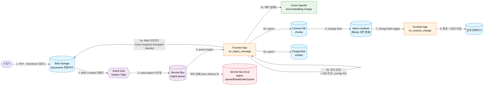

# session-04 — 비동기 인제스션 (ingestion) 파이프라인 — Service Bus + Event Grid + Azure Functions

> **관련 Microsoft Learn 학습 경로**
>
> - [Integrate backend services for AI solutions](https://learn.microsoft.com/ko-kr/training/paths/integrate-backend-services-ai-solutions/)

> [!IMPORTANT]
> **사전 준비 조건**
>
> - [session-00](./00-setup.md), [session-01](./01-rag-mvp.md), [session-02](./02-pgvector.md) 완료 — Azure OpenAI · Cosmos DB · PostgreSQL · User Assigned Managed Identity 가 본인 구독에 존재
> - 시작본 코드를 작업 폴더로 받기: `cp -a save-points/session-04/start/. workshop/` (자세한 안내는 §시작본 코드 받기)

> [!NOTE]
> **용어 안내** — 본 세션의 "인제스션 (ingestion)" 은 외부 데이터를 시스템 안으로 *수집·적재* 하는 행위입니다. "인젝션 (injection — 주입)" 과 헷갈리지 않도록 주의합니다.

---

## 0. 이 세션에서 경험하는 내용

- **한 문장 골** — PDF 또는 Markdown 한 장을 Blob Storage 에 업로드하면 30초 안에 청크 분할 · 임베드 · Cosmos DB · PostgreSQL 양쪽 인덱스에 저장되는 비동기 파이프라인을 직접 경험
- **새로 프로비저닝되는 자원**
  - Service Bus Namespace (Standard 등급) + Queue (`ingest-queue`) + Dead Letter Queue
  - Event Grid System Topic — Blob Storage 이벤트를 발행
  - Event Grid Subscription — System Topic 의 이벤트를 Service Bus Queue 로 라우팅
  - Storage Account `stai200wsdev<고유접미사>` — `documents` 컨테이너 (`allowSharedKeyAccess=false`, OAC + RBAC)
  - Azure Functions (Flex Consumption Linux, Python v2) — 두 개의 함수
  - Cosmos DB lease container — change feed trigger 가 사용할 lease (Bicep 으로 사전 생성)
- **사용해볼 SDK / CLI**
  - Azure Functions Python v2 데코레이터 — `@app.service_bus_queue_trigger`, `@app.cosmos_db_trigger`, `@app.blob_trigger`
  - `func azure functionapp publish` — Functions Core Tools 로 배포
  - `az storage blob upload --auth-mode login` — Entra ID 인증으로 Blob 업로드
- **Portal 에서 확인할 지표 / 데이터**
  - Service Bus → 큐 `ingest-queue` → Metrics — Active 메시지 수 그래프가 업로드 직후 튀고 0 으로 복귀
  - Service Bus → DLQ → Metrics — 0 유지 (실패 없음)
  - Azure Functions → Invocations — 트리거 실행 카운트 + 실행 시간
  - Azure Functions → Log stream — 라이브 로그
  - Event Grid System Topic → Metrics — Publish Events · Delivery Successes 카운트
  - Cosmos DB → Data Explorer — 새 chunk 등장

---

## 1단계 · 프로비저닝

### 1.1 Bicep 모듈 한눈에 보기

이 세션이 배포하는 Bicep 모듈 (`infra/sessions/04-async-ingestion/main.bicep`).

- `service-bus-namespace.bicep` — Standard 등급 네임스페이스
- `service-bus-queue.bicep` — `ingest-queue` + DLQ 정책 (max delivery 5)
- `event-grid-system-topic.bicep` — Blob Storage 이벤트 소스 System Topic
- `event-grid-subscription.bicep` — Service Bus Queue 로 라우팅하는 subscription
- `storage-account.bicep` — `allowSharedKeyAccess=false`, OAC + RBAC
- `function-app-plan-flex.bicep` — Flex Consumption Linux 플랜
- `function-app-flex.bicep` — `functionAppConfig.runtime.name=python` 신 스키마
- `cosmos-lease-container.bicep` — change feed lease container (자동 생성에 의존하지 않음)
- `role-assignment-servicebus-data-receiver.bicep` — User Assigned Managed Identity → Service Bus 메시지 수신
- `role-assignment-eventgrid-data-sender.bicep` — User Assigned Managed Identity → Event Grid 이벤트 송신
- `role-assignment-storage-blob-data-reader.bicep` — User Assigned Managed Identity → Blob 읽기

### 1.2 변경사항 미리보기

```bash
OID=$(az ad signed-in-user show --query id -o tsv)

az deployment group what-if \
  --resource-group rg-ai200ws-dev \
  --template-file infra/sessions/04-async-ingestion/main.bicep \
  --parameters infra/sessions/04-async-ingestion/main.bicepparam \
  --parameters userObjectId=$OID
```

### 1.3 실제 배포

```bash
az deployment group create \
  --resource-group rg-ai200ws-dev \
  --template-file infra/sessions/04-async-ingestion/main.bicep \
  --parameters infra/sessions/04-async-ingestion/main.bicepparam \
  --parameters userObjectId=$OID
```

> [!NOTE]
> Service Bus · Event Grid · Storage Account · Function App 동시 배포에 약 **5~7분** 소요됩니다. 진행되는 동안 [2단계 · 복붙으로 경험해보기](#2단계--복붙으로-경험해보기) 의 이벤트 흐름 다이어그램을 정독합니다.

### 1.4 배포 완료 확인

```bash
# Function App 이 Running 상태인지 + 신 스키마 (functionAppConfig.runtime) 적용 확인
az functionapp show \
  --name func-ai200ws-dev \
  --resource-group rg-ai200ws-dev \
  --query "{state:state, runtime:functionAppConfig.runtime}" -o jsonc
```

기대 — `state: Running`, `runtime: { name: python, version: 3.12 }`.

```bash
# Service Bus 큐가 DLQ 정책과 함께 만들어졌는지
az servicebus queue show \
  --resource-group rg-ai200ws-dev \
  --namespace-name sb-ai200ws-dev \
  --name ingest-queue \
  --query "{status:status, maxDeliveryCount:maxDeliveryCount, dlqEnabled:enableDeadLetteringOnMessageExpiration}" \
  -o jsonc
```

---

## 2단계 · 복붙으로 경험해보기

### 2.1 이벤트 흐름

본 세션의 비동기 인제스션 파이프라인은 다음 흐름으로 동작합니다.



> [!TIP]
> **왜 동기 호출이 아닌 큐 기반인가** — 사용자 응답 시간을 빠르게 유지하기 위해서입니다. 임베드 · 청크 분할 같은 무거운 작업은 큐로 빼고, API 는 청크가 준비된 후에만 답합니다. 또한 일시적 실패에 대한 재시도와 DLQ 격리도 자연스럽게 따라옵니다.

### 2.2 왜 Event Grid 와 Service Bus 둘 다 쓰는가

| 차원 | Event Grid | Service Bus |
|---|---|---|
| **모델** | 이벤트 라우터 (publish · subscribe) | 메시지 큐 (FIFO · 트랜잭션) |
| **전달 보장** | At-least-once + 재시도 | At-least-once + DLQ + 순서 보장 |
| **이벤트 소스** | Blob Storage · Resource Group · 커스텀 등 풍부 | 발신자가 직접 송신 |
| **백프레셔** | 약함 (이벤트 폭주 시 구독자 책임) | 강함 (큐가 버퍼 역할) |
| **본 워크샵 역할** | Blob 이벤트 → Service Bus 로 라우팅 | Function 처리 큐 + DLQ |

본 워크샵은 Event Grid 의 풍부한 이벤트 소스 + Service Bus 의 신뢰성 있는 큐 처리를 결합한 일반적인 패턴을 따릅니다.

### 2.3 코드 복사·붙여넣기

> [!NOTE]
> 아래 파일은 그대로 복사해 해당 경로에 붙여넣습니다. 동작 원리는 코드 다음의 줄별 해설에서 다룹니다.

**파일 1** — `apps/functions/function_app.py`

```python
# (Azure Functions Python v2 데코레이터 스타일.
#  핵심 구성:
#  1) on_ingest_message (@app.service_bus_queue_trigger)
#     - 큐 메시지에서 Blob URL 추출
#     - User Assigned Managed Identity 로 Blob 다운로드 (Storage Blob Data Reader)
#     - 텍스트 추출 + 청크 분할 (약 500 토큰, overlap 50)
#     - Azure OpenAI 배치 임베드 (text-embedding-3-large)
#     - Cosmos DB + PostgreSQL 양쪽 upsert
#     - 처리 실패 시 자동 재시도 (max delivery 5) → DLQ
#  2) on_cosmos_change (@app.cosmos_db_trigger)
#     - lease container 는 Bicep 으로 사전 생성된 것을 참조
#     - 새 chunk 등장 시 집계 컨테이너 갱신
#  주의:
#  - query_items 에 partition_key 명시 (cross-partition RU 폭주 방지)
#  - Flex Consumption 이라 FUNCTIONS_WORKER_RUNTIME 환경변수 사용 안 함
#  실제 코드 본문은 후속 구현 단계에서 작성합니다.)
```

**파일 2** — `apps/functions/requirements.txt`

```text
azure-functions
azure-identity
azure-storage-blob
azure-cosmos
openai
psycopg[binary]
pgvector
```

### 2.4 함수 배포

```bash
cd apps/functions

# Functions Core Tools 로 클라우드 빌드 + 배포
func azure functionapp publish func-ai200ws-dev --python --build remote

cd ../..
```

### 2.5 E2E 테스트 — 샘플 문서 업로드 후 양쪽 인덱스에 도착했는지 확인

```bash
# 1) 샘플 markdown 만들기
cat > /tmp/sample-policy.md <<'EOF'
# 휴가 규정

- 연간 휴가는 15일입니다.
- 6개월 근속 후부터 사용 가능합니다.
- 휴가 사용 시 최소 3일 전에 신청합니다.
EOF

# 2) Blob 업로드 — Entra ID 인증으로
STORAGE=$(az storage account list -g rg-ai200ws-dev \
  --query "[?starts_with(name,'st')].name | [0]" -o tsv)

az storage blob upload \
  --account-name $STORAGE \
  --container-name documents \
  --file /tmp/sample-policy.md \
  --name policy/sample-policy.md \
  --auth-mode login

# 3) 30초 대기 후 Cosmos DB 에 도착했는지 확인
sleep 30

az cosmosdb sql query \
  --account-name cosmos-ai200ws-dev \
  --database-name appdb \
  --container-name chunks \
  --query-text "SELECT VALUE COUNT(1) FROM c WHERE c.doc_id = 'sample-policy'" \
  --partition-key-value "sample-policy"
```

기대 — 0 이 아닌 정수 (청크 개수, 일반적으로 1~3 개).

```bash
# 4) PostgreSQL 에도 도착했는지 확인
UPN=$(az ad signed-in-user show --query userPrincipalName -o tsv)

PGPASSWORD=$(az account get-access-token \
  --resource-url https://ossrdbms-aad.database.windows.net \
  --query accessToken -o tsv) \
psql "host=pg-ai200ws-dev.postgres.database.azure.com \
  port=5432 dbname=appdb user=$UPN sslmode=require" \
  -c "SELECT COUNT(*) FROM chunks WHERE doc_id = 'sample-policy';"
```

---

## 3단계 · Azure Portal UI 에서 확인

[Azure Portal](https://portal.azure.com) 에서 다음 경로를 직접 클릭합니다.

1. **Service Bus `sb-ai200ws-dev`** → 큐 `ingest-queue` → **Metrics** → 다음 두 메트릭 추가
   - `Active Messages` — 업로드 직후 1 로 튀었다가 처리 후 0 으로 복귀
   - `Dead-lettered Messages` — 0 유지 (실패 없음 검증)
2. **Service Bus** → 큐 `ingest-queue` → **Service Bus Explorer** → Peek 으로 처리 중인 메시지 본문 확인 (이미 처리된 경우 비어 있음)
3. **Function App `func-ai200ws-dev`** → **Functions** → `on_ingest_message` → **Invocations** — 실행 1건이 `Success` 상태로, duration 약 2~5초
4. **Function App** → **Log stream** — 라이브 로그에서 `[on_ingest_message] processed sample-policy.md → N chunks` 형태의 출력 확인
5. **Event Grid System Topic** → **Topics** → **Metrics** → `Publish Events`, `Delivery Successes` 카운트 1 증가
6. **Cosmos DB** → **Data Explorer** → `chunks` 컨테이너에서 다음 쿼리 실행

   ```sql
   SELECT * FROM c WHERE c.doc_id = 'sample-policy'
   ```

   결과에 청크 객체들이 노출되어야 합니다.

### 실패 시뮬레이션 (선택)

DLQ 동작을 직접 보고 싶을 때 의도적으로 잘못된 메시지를 큐에 보냅니다.

```bash
# 잘못된 형식의 메시지를 큐에 직접 송신 → 5회 재시도 후 DLQ 로 이동
az servicebus message send \
  --resource-group rg-ai200ws-dev \
  --namespace-name sb-ai200ws-dev \
  --queue-name ingest-queue \
  --body '{"invalid": true}'
```

약 1~2분 후 Portal Service Bus → 큐 `ingest-queue` → **Dead-lettered Messages** 카운트가 1 로 증가하는 것을 확인합니다.

---

## 주의

> [!CAUTION]
> **Cosmos DB change feed trigger lease container 자동 생성은 control plane RBAC 부재 시 silent 실패** — Azure Functions 호스트는 정상 동작하는 것처럼 보이고 에러도 0건이지만 trigger 가 fire 하지 않습니다. 본 워크샵의 Bicep 은 lease container 를 사전 생성합니다 ([docs/pitfalls/common.md](../pitfalls/common.md#cosmos-change-feed-lease-container-silent-fail-session-04) 참고).

> [!WARNING]
> **Flex Consumption 은 신 스키마 사용** — 환경변수 `FUNCTIONS_WORKER_RUNTIME=python` 이 무시됩니다. Bicep 에서 `functionAppConfig.runtime.name = 'python'` 형태의 신 스키마를 사용해야 runtime 이 인식됩니다.

> [!WARNING]
> **Storage Account `allowSharedKeyAccess=false` 일 때 Azure Functions 부팅 실패** — Function 호스트가 Storage 에 SharedKey 로 접근하려는 동작을 차단당해 시작 직후 stop 상태가 됩니다. OAC + User Assigned Managed Identity 에 `Storage Blob Data Owner` + `Storage Queue Data Contributor` + `Storage Table Data Contributor` 역할 부여가 필수입니다.

> [!CAUTION]
> **Cosmos DB `query_items` 에 `partition_key` 명시** — cross-partition query 는 모든 파티션을 fan-out 스캔해 RU 가 폭주하고 throttling 429 가 발생합니다. 가능하면 항상 `partition_key` 명시합니다.

> [!NOTE]
> **`identity.type='UserAssigned'` 자원은 `identity.principalId` 미노출** — `userAssignedIdentities[id].principalId` 형태로 접근해야 합니다. Bicep output 작성 시 주의합니다.

> [!IMPORTANT]
> 더 자세한 함정 모음은 [docs/pitfalls/common.md](../pitfalls/common.md) 의 [비동기 · 메시징](../pitfalls/common.md#비동기--메시징) 섹션을 참고합니다.

---

## 마무리

- **save-point** — 본 세션의 모든 변경은 `save-points/session-04/complete/` 와 일치합니다. 다음 세션으로 넘어가려면 `cp -a save-points/session-05/start/. workshop/` 를 실행합니다 (다음 세션의 시작본이 `workshop/` 위에 덮입니다)
- **자원 정리** — Service Bus · Event Grid · Function App · Storage 는 후속 세션에서 직접 사용되지 않지만, 본 인제스션 파이프라인을 다시 실험하고 싶을 때 그대로 두는 것을 권장합니다. 비용은 Service Bus Standard (월 약 ₩13K) 와 Storage 가 주요 항목입니다. 정리하려면 [자원 정리](../cleanup.md) 의 `session-04 의 Functions + Service Bus + Event Grid 정리` 절차를 참고합니다
- **다음 세션 미리보기** — [session-05](./05-app-config-flags.md) 에서는 환경변수에 들어있던 `ENABLE_SEMANTIC_CACHE` 같은 토글을 App Configuration 으로 분리해, 코드 재배포 없이 포털에서 토글하는 패턴을 도입합니다

---

## 참고 자료

- Microsoft Learn — [Integrate backend services for AI solutions](https://learn.microsoft.com/ko-kr/training/paths/integrate-backend-services-ai-solutions/)
- Microsoft Learn — [Azure Functions Flex Consumption](https://learn.microsoft.com/ko-kr/azure/azure-functions/flex-consumption-plan)
- 본 저장소 — `infra/sessions/04-async-ingestion/main.bicep`, `apps/functions/function_app.py`

---

👈 [session-03 — Managed Redis 시맨틱 캐시](./03-redis-cache.md) | [session-05 — App Configuration 피처 플래그](./05-app-config-flags.md) 👉
