# session-04 (비동기 인제스션 파이프라인 — Service Bus + Event Grid + Azure Functions)

👈 [챌린지 홈](../../README.md)

> [!IMPORTANT]
> **사전 준비 조건**
>
> - [session-00](./00-setup.md), [session-01](./01-rag-mvp.md), [session-02](./02-pgvector.md) 완료 — Azure OpenAI · Cosmos DB · PostgreSQL · User Assigned Managed Identity 가 본인 구독에 존재
> - 시작본 코드를 작업 폴더로 받기 — [시작본 코드 받기](#시작본-코드-받기) 참고

> [!NOTE]
> **용어 안내** — 본 세션의 "인제스션 (ingestion)" 은 외부 데이터를 시스템 안으로 수집·적재하는 행위입니다. "인젝션 (injection — 주입)" 과 헷갈리지 않도록 주의합니다.

---

## 시작본 코드 받기

[session-03](./03-redis-cache.md) 결과물이 들어 있는 `workshop/` 위에 본 세션 시작본을 덮습니다.

```bash
# Linux · macOS · WSL
cp -a save-points/session-04/start/. workshop/
```

```powershell
# Windows PowerShell
Copy-Item -Path save-points/session-04/start/* -Destination workshop -Recurse -Force
```

이후 본 세션의 모든 명령은 `workshop/` 안에서 실행한다고 가정합니다.

학습자가 채우는 파일은 두 개입니다 — `infra/sessions/04-async-ingestion/main.bicep` (모듈 조립), `apps/functions/function_app.py` (트리거 함수). 모듈 11개와 `requirements.txt` · `host.json` 은 완성되어 제공됩니다.

---

## 1단계 · 프로비저닝

`workshop/infra/sessions/04-async-ingestion/main.bicep` 을 열고, 그룹별 주석을 찾아 코드를 채웁니다.

### 1.1 호출할 모듈 한눈에 보기

`infra/modules/session-04/` 에 완성되어 있는 모듈입니다.

```text
infra/modules/session-04/
├── service-bus-namespace.bicep      # Standard 네임스페이스
├── service-bus-queue.bicep          # ingest-queue (DLQ max delivery 5)
├── storage-account.bicep            # allowSharedKeyAccess=false, documents · deployments 컨테이너
├── event-grid-system-topic.bicep    # Blob 이벤트 소스 System Topic
├── event-grid-subscription.bicep    # Blob 이벤트 → Service Bus 라우팅
├── function-app-plan-flex.bicep     # Flex Consumption 플랜
├── function-app-flex.bicep          # Flex Consumption + 신 스키마
├── cosmos-container.bicep           # leases · doc_stats 컨테이너 (재사용)
├── role-assignment-servicebus.bicep # Service Bus 역할 부여 (재사용)
└── role-assignment-storage.bicep    # Storage 역할 부여 (재사용)
```

### 1.2 Service Bus + Storage

`// -------- 1) ...` 과 `// -------- 2) ...` 주석 아래에 추가합니다.

```bicep
module serviceBus '../../modules/session-04/service-bus-namespace.bicep' = {
  name: 'serviceBus'
  params: {
    name: sbName
    location: location
    skuName: 'Standard'
    tags: commonTags
  }
}

module ingestQueue '../../modules/session-04/service-bus-queue.bicep' = {
  name: 'ingestQueue'
  params: {
    namespaceName: serviceBus.outputs.name
    name: 'ingest-queue'
    maxDeliveryCount: 5
  }
}

module storage '../../modules/session-04/storage-account.bicep' = {
  name: 'storage'
  params: {
    name: stName
    location: location
    tags: commonTags
  }
}
```

### 1.3 Event Grid — System Topic + 전달 권한 + Subscription

`// -------- 3) ...` 주석 아래에 추가합니다. 핵심은 **System Topic 의 관리 ID** 에 Service Bus Data Sender 를 부여하는 것입니다 — Event Grid 가 그 ID 로 큐에 전달합니다.

```bicep
module systemTopic '../../modules/session-04/event-grid-system-topic.bicep' = {
  name: 'systemTopic'
  params: {
    name: egtName
    location: location
    sourceStorageAccountId: storage.outputs.id
    tags: commonTags
  }
}

module sbSenderSystemTopic '../../modules/session-04/role-assignment-servicebus.bicep' = {
  name: 'sbSender-systemTopic'
  params: {
    namespaceName: serviceBus.outputs.name
    roleDefinitionId: roleServiceBusDataSender
    principalId: systemTopic.outputs.principalId
  }
}

module egSubscription '../../modules/session-04/event-grid-subscription.bicep' = {
  name: 'egSubscription'
  params: {
    systemTopicName: systemTopic.outputs.name
    name: 'to-service-bus'
    serviceBusQueueId: resourceId(
      'Microsoft.ServiceBus/namespaces/queues',
      serviceBus.outputs.name,
      'ingest-queue'
    )
    // documents 컨테이너만 인제스션 트리거 — 함수 배포 zip 이 올라가는 deployments
    // 컨테이너의 BlobCreated 까지 받으면 BlobNotFound 로 큐가 오염된다.
    subjectBeginsWith: '/blobServices/default/containers/documents/'
  }
  dependsOn: [
    ingestQueue
    sbSenderSystemTopic
  ]
}
```

### 1.4 역할 할당 — User Assigned Managed Identity + 사용자 (E2E 테스트에 필요)

`// -------- 4) ...` 와 `// -------- 4b) ...` 주석 아래에 추가합니다. Function 의 신원에 Service Bus 수신 + Storage Blob/Queue 권한을, 사용자에게는 2.5 의 E2E 테스트에서 본인 `az login` 자격으로 Blob 업로드·검증할 권한을 부여합니다. `if (!empty(userObjectId))` 조건부 모듈이지만, 표준 배포 (3단계) 가 항상 `userObjectId` 를 넘기므로 그대로 채웁니다.

```bicep
module sbReceiverUami '../../modules/session-04/role-assignment-servicebus.bicep' = {
  name: 'sbReceiver-uami'
  params: {
    namespaceName: serviceBus.outputs.name
    roleDefinitionId: roleServiceBusDataReceiver
    principalId: uami.properties.principalId
  }
}

module blobOwnerUami '../../modules/session-04/role-assignment-storage.bicep' = {
  name: 'blobOwner-uami'
  params: {
    storageAccountName: storage.outputs.name
    roleDefinitionId: roleStorageBlobDataOwner
    principalId: uami.properties.principalId
  }
}

module queueContributorUami '../../modules/session-04/role-assignment-storage.bicep' = {
  name: 'queueContributor-uami'
  params: {
    storageAccountName: storage.outputs.name
    roleDefinitionId: roleStorageQueueDataContributor
    principalId: uami.properties.principalId
  }
}

module blobContributorUser '../../modules/session-04/role-assignment-storage.bicep' = if (!empty(userObjectId)) {
  name: 'blobContributor-user'
  params: {
    storageAccountName: storage.outputs.name
    roleDefinitionId: roleStorageBlobDataContributor
    principalId: userObjectId
    principalType: 'User'
  }
}

module sbSenderUser '../../modules/session-04/role-assignment-servicebus.bicep' = if (!empty(userObjectId)) {
  name: 'sbSender-user'
  params: {
    namespaceName: serviceBus.outputs.name
    roleDefinitionId: roleServiceBusDataSender
    principalId: userObjectId
    principalType: 'User'
  }
}
```

### 1.5 Cosmos 컨테이너 + Function App

`// -------- 5) ...` 와 `// -------- 6) ...`, 그리고 `// -------- 출력` 주석 아래에 추가합니다.

```bicep
module leaseContainer '../../modules/session-04/cosmos-container.bicep' = {
  name: 'leaseContainer'
  params: {
    accountName: cosmos.name
    name: 'leases'
    partitionKeyPath: '/id'
  }
}

module statsContainer '../../modules/session-04/cosmos-container.bicep' = {
  name: 'statsContainer'
  params: {
    accountName: cosmos.name
    name: 'doc_stats'
    partitionKeyPath: '/doc_id'
  }
}

// Function(Azure 호스팅) 이 UAMI 로 PG 에 접속하려면 PG 방화벽이 Azure 서비스를 허용해야
// 한다. session-02 는 dev IP 만 열므로 여기서 추가 (없으면 함수 _upsert_pg 가 ConnectionTimeout).
module pgAllowAzure '../../modules/session-02/postgres-firewall-rule.bicep' = {
  name: 'pgAllowAzure'
  params: {
    serverName: pgName
    name: 'AllowAllAzureServices'
    startIpAddress: '0.0.0.0'
    endIpAddress: '0.0.0.0'
  }
}

module plan '../../modules/session-04/function-app-plan-flex.bicep' = {
  name: 'plan'
  params: {
    name: aspName
    location: location
    tags: commonTags
  }
}

module functionApp '../../modules/session-04/function-app-flex.bicep' = {
  name: 'functionApp'
  params: {
    name: funcName
    location: location
    planId: plan.outputs.id
    uamiId: uami.id
    uamiClientId: uami.properties.clientId
    storageAccountName: storage.outputs.name
    storageBlobEndpoint: storage.outputs.blobEndpoint
    deploymentContainerName: storage.outputs.deploymentContainerName
    appInsightsConnectionString: appInsights.properties.ConnectionString
    serviceBusFqdn: serviceBus.outputs.fqdn
    aoaiEndpoint: aoai.properties.endpoint
    cosmosEndpoint: cosmos.properties.documentEndpoint
    cosmosDatabaseName: 'appdb'
    postgresHost: '${pgName}.postgres.database.azure.com'
    postgresUser: uamiName
    tags: commonTags
  }
  dependsOn: [
    blobOwnerUami
    queueContributorUami
    sbReceiverUami
    pgAllowAzure
  ]
}
```

```bicep
output serviceBusName string = serviceBus.outputs.name
output storageName string = storage.outputs.name
output functionAppName string = functionApp.outputs.name
output systemTopicName string = systemTopic.outputs.name
```

### 1.6 조립 검증 + 배포

```bash
az bicep build --file infra/sessions/04-async-ingestion/main.bicep --outfile /tmp/main.json && echo "BUILD OK"
```

```bash
OID=$(az ad signed-in-user show --query id -o tsv)

az deployment group create \
  --resource-group rg-ai200ws-dev \
  --template-file infra/sessions/04-async-ingestion/main.bicep \
  --parameters infra/sessions/04-async-ingestion/main.bicepparam \
  --parameters userObjectId=$OID
```

> [!NOTE]
> Service Bus · Event Grid · Storage · Function App 동시 배포에 약 **5~7분** 소요됩니다. 진행되는 동안 [2단계 · 복붙으로 경험해보기](#2단계--복붙으로-경험해보기) 의 이벤트 흐름을 정독합니다.

### 1.7 배포 완료 확인

자원 이름은 글로벌 unique 접미사가 붙으므로 조회해 환경변수에 담아둡니다.

```bash
FUNC=$(az functionapp list -g rg-ai200ws-dev --query "[0].name" -o tsv)
SB=$(az servicebus namespace list -g rg-ai200ws-dev --query "[0].name" -o tsv)

# Function App 이 Running + 신 스키마(functionAppConfig.runtime) 적용.
# Flex Consumption 은 az functionapp show 의 state/runtime 이 null 로 나오므로
# az resource show 로 properties 를 직접 조회한다.
az resource show -g rg-ai200ws-dev -n $FUNC --resource-type Microsoft.Web/sites \
  --query "{state:properties.state, runtime:properties.functionAppConfig.runtime}" -o jsonc

# 큐가 DLQ 정책과 함께 만들어졌는지
az servicebus queue show -g rg-ai200ws-dev --namespace-name $SB --name ingest-queue \
  --query "{status:status, maxDeliveryCount:maxDeliveryCount}" -o jsonc
```

기대 — `state: Running`, `runtime: { name: python, version: 3.12 }`, `maxDeliveryCount: 5`.

---

## 2단계 · 복붙으로 경험해보기

### 2.1 이벤트 흐름

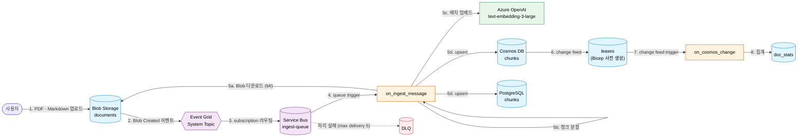

> [!TIP]
> **왜 동기 호출이 아닌 큐 기반인가** — 임베드·청크 분할 같은 무거운 작업을 큐로 빼면 사용자 응답이 빨라지고, 일시 실패에 대한 재시도와 DLQ 격리가 자연스럽게 따라옵니다. 큰 페이로드(문서 본문)는 메시지에 싣지 않고 Blob URL 만 전달하는 claim-check 패턴을 씁니다.

### 2.2 왜 Event Grid 와 Service Bus 둘 다 쓰는가

| 차원 | Event Grid | Service Bus |
|---|---|---|
| **모델** | 이벤트 라우터 (publish · subscribe) | 메시지 큐 (FIFO · 트랜잭션) |
| **전달 보장** | At-least-once + 재시도 | At-least-once + DLQ + 순서 보장 |
| **이벤트 소스** | Blob Storage 등 풍부 | 발신자가 직접 송신 |
| **백프레셔** | 약함 | 강함 (큐가 버퍼) |
| **본 챌린지 역할** | Blob 이벤트 → Service Bus 로 라우팅 | Function 처리 큐 + DLQ |

### 2.3 함수 코드 구현

`apps/functions/function_app.py` 의 함수 본체가 비어 있습니다. 트리거 데코레이터·헬퍼·의존성은 제공되며, 아래 본체를 채웁니다.

`_extract_text` · `_upsert_cosmos` · `_upsert_pg` 를 채웁니다.

```python
def _extract_text(blob_name: str, raw: bytes) -> str:
    if blob_name.lower().endswith(".pdf"):
        import io

        from pypdf import PdfReader

        reader = PdfReader(io.BytesIO(raw))
        return "\n".join(page.extract_text() or "" for page in reader.pages)
    return raw.decode("utf-8", errors="ignore")


def _upsert_cosmos(doc_id: str, chunks: list[str], embeddings: list[list[float]]) -> None:
    container = _cosmos_container("chunks")
    for i, (content, emb) in enumerate(zip(chunks, embeddings, strict=True)):
        container.upsert_item(
            {"id": f"{doc_id}-{i}", "doc_id": doc_id, "title": doc_id,
             "content": content, "embedding": emb}
        )


def _upsert_pg(doc_id: str, chunks: list[str], embeddings: list[list[float]]) -> None:
    token = _credential.get_token(_PG_AAD_SCOPE).token
    conninfo = (
        f"host={os.environ['POSTGRES_HOST']} port=5432 "
        f"dbname={os.environ.get('POSTGRES_DATABASE', 'appdb')} "
        f"user={os.environ['POSTGRES_USER']} password={token} sslmode=require"
    )
    with psycopg.connect(conninfo) as conn:
        register_vector(conn)
        with conn.cursor() as cur:
            for i, (content, emb) in enumerate(zip(chunks, embeddings, strict=True)):
                cur.execute(
                    "INSERT INTO chunks (id, doc_id, title, content, embedding) "
                    "VALUES (%s, %s, %s, %s, %s) "
                    "ON CONFLICT (id) DO UPDATE SET content = EXCLUDED.content, "
                    "embedding = EXCLUDED.embedding",
                    (f"{doc_id}-{i}", doc_id, doc_id, content, HalfVector(emb)),
                )
```

두 트리거 함수 `on_ingest_message` · `on_cosmos_change` 본체를 채웁니다.

```python
@app.service_bus_queue_trigger(
    arg_name="msg", queue_name="ingest-queue", connection="ServiceBusConnection"
)
def on_ingest_message(msg: func.ServiceBusMessage) -> None:
    event = json.loads(msg.get_body().decode("utf-8"))
    if isinstance(event, list):
        event = event[0]
    blob_url = event["data"]["url"]

    blob_name = urlparse(blob_url).path.split("/", 2)[-1]
    doc_id = _doc_id_from_blob(blob_name)

    raw = BlobClient.from_blob_url(blob_url, credential=_credential).download_blob().readall()
    chunks = _chunk_text(_extract_text(blob_name, raw))
    if not chunks:
        logging.warning("[on_ingest_message] %s — 텍스트 없음, skip", blob_name)
        return

    client = _aoai()
    deployment = os.environ.get("AZURE_OPENAI_EMBED_DEPLOYMENT", "text-embedding-3-large")
    embeddings = [d.embedding for d in client.embeddings.create(model=deployment, input=chunks).data]

    _upsert_cosmos(doc_id, chunks, embeddings)
    _upsert_pg(doc_id, chunks, embeddings)
    logging.info("[on_ingest_message] processed %s → %d chunks", blob_name, len(chunks))


@app.cosmos_db_trigger(
    arg_name="docs", connection="CosmosDbConnection", database_name="appdb",
    container_name="chunks", lease_container_name="leases",
    create_lease_container_if_not_exists=False,
)
def on_cosmos_change(docs: func.DocumentList) -> None:
    if not docs:
        return
    counts: dict[str, int] = {}
    for doc in docs:
        doc_id = doc.get("doc_id")
        if doc_id:
            counts[doc_id] = counts.get(doc_id, 0) + 1

    stats = _cosmos_container("doc_stats")
    for doc_id, delta in counts.items():
        try:
            item = stats.read_item(item=doc_id, partition_key=doc_id)
            item["chunk_count"] = item.get("chunk_count", 0) + delta
        except Exception:  # noqa: BLE001
            item = {"id": doc_id, "doc_id": doc_id, "chunk_count": delta}
        stats.upsert_item(item)
```

### 2.4 함수 배포

```bash
cd apps/functions
func azure functionapp publish $FUNC --python --build remote
cd ../..
```

### 2.5 E2E 테스트 — 업로드 후 양쪽 인덱스 도착 확인

```bash
# 1) 샘플 markdown
cat > /tmp/sample-policy.md <<'EOF'
# 휴가 규정
- 연간 휴가는 15일입니다.
- 6개월 근속 후부터 사용 가능합니다.
EOF
```

```bash
# 2) Entra ID 인증 업로드
STORAGE=$(az storage account list -g rg-ai200ws-dev --query "[?starts_with(name,'st')].name | [0]" -o tsv)
az storage blob upload --account-name $STORAGE --container-name documents \
  --file /tmp/sample-policy.md --name policy/sample-policy.md --auth-mode login
```

```bash
# 3) 약 30초 후 Cosmos 확인
#    az 에는 Cosmos 데이터플레인 쿼리 명령이 없으므로 SDK 로 조회합니다.
sleep 30
COSMOS=$(az cosmosdb list -g rg-ai200ws-dev --query "[0].name" -o tsv)
pip install -q azure-cosmos azure-identity   # 로컬에 없으면 1회만
COSMOS_ENDPOINT="https://${COSMOS}.documents.azure.com:443/" python - <<'PY'
import os
from azure.cosmos import CosmosClient
from azure.identity import AzureCliCredential
chunks = (CosmosClient(os.environ["COSMOS_ENDPOINT"], credential=AzureCliCredential())
          .get_database_client("appdb").get_container_client("chunks"))
n = list(chunks.query_items(
    "SELECT VALUE COUNT(1) FROM c WHERE c.doc_id='sample-policy'",
    partition_key="sample-policy"))[0]
print("chunks(sample-policy) =", n)
PY
```

기대 — `chunks(sample-policy) =` 뒤에 0 이 아닌 정수 (청크 개수).

```bash
# 4) PostgreSQL 도 확인
PG_HOST=$(az postgres flexible-server list -g rg-ai200ws-dev --query "[0].fullyQualifiedDomainName" -o tsv)
UPN=$(az ad signed-in-user show --query userPrincipalName -o tsv)

PGPASSWORD=$(az account get-access-token \
  --resource https://ossrdbms-aad.database.windows.net --query accessToken -o tsv) \
psql "host=$PG_HOST port=5432 dbname=appdb user=$UPN sslmode=require" \
  -c "SELECT COUNT(*) FROM chunks WHERE doc_id = 'sample-policy';"
```

---

## 3단계 · Azure Portal UI 에서 확인

[Azure Portal](https://portal.azure.com) 에서 다음 경로를 직접 클릭합니다.

1. **Service Bus** → 큐 `ingest-queue` → **Metrics** → `Active Messages` (업로드 직후 1 → 0), `Dead-lettered Messages` (0 유지)

   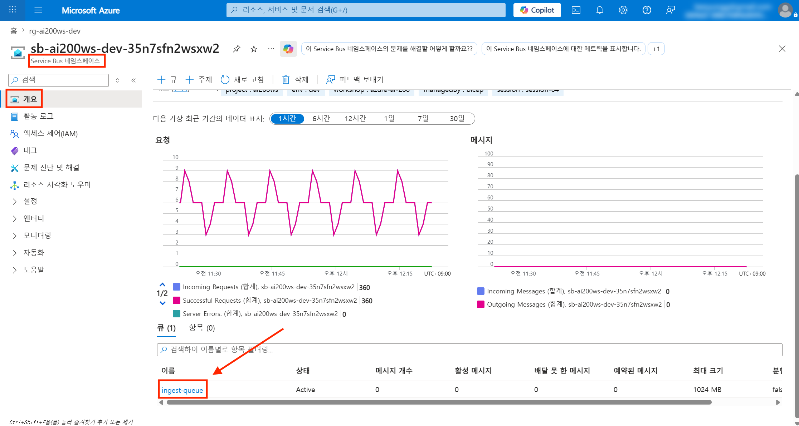
   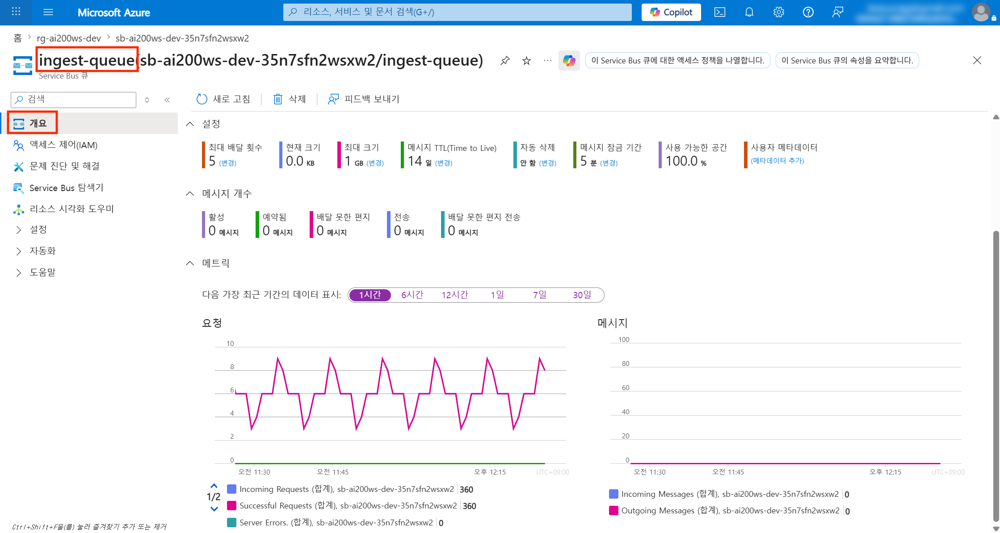

2. **Application Insights `ai-…`** → **Logs** — `on_ingest_message` 실행 성공 확인 (아래 [!NOTE] 의 KQL). Log stream 은 host 잡음이 많아 권장하지 않습니다

   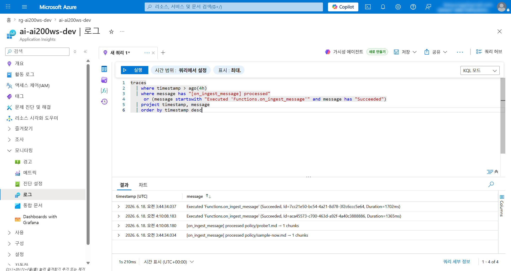

3. **Function App** → **Functions** → `on_cosmos_change` → **Invocations** — change feed 실행 1건 `Success`

   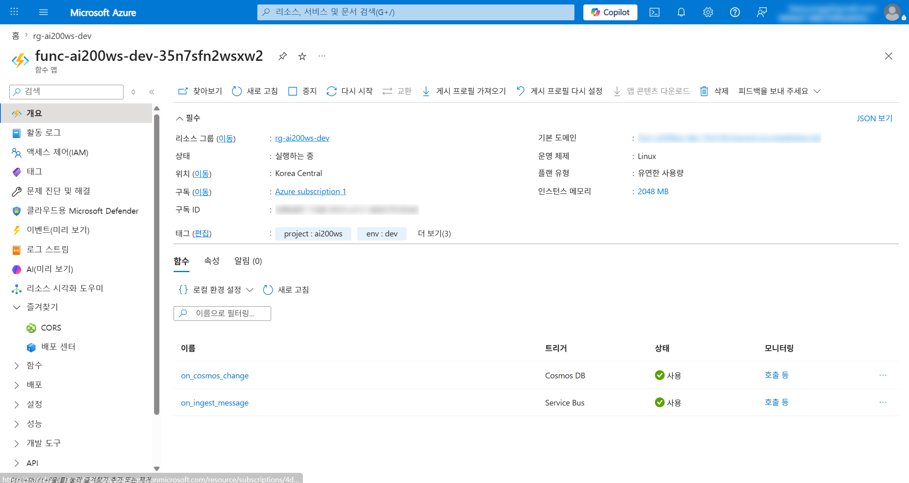
   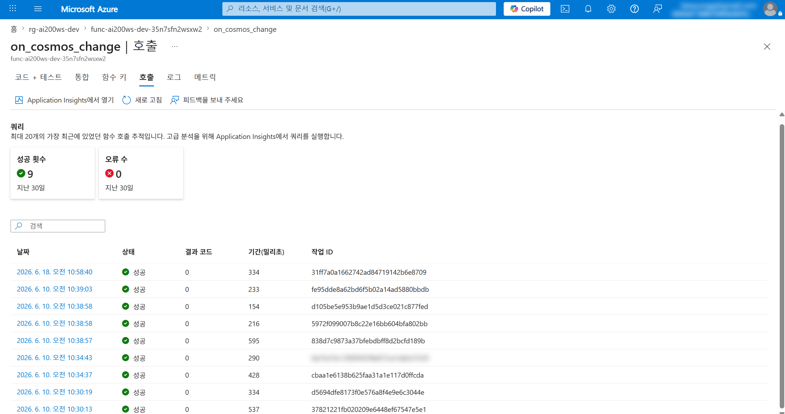

4. **Event Grid System Topic** → **Metrics** — `Publish Events` · `Delivery Successes` 카운트 1 증가

   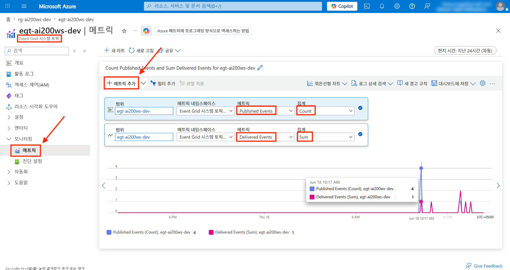

5. **Cosmos DB** → **Data Explorer** → `chunks` 에서 `SELECT * FROM c WHERE c.doc_id = 'sample-policy'`, `doc_stats` 에서 집계 카운트 확인 (아래 [!NOTE] — 첫 문서는 `doc_stats` 에 안 보일 수 있음)

   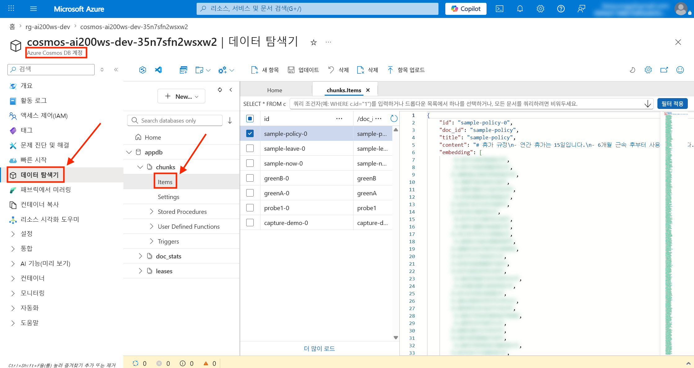
   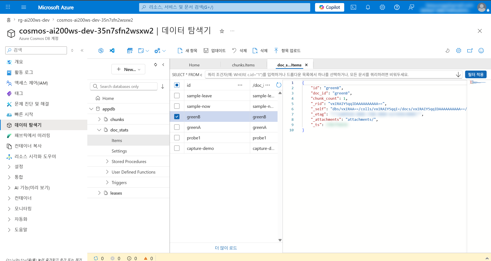

> [!NOTE]
> **`on_ingest_message` 의 Invocations(호출) 탭은 비어 보입니다** — Flex Consumption + Python 의 Service Bus 트리거 실행은 App Insights `requests` 텔레메트리를 만들지 않아 **Functions → `on_ingest_message` → Invocations** 탭에 실행이 표시되지 않습니다 (데이터는 정상 처리됨). 또한 **Log stream** 은 host 의 storage 리스 폴링·토큰 로그가 많아 함수 로그가 묻힙니다. 실행 성공은 **Application Insights `ai-…` → Logs** 에서 아래 KQL 로 확인합니다 (Application Insights 의 Logs 는 classic 스키마라 테이블·컬럼이 소문자):
>
> ```kusto
> traces
> | where timestamp > ago(4h)
> | where message has "[on_ingest_message] processed"
>    or (message startswith "Executed 'Functions.on_ingest_message'" and message has "Succeeded")
> | project timestamp, message
> | order by timestamp desc
> ```
>
> 함수 trace 는 adaptive sampling 으로 일부 누락될 수 있어, 안 보이면 시간 범위를 넓히거나 문서를 한 번 더 업로드합니다. `on_cosmos_change`(Cosmos DB 트리거)는 `requests` 가 생성되어 Invocations 탭에 정상 표시됩니다.

> [!NOTE]
> **첫 업로드 문서가 `doc_stats` 에 안 보일 수 있습니다** — Cosmos change feed 트리거는 기본적으로 lease 가 확립된 시점 이후의 **새** 변경만 읽습니다 (`start_from_beginning` 미설정). 배포 직후 첫 문서는 lease 확립 **전**에 인입되어 `on_cosmos_change` 가 놓칠 수 있습니다. 두 번째 문서부터는 정상 집계됩니다 (첫 문서 집계가 필요하면 같은 문서를 한 번 더 업로드).

### 실패 시뮬레이션 (선택)

```bash
# 잘못된 메시지를 큐에 직접 송신 → on_ingest_message 가 KeyError → 5회 재시도 후 DLQ.
# az servicebus 는 관리 플레인 전용(메시지 송신 명령 없음)이라 SDK 로 보낸다.
pip install -q azure-servicebus azure-identity   # 로컬에 없으면 1회만
SB=$(az servicebus namespace list -g rg-ai200ws-dev --query "[0].name" -o tsv)
SB_FQDN="${SB}.servicebus.windows.net" python - <<'PY'
import os
from azure.servicebus import ServiceBusClient, ServiceBusMessage
from azure.identity import AzureCliCredential
with ServiceBusClient(os.environ["SB_FQDN"], AzureCliCredential()) as client:
    with client.get_queue_sender("ingest-queue") as sender:
        sender.send_messages(ServiceBusMessage('{"invalid": true}'))
print("잘못된 메시지 송신 완료")
PY
```

약 1~2분 후 Portal 의 **Dead-lettered Messages** 카운트가 1 로 증가합니다.

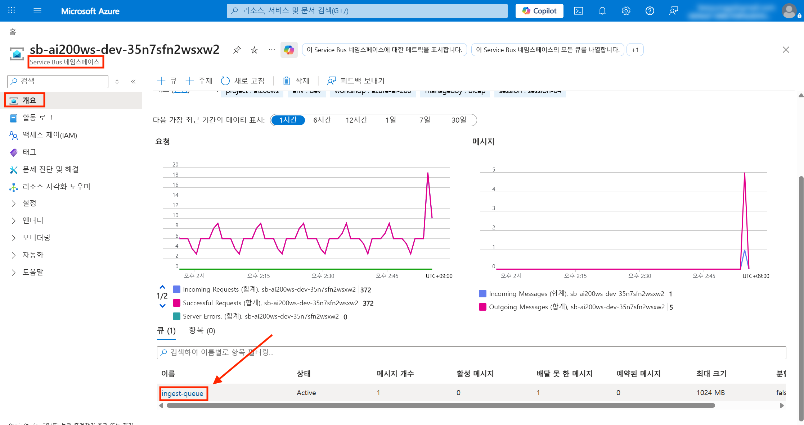
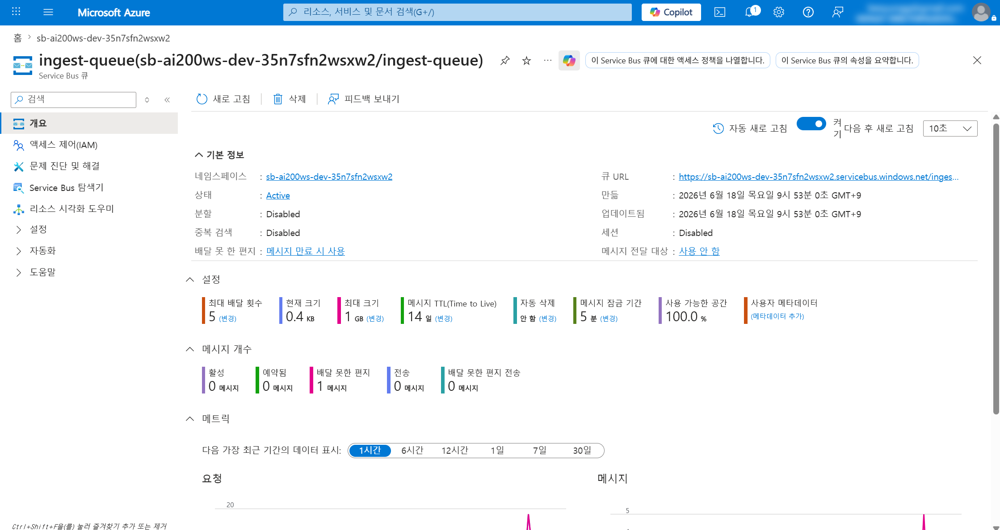

---

## Microsoft Learn 경로 커버리지 — 사용 / 생략

[Integrate backend services for AI solutions](https://learn.microsoft.com/ko-kr/training/paths/integrate-backend-services-ai-solutions/) 학습 경로 3개 모듈을 본 세션에서 어떻게 다루는지 정리합니다.

| 모듈 | 단원 핵심 | 본 세션 |
|---|---|---|
| **1. Service Bus 로 AI 작업 큐** | 메시징 개념 · 큐 vs 토픽 · 메시지 구조화(claim-check·correlation) · peek-lock·DLQ | **사용** — 큐(`ingest-queue`) + DLQ(max delivery 5) + claim-check(Blob URL 전달) (1.2 · 3.x) |
| **2. Event Grid 이벤트 기반 워크플로** | 개념·패턴 · 이벤트 스키마/필터 · 배달·재시도·dead-letter · 커스텀 이벤트 게시 | **일부 사용** — Blob System Topic → Service Bus 전달, BlobCreated 필터, 재시도. **생략** — 커스텀 이벤트 게시(AI 앱이 직접 발행)는 범위 외 |
| **3. Functions 서버리스 AI 백엔드** | 호스팅(Flex vs Premium) · 로컬 개발 · 트리거·바인딩 · 비밀·구성 · ID·액세스 | **사용** — Flex Consumption + 신 스키마, Service Bus/Cosmos 트리거, Managed Identity 바인딩. **생략** — 연습의 MCP 서버 시나리오(인제스션과 무관, Phase 10 후보) |

> [!NOTE]
> **학습 경로보다 깊이 다루는 부분** — Flex Consumption 신 스키마, Storage `allowSharedKeyAccess=false` 시 Functions 부팅 함정, Cosmos change feed lease container 사전 생성, Event Grid → Service Bus 전달을 위한 System Topic 관리 ID RBAC 는 실전 함정으로 본 세션이 보강합니다.

---

## 마무리

- **save-point** — 본 세션의 모든 변경은 `save-points/session-04/complete/` 와 일치합니다. 다음 세션으로 넘어가려면 `workshop/` 을 그대로 두고 `cp -a save-points/session-05/start/. workshop/` 를 실행합니다
- **자원 정리** — Service Bus · Function App · Storage 는 후속 세션에서 직접 사용되지 않고 idle 비용·관리면이 누적됩니다. 본 세션 학습이 끝났다면 [자원 정리](../cleanup.md) 로 정리하는 것을 권장합니다 (Log Analytics · ACR 같은 무료 자원은 보존). 다시 실험하려면 본 세션 Bicep 을 재배포합니다
- **다음 세션 미리보기** — [session-05](./05-app-config-flags.md) 에서는 환경변수에 들어있던 `CACHE_ENABLED` 같은 토글을 App Configuration 으로 분리해, 코드 재배포 없이 포털에서 토글하는 패턴을 도입합니다

---

👈 [session-03](./03-redis-cache.md) | [session-05](./05-app-config-flags.md) 👉