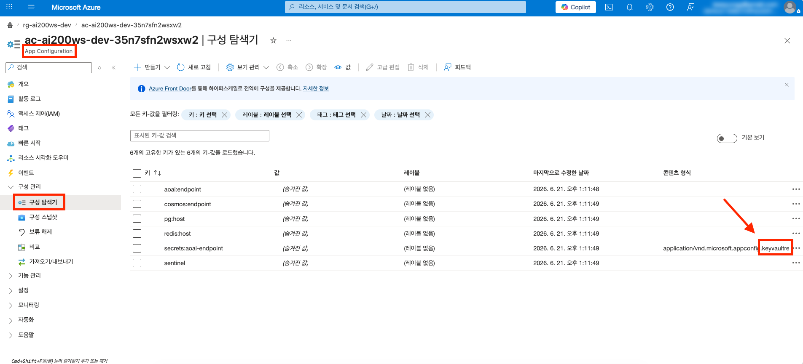
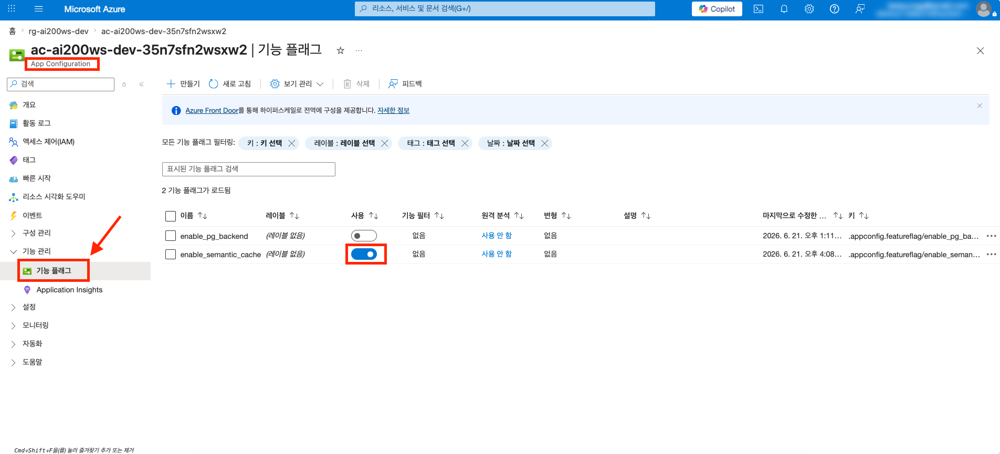
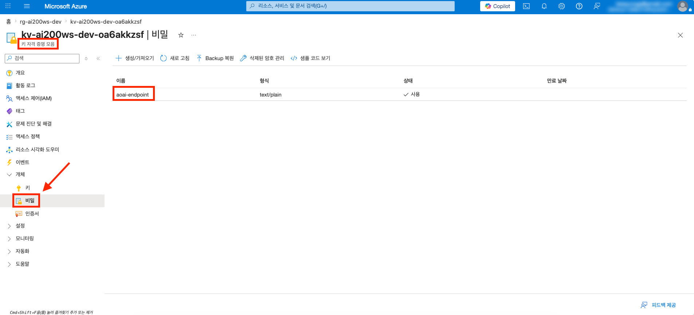
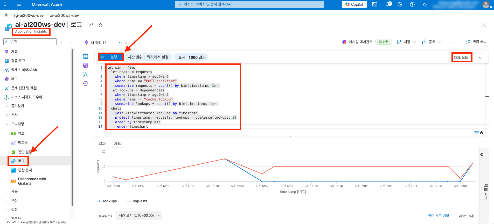

# session-05 — App Configuration 피처 플래그

> **관련 Microsoft Learn 학습 경로**
>
> - [Manage app secrets and configuration](https://learn.microsoft.com/ko-kr/training/paths/manage-app-secrets-configuration/)

> [!IMPORTANT]
> **사전 준비 조건**
>
> - [session-00](./00-setup.md) ~ [session-04](./04-async-ingestion.md) 완료 — Azure Container Apps · Cosmos DB · PostgreSQL · Managed Redis · Key Vault · User Assigned Managed Identity · Application Insights 가 본인 구독에 존재
> - 시작본 코드를 작업 폴더로 받기 — [시작본 코드 받기](#시작본-코드-받기) 참고

---

## 0. 이 세션에서 경험하는 내용

- **한 문장 골** — 코드 한 줄도 고치지 않고, Azure Portal 의 피처 플래그 토글 하나로 시맨틱 캐시를 켜고 끌 수 있는 런타임 설정 분리를 도입
- **새로 프로비저닝되는 자원**
  - App Configuration (Free 등급 — 비용 0)
  - 일반 키/값 (`aoai:endpoint`, `cosmos:endpoint`, `pg:host`, `redis:host`) + sentinel
  - Key Vault reference (`secrets:aoai-endpoint` — session-01 secret 을 참조로 노출)
  - Feature flag `enable_semantic_cache`, `enable_pg_backend`
  - 역할 부여 — User Assigned Managed Identity 에 `App Configuration Data Reader`, 사용자에 `App Configuration Data Owner` (토글용)
- **이 세션의 학습 포인트**
  - 완성된 App Configuration 모듈을 `main.bicep` 에서 그룹별로 조립
  - `azure-appconfiguration-provider` + `featuremanagement` 로 피처 플래그를 읽고, 동적 새로 고침으로 토글을 반영
- **사용해볼 SDK / CLI**
  - `azure-appconfiguration-provider` Python 패키지 — Key Vault reference 자동 해석 + sentinel refresh
  - `featuremanagement` 의 `FeatureManager` — 피처 플래그 평가
  - `az appconfig feature enable/disable` — CLI 로 플래그 토글
- **Portal 에서 확인할 지표 / 데이터**
  - App Configuration → Configuration explorer — 키/값 + Key Vault reference 목록
  - App Configuration → Feature manager — 피처 플래그 토글 UI
  - Application Insights → Logs(KQL) — 토글 OFF 직후 `cache.lookup` 의 분당 발생 건수가 0 으로 떨어지는 절벽

> [!TIP]
> 이 세션은 `Bicep 조립 → 배포 → loader 코드 채우기 → 이미지 빌드·배포 → 포털 토글 실험 → Portal 확인` 흐름으로 진행합니다.

---

## 시작본 코드 받기

[session-04](./04-async-ingestion.md) 결과물이 들어 있는 `workshop/` 위에 본 세션 시작본을 덮습니다.

```bash
# Linux · macOS · WSL
cp -a save-points/session-05/start/. workshop/
```

```powershell
# Windows PowerShell
Copy-Item -Path save-points/session-05/start/* -Destination workshop -Recurse -Force
```

이후 본 세션의 모든 명령은 `workshop/` 안에서 실행한다고 가정합니다.

학습자가 채우는 파일은 두 개입니다 — `infra/sessions/05-app-config-flags/main.bicep` (모듈 조립), `apps/api/src/config/loader.py` (App Configuration 로더). 모듈 5개와 `main.py` 배선은 완성되어 제공됩니다.

---

## 1단계 · 프로비저닝

`workshop/infra/sessions/05-app-config-flags/main.bicep` 을 열고, 그룹별 주석을 찾아 코드를 채웁니다.

### 1.1 호출할 모듈 한눈에 보기

`infra/modules/session-05/` 에 완성되어 있는 모듈입니다.

- `app-configuration.bicep` — Free 등급 store. 앱은 endpoint + Entra(UAMI)로 읽지만, ARM 으로 keyValues·플래그를 시드하려면 store 의 local auth 를 켜둔다 (`disableLocalAuth: false`) — local auth 가 꺼져 있으면 ARM 시드가 Conflict 로 실패
- `app-configuration-keyvalue.bicep` — 일반 키/값 (재사용)
- `app-configuration-keyvault-ref.bicep` — Key Vault reference
- `app-configuration-feature-flag.bicep` — 피처 플래그
- `role-assignment-appconfig.bicep` — 역할 부여 (재사용)

### 1.2 store + 키/값 + sentinel

`// -------- 1) ...` · `// -------- 2) ...` · `// -------- 3) ...` 주석 아래에 채웁니다. 키/값 값이 existing 자원의 런타임 속성이라 for-루프가 불가능하므로 4개를 개별 호출합니다.

```bicep
module appConfig '../../modules/session-05/app-configuration.bicep' = {
  name: 'appConfig'
  params: {
    name: acName
    location: location
    skuName: 'free'
    tags: commonTags
  }
}

module kvAoai '../../modules/session-05/app-configuration-keyvalue.bicep' = {
  name: 'kv-aoai-endpoint'
  params: {
    storeName: appConfig.outputs.name
    key: 'aoai:endpoint'
    value: aoai.properties.endpoint
  }
}

module kvCosmos '../../modules/session-05/app-configuration-keyvalue.bicep' = {
  name: 'kv-cosmos-endpoint'
  params: {
    storeName: appConfig.outputs.name
    key: 'cosmos:endpoint'
    value: cosmos.properties.documentEndpoint
  }
}

module kvPg '../../modules/session-05/app-configuration-keyvalue.bicep' = {
  name: 'kv-pg-host'
  params: {
    storeName: appConfig.outputs.name
    key: 'pg:host'
    value: '${pgName}.postgres.database.azure.com'
  }
}

module kvRedis '../../modules/session-05/app-configuration-keyvalue.bicep' = {
  name: 'kv-redis-host'
  params: {
    storeName: appConfig.outputs.name
    key: 'redis:host'
    value: redis.properties.hostName
  }
}

module sentinel '../../modules/session-05/app-configuration-keyvalue.bicep' = {
  name: 'sentinel'
  params: {
    storeName: appConfig.outputs.name
    key: 'sentinel'
    value: '1'
  }
}
```

### 1.3 Key Vault reference + 피처 플래그

`// -------- 4) ...` 와 `// -------- 5) ...` 주석 아래에 채웁니다. Key Vault reference 는 값이 아니라 secret URI 포인터만 저장하고, Provider 가 `load()` 시 자동 해석합니다.

```bicep
module kvRef '../../modules/session-05/app-configuration-keyvault-ref.bicep' = {
  name: 'kvRef'
  params: {
    storeName: appConfig.outputs.name
    key: 'secrets:aoai-endpoint'
    secretUri: '${kv.properties.vaultUri}secrets/aoai-endpoint'
  }
}

module flagSemanticCache '../../modules/session-05/app-configuration-feature-flag.bicep' = {
  name: 'flag-semanticCache'
  params: {
    storeName: appConfig.outputs.name
    flagName: 'enable_semantic_cache'
    enabled: true
  }
}

module flagPgBackend '../../modules/session-05/app-configuration-feature-flag.bicep' = {
  name: 'flag-pgBackend'
  params: {
    storeName: appConfig.outputs.name
    flagName: 'enable_pg_backend'
    enabled: false
  }
}
```

### 1.4 역할 할당 + 출력

`// -------- 6) ...` 와 `// -------- 출력` 주석 아래에 채웁니다. User Assigned Managed Identity 는 읽기(`Data Reader`), 사용자는 토글을 위한 쓰기(`Data Owner`) 를 부여합니다.

```bicep
module dataReaderUami '../../modules/session-05/role-assignment-appconfig.bicep' = {
  name: 'dataReader-uami'
  params: {
    storeName: appConfig.outputs.name
    roleDefinitionId: roleAppConfigDataReader
    principalId: uami.properties.principalId
  }
}

module dataOwnerUser '../../modules/session-05/role-assignment-appconfig.bicep' = if (!empty(userObjectId)) {
  name: 'dataOwner-user'
  params: {
    storeName: appConfig.outputs.name
    roleDefinitionId: roleAppConfigDataOwner
    principalId: userObjectId
    principalType: 'User'
  }
}
```

```bicep
output appConfigName string = appConfig.outputs.name
output appConfigEndpoint string = appConfig.outputs.endpoint
```

### 1.5 조립 검증 + 배포

```bash
az bicep build --file infra/sessions/05-app-config-flags/main.bicep --outfile /tmp/main.json && echo "BUILD OK"

OID=$(az ad signed-in-user show --query id -o tsv)
az deployment group create \
  --resource-group rg-ai200ws-dev \
  --template-file infra/sessions/05-app-config-flags/main.bicep \
  --parameters infra/sessions/05-app-config-flags/main.bicepparam \
  --parameters userObjectId=$OID
```

> [!NOTE]
> App Configuration 자체 배포는 약 **1분** 으로 본 워크샵에서 가장 빠릅니다.

### 1.6 배포 완료 확인

```bash
AC=$(az appconfig list -g rg-ai200ws-dev --query "[0].name" -o tsv)

az appconfig show -n $AC -g rg-ai200ws-dev \
  --query "{state:provisioningState, sku:sku.name, endpoint:endpoint}" -o jsonc

az appconfig feature list -n $AC --query "[].{key:key, state:state}" -o table
```

기대 — `Succeeded`, `sku: free`, 피처 플래그 2개 (`enable_semantic_cache` 는 on, `enable_pg_backend` 는 off).

---

## 2단계 · 복붙으로 경험해보기

### 2.1 왜 Key Vault 만으로는 부족한가

| 차원 | Key Vault | App Configuration |
|---|---|---|
| **목적** | 시크릿 (키 · 비밀번호 · 연결문자열) 보관 | 설정값 · 피처 플래그 · 환경 분리 |
| **버저닝 모델** | 시크릿 버전 | 라벨 (`dev`/`prod`) + 스냅샷 |
| **접근 빈도** | 드물게 (앱 시작 시 정도) | 자주 (런타임 refresh 폴링) |
| **요금 모델** | 작업당 과금 | 요청당 + 저장당 과금 |

핵심 차이 — **시크릿은 자주 읽으면 안 되고, 설정값은 자주 읽어야 합니다.** App Configuration 의 Key Vault reference 기능으로 진짜 시크릿만 Key Vault 에 두고 안전하게 참조합니다.

> [!TIP]
> **시험 단골 패턴** — "endpoint URL · 피처 플래그 · 일반 설정은 Key Vault 가 아닌 App Configuration 에." 시크릿이 아닌 endpoint · 플래그는 App Configuration 에, 진짜 시크릿만 Key Vault 에 둡니다.

### 2.2 App Configuration 로더 구현

`apps/api/src/config/loader.py` 의 `load_app_config` 본체가 비어 있습니다. `main.py` 배선(요청마다 `refresh()` 후 `enable_semantic_cache` 평가)은 이미 제공됩니다.

```python
    credential = DefaultAzureCredential()
    provider = await load(
        endpoint=settings.app_config_endpoint,
        credential=credential,
        keyvault_credential=credential,
        feature_flag_enabled=True,
        feature_flag_refresh_enabled=True,
        refresh_on=[WatchKey(_SENTINEL_KEY)],
        refresh_interval=_REFRESH_INTERVAL_SECONDS,
    )
    return AppConfig(provider, credential)
```

> [!WARNING]
> **피처 플래그 refresh 는 4박자가 모두 필요** — `feature_flag_enabled=True` (플래그 로드, 단수 주의 — `feature_flags_enabled` 복수는 무시됨) + `feature_flag_refresh_enabled=True` (플래그 새로 고침 활성) + `refresh_on=[WatchKey(...)]` (감시 키) + 요청 핸들러의 `config.refresh()` 호출. 하나라도 빠지면 토글이 반영되지 않습니다. 특히 `feature_flag_refresh_enabled` 는 일반 설정 refresh 와 별개라 자주 누락됩니다.

> [!NOTE]
> 패키지는 `azure-appconfiguration-provider` (provider 의 `load`) 와 `featuremanagement` (`FeatureManager`) 두 개입니다. 저수준 `azure-appconfiguration` 이나 `azure.appconfiguration.feature_management` 가 아닙니다.

### 2.3 이미지 빌드 · 배포 · 토글 실험

```bash
ACR_NAME=$(az acr list -g rg-ai200ws-dev --query "[0].name" -o tsv)
docker build --platform linux/amd64 -t $ACR_NAME.azurecr.io/api:s05 apps/api
docker push $ACR_NAME.azurecr.io/api:s05

# App Configuration endpoint 를 환경변수로 주입 (REDIS_HOST 는 session-03 에서 설정됨)
AC_ENDPOINT=$(az appconfig show -n $AC -g rg-ai200ws-dev --query endpoint -o tsv)
az containerapp update \
  --name ca-api-ai200ws-dev \
  --resource-group rg-ai200ws-dev \
  --image $ACR_NAME.azurecr.io/api:s05 \
  --set-env-vars APP_CONFIG_ENDPOINT=$AC_ENDPOINT

API_FQDN=$(az containerapp show -n ca-api-ai200ws-dev -g rg-ai200ws-dev \
  --query "properties.configuration.ingress.fqdn" -o tsv)
```

여기서는 CLI 로 ON/OFF 효과를 빠르게 확인합니다. Portal 토글로 절벽 차트를 만드는 본 캡쳐 시퀀스는 [3단계 · Azure Portal UI 에서 확인](#3단계--azure-portal-ui-에서-확인) 에서 진행합니다.

캐시 ON 상태에서 검증용 트래픽을 흘려, hot 질문이 캐시 hit 으로 즉시 반환되는지 확인합니다. 헬퍼 스크립트는 hot 질문 (캐시 hit 유발) 과 다양한 질문 (retrieve+generate = miss 유발) 을 번갈아 보냅니다.

```bash
uv run --project apps/api python scripts/send_chat_traffic.py --url $API_FQDN --count 6
```

출력에서 `q=휴가 규정 알려줘` 줄이 두 번째 등장부터 0.1~0.2s 면 캐시 hit 입니다. 다양한 질문 줄은 retrieve+generate 를 매번 수행하므로 더 느립니다.

CLI 로 피처 플래그를 OFF 로 토글하고, 폴링 주기만큼 대기한 뒤 다시 트래픽을 흘립니다. 이번에는 hot 질문도 캐시를 우회해 느려집니다.

```bash
az appconfig feature disable -n $AC --feature enable_semantic_cache --yes
sleep 60
uv run --project apps/api python scripts/send_chat_traffic.py --url $API_FQDN --count 6
```

`q=휴가 규정 알려줘` 줄까지 retrieve+generate 시간으로 느려지면 캐시가 우회된 것입니다.

다시 켜려면 `az appconfig feature enable -n $AC --feature enable_semantic_cache --yes`.

---

## 3단계 · Azure Portal UI 에서 확인

[Azure Portal](https://portal.azure.com) 에서 다음 경로를 직접 클릭합니다.

1. **App Configuration** → **Configuration explorer** — `aoai:endpoint` 등 키 목록 + Key Vault reference 키(`secrets:aoai-endpoint`)는 타입이 `Key vault reference`

   

   `aoai:endpoint` · `cosmos:endpoint` · `pg:host` · `redis:host` 키 4개와 `sentinel` 이 나열되고, `secrets:aoai-endpoint` 의 타입이 **Key vault reference** 로 표시되는지 확인합니다.

2. **App Configuration** → **Feature manager** — `enable_semantic_cache` 토글. 토글은 CLI 가 아니라 **Feature manager 화면에서 직접** 수행해 Portal 조작을 경험합니다.

   아래 순서로 터미널 (트래픽) 과 Portal (토글) 을 오가며, 4번 **Logs** 차트에 나타날 절벽 데이터를 만듭니다.

   1. 별도 터미널에서 캐시 ON 상태로 트래픽 15건을 흘립니다.

      ```bash
      uv run --project apps/api python scripts/send_chat_traffic.py --url $API_FQDN --count 15
      ```

   2. **Feature manager** 에서 `enable_semantic_cache` 를 **OFF 로 토글** 합니다 (이 화면이 아래 캡쳐 대상).
   3. 폴링 주기 (30~60초) 만큼 대기한 뒤, 캐시 OFF 상태로 같은 스크립트를 다시 실행해 트래픽 15건을 흘립니다.

      ```bash
      uv run --project apps/api python scripts/send_chat_traffic.py --url $API_FQDN --count 15
      ```

   4. `enable_semantic_cache` 를 다시 **ON 으로 토글** 해 원상복구합니다.

   

   `enable_semantic_cache` 와 `enable_pg_backend` 플래그 2개가 나열되는지 확인합니다. 토글을 끄면 폴링 주기 (30~60초) 안에 API 의 캐시 동작이 바뀝니다. 위 ON → 토글 → OFF → 토글 시퀀스가 아래 4번 **Logs** 차트의 절벽 데이터를 만듭니다.

3. **Key Vault** → **Secrets** — App Configuration 이 reference 하는 secret 이름은 노출, 실제 값은 권한이 있어야 조회

   

   App Configuration 이 reference 하는 secret `aoai-endpoint` 의 이름이 목록에 노출되는지 확인합니다. 실제 값은 **Key Vault Secrets User** 같은 데이터 권한이 있어야 조회됩니다.

4. **Application Insights** → **Logs** 에서 다음 KQL 실행

   ```kusto
   let win = 40m;
   let chats = requests
   | where timestamp > ago(win)
   | where name == "POST /api/chat"
   | summarize requests = count() by bin(timestamp, 1m);
   let lookups = dependencies
   | where timestamp > ago(win)
   | where name == "cache.lookup"
   | summarize lookups = count() by bin(timestamp, 1m);
   chats
   | join kind=leftouter lookups on timestamp
   | project timestamp, requests, lookups = coalesce(lookups, 0)
   | order by timestamp asc
   | render timechart
   ```

   `requests` (분당 `/api/chat` 호출 수) 와 `cache.lookup` (분당 캐시 조회 수) 두 선을 함께 그립니다. 플래그를 OFF 로 토글하면 코드가 캐시 계층을 건너뛰어 `cache.lookup` 만 0 으로 떨어지지만, `requests` 선은 그대로 유지됩니다 — 같은 트래픽인데 캐시 계층만 사라졌다는 명백한 증거입니다. 다시 ON 으로 토글하면 `cache.lookup` 이 회복됩니다. 두 선을 함께 봐야 **플래그 OFF (캐시 건너뜀)** 와 **트래픽 없음 (idle)** 을 구분할 수 있습니다 — 둘 다 `cache.lookup` 이 0 이지만, 전자는 `requests` 가 유지되고 후자는 `requests` 도 함께 0 입니다.

   

   2번에서 만든 ON → OFF → ON 시퀀스에 맞춰, OFF 구간에서 `lookups` 가 0 으로 떨어졌다가 다시 ON 으로 토글하면 0 에서 회복되는 절벽이 차트에 나타나는지 확인합니다.

> [!NOTE]
> **Live Metrics 는 이 세션에서 캡쳐하지 않습니다** — Live Metrics 는 SDK 기본값으로 켜져 있어 설정 문제는 아니지만, Azure Container Apps 가 트래픽이 없으면 replica 를 0 으로 내리는(scale-to-zero) 특성 때문에 실시간 스트림을 보내는 주체가 사라져 참가자가 재현하기 어렵습니다. 캐시 ON→OFF 효과는 위 **Logs(KQL)** 의 `hit_rate` 타임차트로 영구 데이터로 확인합니다. 관측성 전담 세션인 [session-06](./06-observability.md) 도 Live Metrics 대신 KQL 을 우선하는 같은 방식으로 구성됩니다.

---

## Microsoft Learn 경로 커버리지 — 사용 / 생략

[Manage app secrets and configuration](https://learn.microsoft.com/ko-kr/training/paths/manage-app-secrets-configuration/) 학습 경로 2개 모듈을 본 세션에서 어떻게 다루는지 정리합니다.

| 모듈 | 단원 핵심 | 본 세션 |
|---|---|---|
| **1. Key Vault 로 비밀 관리** | 비밀/키/인증서 저장 · SDK 검색(관리 ID) · 버전·회전 · 캐싱 | **session-00 에서 커버** — Key Vault · User Assigned Managed Identity · Key Vault Secrets User 부여가 이미 구축됨. 본 세션은 그 secret 을 App Configuration reference 로 노출 |
| **2. App Configuration 으로 설정 관리** | provider `load()` + DefaultAzureCredential · 레이블·피처 플래그 · Key Vault reference · 저장 대상 결정 | **사용** — Free store + 피처 플래그 + Key Vault reference + 동적 refresh (1·2단계). **생략** — 레이블 스태킹(dev/prod)은 단일 dev 환경이라 개념만 |

> [!NOTE]
> **인증** — 학습 경로 표준대로 연결 문자열 대신 endpoint + DefaultAzureCredential. App Configuration 측은 `App Configuration Data Reader`, Key Vault reference 해석은 session-01 의 `Key Vault Secrets User` 를 재사용합니다.

---

## 주의

> [!WARNING]
> **피처 플래그 refresh 4박자 누락** — `feature_flag_refresh_enabled=True` 가 빠지면 토글이 반영되지 않습니다 ([2.2](#22-app-configuration-로더-구현) 참고). 가장 흔한 함정입니다.

> [!WARNING]
> **Sentinel refresh 는 폴링 방식** — 30~60초 지연이 있으므로 토글 후 즉시 반영되지 않습니다. 자동 백그라운드 폴링이 아니라 요청 핸들러의 `config.refresh()` 호출 시점에 폴링이 일어납니다.

> [!CAUTION]
> **패키지 경로** — `azure-appconfiguration-provider` (provider `load`) + `featuremanagement` (`FeatureManager`) 두 개입니다. `azure.appconfiguration.feature_management` 같은 경로는 존재하지 않습니다.

> [!NOTE]
> **`is_enabled()` 는 호출마다 평가** — hot path 에서 과도하게 호출하지 않도록 요청 시작 시 1회 평가 후 결과를 재사용합니다.

> [!IMPORTANT]
> 더 자세한 함정 모음은 [docs/pitfalls/common.md](../pitfalls/common.md) 를 참고합니다.

---

## 마무리

- **save-point** — 본 세션의 모든 변경은 `save-points/session-05/complete/` 와 일치합니다. 다음 세션으로 넘어가려면 `workshop/` 을 그대로 두고 `cp -a save-points/session-06/start/. workshop/` 를 실행합니다
- **자원 정리** — App Configuration (Free) 과 Key Vault 는 비용이 사실상 0 이고 후속 세션 ([session-06](./06-observability.md)) 에서 계속 사용되므로 정리하지 않습니다
- **다음 세션 미리보기** — [session-06](./06-observability.md) 에서는 지금까지 자동 계측이 잡아주던 trace 를 RAG 의 비즈니스 의미가 담긴 커스텀 span (`rag.retrieve`, `rag.generate`, `cache.lookup`, 토큰 카운트) 으로 격상시키고, KQL Workbook 과 Metric Alert 로 관측성을 구축합니다

---

## 참고 자료

- Microsoft Learn — [Manage app secrets and configuration](https://learn.microsoft.com/ko-kr/training/paths/manage-app-secrets-configuration/)
- Microsoft Learn — [App Configuration Python provider](https://learn.microsoft.com/ko-kr/azure/azure-app-configuration/quickstart-python-provider)
- 본 저장소 — `infra/sessions/05-app-config-flags/main.bicep`, `apps/api/src/config/loader.py`

---

👈 [session-04 — 비동기 인제스션 (Service Bus + Event Grid + Functions)](./04-async-ingestion.md) | [session-06 — Observability 심화](./06-observability.md) 👉
