# session-06 (Observability 심화 — 커스텀 OpenTelemetry span · KQL Workbook · Log Search Alert)

👈 [session-05](./05-app-config-flags.md)

> [!IMPORTANT]
> **사전 준비 조건**
>
> - [session-00](./00-setup.md) ~ [session-05](./05-app-config-flags.md) 완료 — Application Insights · Log Analytics Workspace · Azure Container Apps · 시맨틱 캐시 · 피처 플래그 가 본인 구독에 존재
> - 시작본 코드를 작업 폴더로 받기 — [시작본 코드 받기](#시작본-코드-받기) 참고

---

## 시작본 코드 받기

[session-05](./05-app-config-flags.md) 결과물이 들어 있는 `workshop/` 위에 본 세션 시작본을 덮습니다.

```bash
# Linux · macOS · WSL
cp -a save-points/session-06/start/. workshop/
```

```powershell
# Windows PowerShell
Copy-Item -Path save-points/session-06/start/* -Destination workshop -Recurse -Force
```

이후 본 세션의 모든 명령은 `workshop/` 안에서 실행한다고 가정합니다.

학습자가 채우는 파일은 두 개입니다 — `infra/sessions/06-observability/main.bicep` (모듈 조립), `apps/api/src/observability/spans.py` (커스텀 span + 메트릭). 모듈 3개와 `chain.py`·`main.py` 배선은 완성되어 제공됩니다.

---

## 1 단계 : 프로비저닝

`workshop/infra/sessions/06-observability/main.bicep` 을 열고, 주석을 찾아 코드를 채웁니다. `workbookData` 변수(워크북 정의)는 이미 제공됩니다.

### 1.1 호출할 모듈 한눈에 보기

`infra/modules/session-06/` 에 완성되어 있는 모듈입니다.

```text
infra/modules/session-06/
├── monitor-action-group.bicep          # 이메일 수신자 Action Group
├── monitor-scheduled-query-alert.bicep # Log Search Alert (재사용 — 오류율·p95)
└── monitor-workbook.bicep              # 워크북 ARM JSON 임베드
```

### 1.2 Action Group + Log Search Alert 2개

`// -------- 1) ...` · `// -------- 2) ...` · `// -------- 3) ...` 주석 아래에 채웁니다.

```bicep
module actionGroup '../../modules/session-06/monitor-action-group.bicep' = {
  name: 'actionGroup'
  params: {
    name: actionGroupName
    shortName: 'ai200alert'
    email: alertEmail
  }
}

module alertErrorRate '../../modules/session-06/monitor-scheduled-query-alert.bicep' = {
  name: 'alert-errorRate'
  params: {
    name: 'alert-error-rate-${projectId}-${env}'
    location: location
    appInsightsId: appInsights.id
    query: 'requests | where success == false | summarize FailedCount = count()'
    metricMeasureColumn: 'FailedCount'
    timeAggregation: 'Total'
    operator: 'GreaterThan'
    threshold: 5
    severity: 2
    actionGroupId: actionGroup.outputs.id
  }
}

module alertP95 '../../modules/session-06/monitor-scheduled-query-alert.bicep' = {
  name: 'alert-p95'
  params: {
    name: 'alert-p95-latency-${projectId}-${env}'
    location: location
    appInsightsId: appInsights.id
    query: 'requests | summarize p95 = percentile(duration, 95)'
    metricMeasureColumn: 'p95'
    timeAggregation: 'Average'
    operator: 'GreaterThan'
    threshold: 3000
    severity: 3
    actionGroupId: actionGroup.outputs.id
  }
}
```

> [!TIP]
> **왜 metric alert 가 아니라 log search alert 인가** — p95 지연·토큰 비용·커스텀 차원 집계 같은 AI 워크로드 조건은 metric alert 로 표현할 수 없습니다. KQL 로 테이블을 집계하는 log search alert (`scheduledQueryRules`) 가 이런 조건에 적합합니다.

### 1.3 Workbook + 출력

`// -------- 4) ...` 와 `// -------- 출력` 주석 아래에 채웁니다.

```bicep
module workbook '../../modules/session-06/monitor-workbook.bicep' = {
  name: 'workbook'
  params: {
    name: guid(resourceGroup().id, 'session-06-workbook')
    location: location
    displayName: 'AI-200 Workshop 관측성'
    appInsightsId: appInsights.id
    serializedData: string(workbookData)
  }
}
```

```bicep
output actionGroupId string = actionGroup.outputs.id
output workbookId string = workbook.outputs.id
```

### 1.4 조립 검증 + 배포

```bash
az bicep build --file infra/sessions/06-observability/main.bicep --outfile /tmp/main.json && echo "BUILD OK"
```

```powershell
# Windows PowerShell
az bicep build --file infra/sessions/06-observability/main.bicep --outfile "$env:TEMP\main.json"
if ($?) { "BUILD OK" }
```

```bash
ALERT_EMAIL=$(az ad signed-in-user show --query mail -o tsv)
az deployment group create \
  --resource-group rg-ai200ws-dev \
  --template-file infra/sessions/06-observability/main.bicep \
  --parameters infra/sessions/06-observability/main.bicepparam \
  --parameters alertEmail=$ALERT_EMAIL
```

```powershell
# Windows PowerShell
$ALERT_EMAIL = (az ad signed-in-user show --query mail -o tsv)
az deployment group create `
  --resource-group rg-ai200ws-dev `
  --template-file infra/sessions/06-observability/main.bicep `
  --parameters infra/sessions/06-observability/main.bicepparam `
  --parameters alertEmail=$ALERT_EMAIL
```

> [!NOTE]
> Workbook + Action Group + Alert 합쳐 약 **1분** 으로 빠르게 완료됩니다. 배포 직후 본인 이메일에 Action Group 구독 확인 메일이 오면 안의 `Subscribe` 링크를 클릭해 활성화합니다.

### 1.5 배포 완료 확인

```bash
az monitor scheduled-query list -g rg-ai200ws-dev \
  --query "[].{name:name, enabled:enabled, severity:severity}" -o table
```

```powershell
# Windows PowerShell
az monitor scheduled-query list -g rg-ai200ws-dev `
  --query "[].{name:name, enabled:enabled, severity:severity}" -o table
```

```bash
az resource list -g rg-ai200ws-dev --resource-type microsoft.insights/workbooks \
  --query "[].name" -o table
```

```powershell
# Windows PowerShell
az resource list -g rg-ai200ws-dev --resource-type microsoft.insights/workbooks `
  --query "[].name" -o table
```

기대 — Log Search Alert 2개가 enabled, 워크북 1개 노출.

---

## 2 단계 : 복붙으로 경험해보기

### 2.1 커스텀 span + 메트릭 구현

`apps/api/src/observability/spans.py` 파일에서 아래 내용들을 수행합니다.

`# 힌트: meter.create_counter ...` 주석 아래에 counter 4개를 추가합니다.

```python
# Counter 는 인터벌별 합으로 customMetrics.value 에 내보내져 KQL sum(value) 로 집계된다.
_token_prompt = _meter.create_counter("tokens.prompt", unit="token", description="프롬프트 토큰")
_token_completion = _meter.create_counter(
    "tokens.completion", unit="token", description="컴플리션 토큰"
)
_cache_hit = _meter.create_counter("cache.hit", description="캐시 hit 횟수")
_cache_total = _meter.create_counter("cache.total", description="캐시 조회 총 횟수")
```

동일 파일에서 아래 세 함수의 `raise NotImplementedError` 를 각각 교체합니다.

```python
@contextmanager
def rag_span(name: str) -> Iterator[Span]:
    with _tracer.start_as_current_span(name) as span:
        yield span


def record_tokens(prompt: int, completion: int) -> None:
    _token_prompt.add(prompt)
    _token_completion.add(completion)


def record_cache(hit: bool) -> None:
    _cache_total.add(1)
    if hit:
        _cache_hit.add(1)
```

### 2.2 카오스 엔드포인트 (제공됨)

`main.py` 에 알림 검증용 엔드포인트가 이미 추가돼 있습니다.

```python
@app.post("/api/_chaos")
async def chaos() -> None:
    """의도적으로 500 을 반환해 오류율·알림(session-06)을 검증한다."""
    raise HTTPException(status_code=500, detail="intentional chaos")
```

### 2.3 빌드 · 배포 · 트래픽 발생

```bash
ACR_NAME=$(az acr list -g rg-ai200ws-dev --query "[0].name" -o tsv)
docker build --platform linux/amd64 -t $ACR_NAME.azurecr.io/api:s06 apps/api
docker push $ACR_NAME.azurecr.io/api:s06

az containerapp update --name ca-api-ai200ws-dev --resource-group rg-ai200ws-dev \
  --image $ACR_NAME.azurecr.io/api:s06
API_FQDN=$(az containerapp show -n ca-api-ai200ws-dev -g rg-ai200ws-dev \
  --query "properties.configuration.ingress.fqdn" -o tsv)
```

```powershell
# Windows PowerShell
$ACR_NAME = (az acr list -g rg-ai200ws-dev --query "[0].name" -o tsv)
docker build --platform linux/amd64 -t "$ACR_NAME.azurecr.io/api:s06" apps/api
docker push "$ACR_NAME.azurecr.io/api:s06"

az containerapp update --name ca-api-ai200ws-dev --resource-group rg-ai200ws-dev `
  --image "$ACR_NAME.azurecr.io/api:s06"
$API_FQDN = (az containerapp show -n ca-api-ai200ws-dev -g rg-ai200ws-dev `
  --query "properties.configuration.ingress.fqdn" -o tsv)
```

정상 트래픽으로 커스텀 span 과 메트릭을 채운 뒤, 의도적 오류로 오류율 알림을 발화시킵니다. `for` 루프 대신 크로스 플랫폼 헬퍼 스크립트를 `uv run` 으로 실행하므로 Windows·macOS·Linux 어디서나 동일하게 동작합니다.

```bash
# 정상 트래픽 20건 — 커스텀 span(rag.retrieve·rag.generate·cache.lookup)·메트릭 생성
uv run --project apps/api python scripts/send_chat_traffic.py --url $API_FQDN --count 20
```

```powershell
# Windows PowerShell
uv run --project apps/api python scripts/send_chat_traffic.py --url $API_FQDN --count 20
```

```bash
# 오류율 알림 검증 — 의도적 500 을 10건 발생 (간격 필수)
uv run --project apps/api python scripts/send_chat_traffic.py --url $API_FQDN --chaos 10 --interval 3
```

```powershell
# Windows PowerShell
uv run --project apps/api python scripts/send_chat_traffic.py --url $API_FQDN --chaos 10 --interval 3
```

5~10분 후 본인 이메일에 알림 메일 도착 여부를 확인합니다.

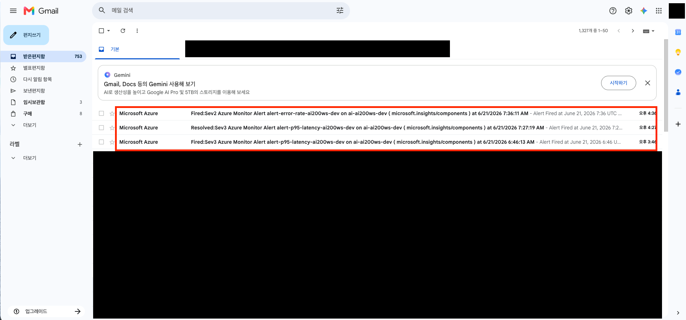

이메일 제목에 alert 이름 `alert-error-rate-...` 가 포함되어 있는지, 본문의 검색 결과 수가 임계값 5 를 초과했는지 확인합니다. 메일이 오지 않으면 Action Group 구독 확인 메일의 `Subscribe` 링크를 클릭했는지 먼저 점검합니다.

---

## 3 단계 : Azure Portal UI 에서 확인

[Azure Portal](https://portal.azure.com) 에서 다음 경로를 직접 클릭합니다.

1. **Application Insights** → **Workbooks** → `AI-200 Workshop 관측성` — P95 latency · 분당 토큰 · 캐시 hit rate 가 한 화면에 시각화

   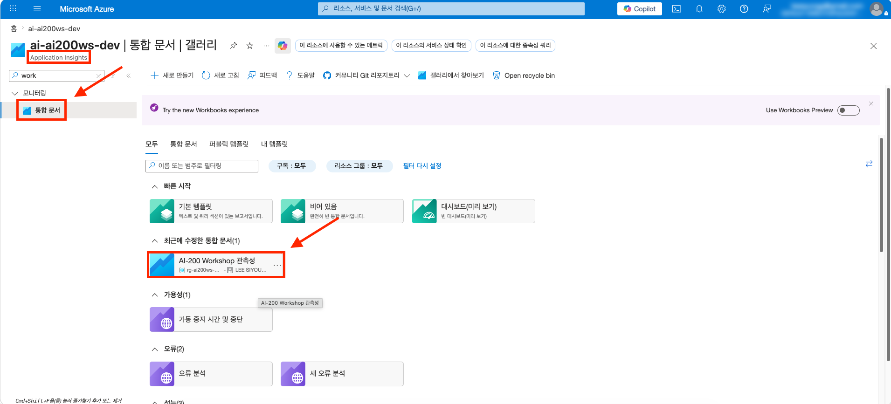
   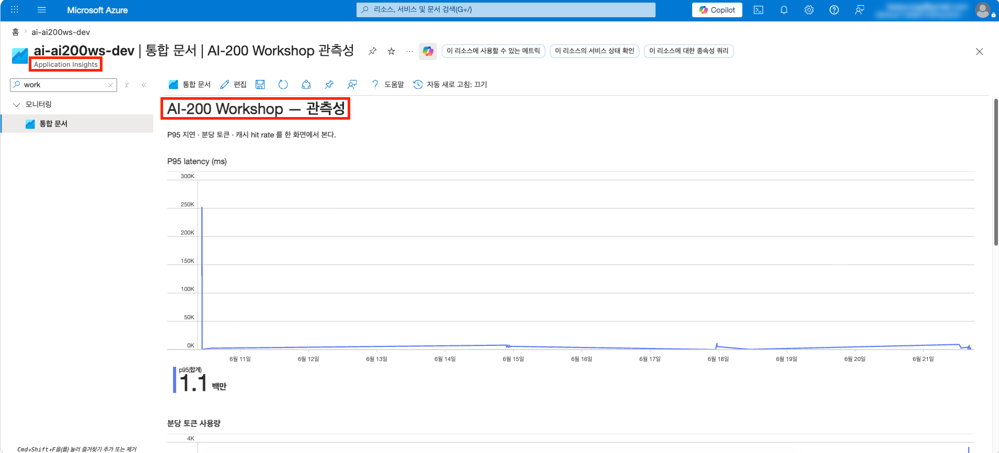

   워크북의 세 차트 — P95 latency · 분당 토큰 · 캐시 hit rate — 에 2단계에서 발생시킨 트래픽이 반영되어 있는지 확인합니다. 분당 토큰 차트에 `tokens.prompt` 와 `tokens.completion` 두 계열이 보이면 OpenTelemetry 메트릭 발행이 정상입니다.

2. **Application Insights** → **Transaction search** → 커스텀 RAG span 트리 확인

   커스텀 span 은 시맨틱 캐시가 켜진 상태에서 캐시 **hit** 가 나면 `rag.retrieve` · `rag.generate` 가 통째로 건너뛰어지고, 트래픽이 적거나 replica 가 막 깨어난 상황에서는 일부 span 이 누락될 수 있습니다. 세 span 을 한 trace 에서 억지로 보려 하지 말고, **안정적으로 재현되는 방식** — 캐시를 잠깐 끄고 지속 트래픽을 흘려 모든 요청이 full RAG 가 되게 하는 방식 — 으로 커스텀 RAG span 트리를 캡쳐합니다.

   1. Portal 의 **Feature manager** (또는 CLI) 에서 `enable_semantic_cache` 플래그를 잠깐 **Off** 로 토글합니다. 캐시가 꺼지면 모든 요청이 retrieval + generation 을 거치는 full RAG 가 됩니다.
   2. 지속 트래픽으로 replica 를 깨워 둔 채 요청을 흘립니다.

      ```bash
      uv run --project apps/api python scripts/send_chat_traffic.py --url $API_FQDN --count 20
      ```

   3. **Transaction search** 에서 소요 시간이 긴 (2~4초) `POST /api/chat` 한 건을 엽니다. trace 트리에 자동 request span 아래로 `rag.retrieve` · `rag.generate` · `POST /openai/.../gpt-5-mini/chat/completions` 가 자식 span 으로 중첩되어 보입니다. 이 화면을 캡쳐합니다.
   4. 캡쳐가 끝나면 `enable_semantic_cache` 플래그를 다시 **On** 으로 복구합니다.

   `cache.lookup` span 은 캐시가 켜진 상태에서만 생기며, [session-03](./03-redis-cache.md) · [session-05](./05-app-config-flags.md) 에서 이미 캡쳐했습니다.

   > [!NOTE]
   > 커스텀 span (특히 `rag.generate`) 은 트래픽이 적거나 replica 가 막 깨어난 (콜드 스타트) 상황에서는 OpenTelemetry 의 배치 export 와 Azure Container Apps 의 scale-to-zero 특성상 일부 누락될 수 있습니다. 위처럼 지속 트래픽을 흘려 replica 를 깨워 두면 안정적으로 기록됩니다. 이는 코드 문제가 아니라 서버리스 환경의 배치 텔레메트리 특성입니다.

   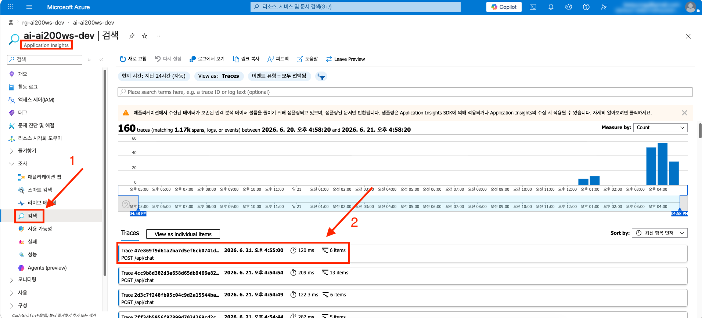
   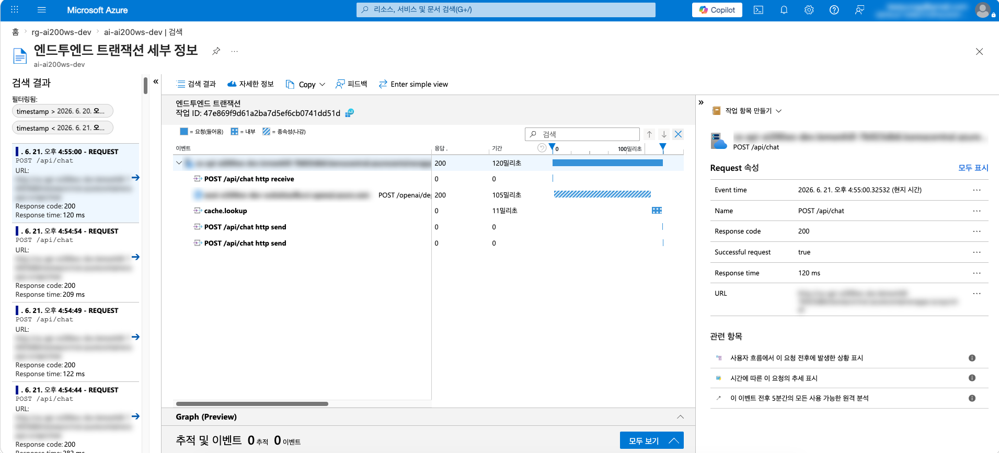

   자동 계측된 `POST /api/chat` request span 아래에 `rag.retrieve` · `rag.generate` · `POST /openai/.../gpt-5-mini/chat/completions` 가 자식 span 으로 중첩되어 있는지 확인합니다. 각 span 을 선택하면 `retrieval.count` · `tokens.prompt` 같은 attribute 가 customDimensions 에 표시됩니다.

3. **Application Insights** → **Failures** → `/api/_chaos` 호출의 stack trace

   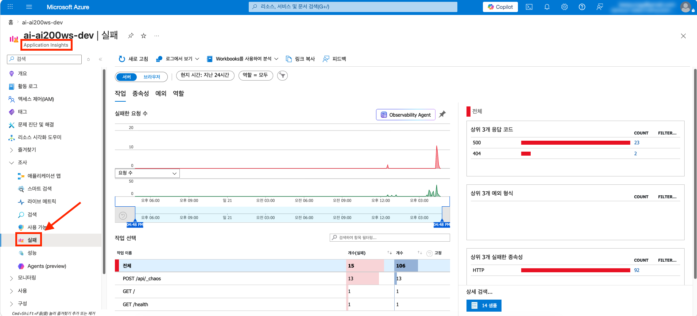
   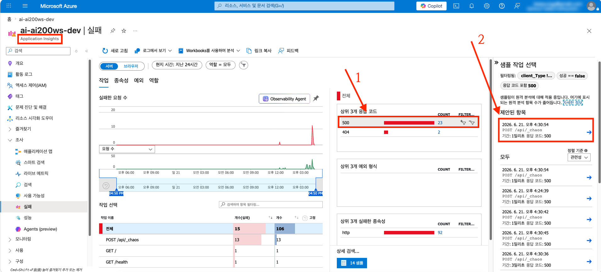
   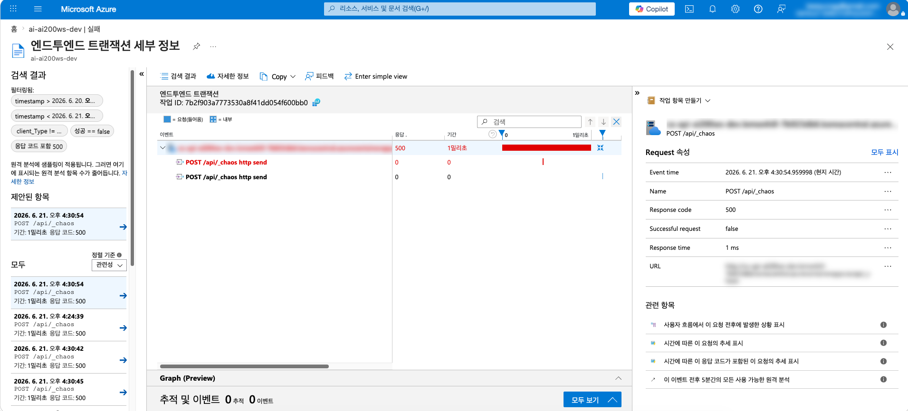

   Failures 화면의 작업 목록에서 `POST /api/_chaos` 의 실패 10건이 집계되는지, 우측 패널에서 `intentional chaos` 예외의 stack trace 가 보이는지 확인합니다.

4. **Azure Monitor** → **Alerts** → 발화된 오류율 alert + 본인 이메일 메일

   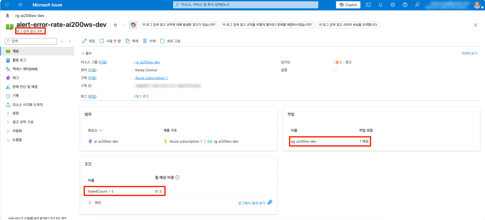
   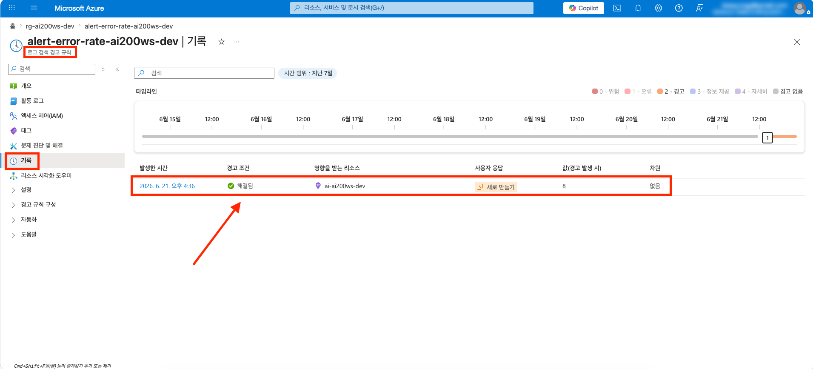

   Alerts 목록에 `alert-error-rate-...` 가 **Fired(발생됨)** 상태로 표시되는지 확인합니다. Action Group 에 등록한 본인 이메일로 같은 내용의 알림 메일이 도착했는지도 함께 확인합니다.

5. (권장) **Application Insights** → **Logs** 에서 다음 KQL 직접 실행

   ```kusto
   customMetrics
   | where name in ("tokens.prompt", "tokens.completion")
   | summarize tokens = sum(value) by name, bin(timestamp, 1m)
   | render timechart
   ```

   ```kusto
   customMetrics
   | where name in ("cache.hit", "cache.total")
   | summarize hits = sumif(value, name == "cache.hit"), total = sumif(value, name == "cache.total") by bin(timestamp, 5m)
   | extend hit_rate = round(100.0 * hits / total, 1)
   | render timechart
   ```

   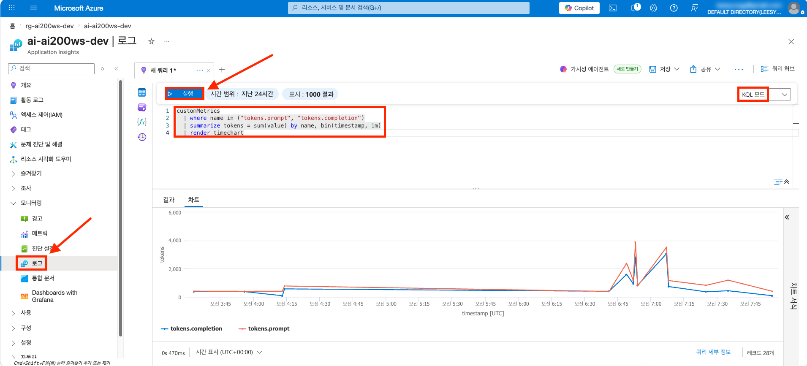

   토큰 쿼리는 `tokens.prompt` · `tokens.completion` 두 계열의 시계열로, 캐시 쿼리는 `hit_rate` 값이 채워진 차트로 렌더링되는지 확인합니다. 빈 결과라면 OpenTelemetry 메트릭(Counter) 발행이 누락된 상태입니다.

---

## 마무리

- **save-point** — 본 세션의 모든 변경은 `save-points/session-06/complete/` 와 일치합니다. 다음 세션으로 넘어가려면 `workshop/` 을 그대로 두고 bash: `cp -a save-points/session-07/start/. workshop/` · PowerShell: `Copy-Item -Path save-points/session-07/start/* -Destination workshop -Recurse -Force` 를 실행합니다
- **자원 정리** — Workbook · Action Group · Log Search Alert 는 비용이 사실상 0 이라 정리하지 않습니다. Application Insights · Log Analytics Workspace 는 [session-00](./00-setup.md) 부터 사용 중이므로 챌린지 전체 정리 시점에 함께 정리합니다
- **다음 세션 미리보기** — [session-07](./07-aks.md) 에서는 같은 RAG 워커로드를 Azure Container Apps 대신 Azure Kubernetes Service 로 배포해보고, K8s 매니페스트 · `kubectl` · Container Insights 로 두 호스팅 모델의 트레이드오프를 직접 비교합니다

---

👈 [session-05](./05-app-config-flags.md) | [session-07](./07-aks.md) 👉
