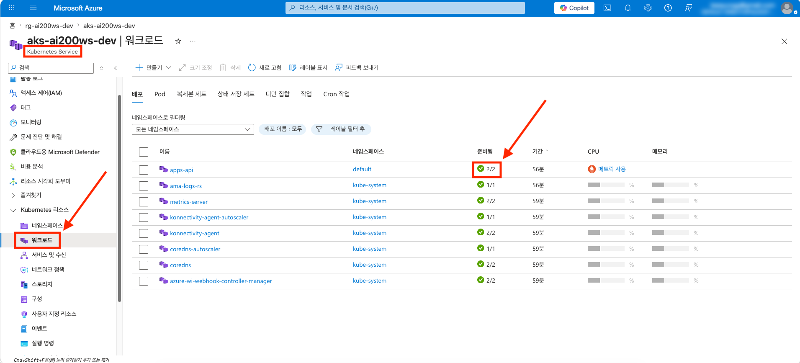
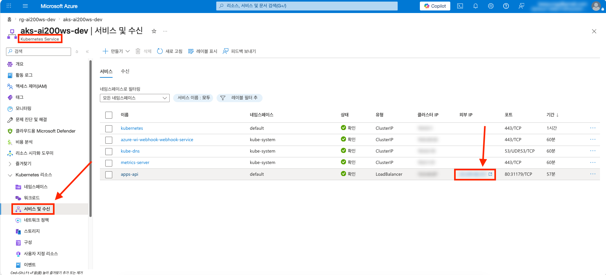
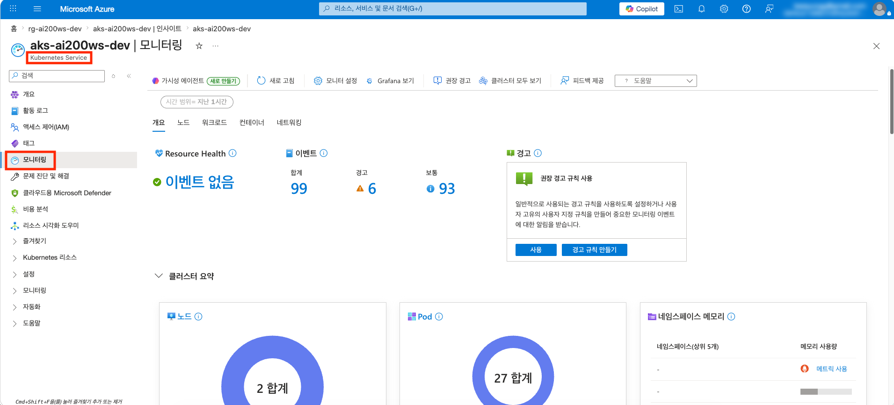
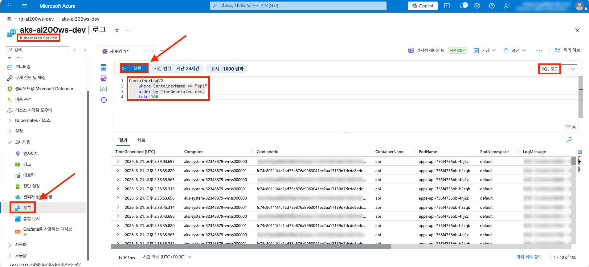

# session-07 — Azure Kubernetes Service 대안 배포

> **관련 Microsoft Learn 학습 경로**
>
> - [Deploy and monitor apps on Azure Kubernetes Service](https://learn.microsoft.com/ko-kr/training/paths/deploy-monitor-apps-azure-kubernetes-service/)

> [!IMPORTANT]
> **사전 준비 조건**
>
> - [session-00](./00-setup.md) ~ [session-06](./06-observability.md) 완료 — Azure OpenAI · Cosmos DB · Azure Container Registry(apps/api 이미지) · User Assigned Managed Identity · Log Analytics Workspace 가 본인 구독에 존재
> - 시작본 코드를 작업 폴더로 받기 — [시작본 코드 받기](#시작본-코드-받기) 참고
> - `kubectl` 1.30+ 설치 확인 — [PREREQUISITES.md](../../PREREQUISITES.md) 참고

---

## 0. 이 세션에서 경험하는 내용

- **한 문장 골** — [session-01](./01-rag-mvp.md) 에서 Azure Container Apps 에 올렸던 **같은 RAG API(apps/api) 를 Azure Kubernetes Service 에 Deployment + Service 로 재배포** 해, 두 호스팅 모델의 트레이드오프를 K8s 매니페스트 · `kubectl` · Container Insights 로 직접 비교
- **새로 프로비저닝되는 자원**
  - AKS 클러스터 (Standard_D2s_v3 노드 2개, Entra ID + Azure RBAC, `disableLocalAccounts=true`, CNI Overlay, Workload Identity)
  - AKS 전용 User Assigned Managed Identity (control plane + kubelet) + `AcrPull` + `Managed Identity Operator`
  - Container Insights — DCR + DCRA 명시 선언
  - 워크로드용 federated identity credential (session-00 User Assigned Managed Identity ↔ `apps-api-sa`)
- **이 세션의 학습 포인트**
  - 완성된 AKS 모듈을 `main.bicep` 에서 조립, K8s Deployment + Service 매니페스트 작성
  - **Workload Identity** — 시크릿 없이 파드가 DefaultAzureCredential 로 Azure OpenAI · Cosmos 접근
- **사용해볼 SDK / CLI**
  - `kubectl` — `apply` · `get` · `logs` · `describe`
  - `az aks get-credentials` (`--admin` 사용 안 함, Entra ID + Azure RBAC)
- **Portal 에서 확인할 지표 / 데이터**
  - AKS → Workloads — Deployment · Pod
  - AKS → Insights — 노드 · Pod 메트릭 (Container Insights 동작 검증)
  - AKS → Logs (KQL) — `ContainerLogV2`

---

## 시작본 코드 받기

[session-06](./06-observability.md) 결과물이 들어 있는 `workshop/` 위에 본 세션 시작본을 덮습니다.

```bash
# Linux · macOS · WSL
cp -a save-points/session-07/start/. workshop/
```

```powershell
# Windows PowerShell
Copy-Item -Path save-points/session-07/start/* -Destination workshop -Recurse -Force
```

이후 본 세션의 모든 명령은 `workshop/` 안에서 실행한다고 가정합니다.

학습자가 채우는 파일은 세 개입니다 — `infra/sessions/07-aks/main.bicep` (모듈 조립), `manifests/deployment.yaml` · `manifests/service.yaml` (K8s 매니페스트). 모듈 7개와 ServiceAccount · ConfigMap 매니페스트는 완성되어 제공됩니다. apps/api 는 [session-01](./01-rag-mvp.md) 이미지를 그대로 재사용하므로 앱 코드 변경은 없습니다.

---

## 1단계 · 프로비저닝

`workshop/infra/sessions/07-aks/main.bicep` 을 열고, 그룹별 주석을 찾아 코드를 채웁니다. `aksUami`(AKS 전용 User Assigned Managed Identity) 자원은 이미 제공됩니다.

### 1.1 호출할 모듈 한눈에 보기

- `aks-cluster.bicep` — Workload Identity·Entra RBAC·disableLocalAccounts·CNI Overlay·omsagent
- `aks-container-insights-dcr.bicep` · `aks-container-insights-dcra.bicep` — Container Insights
- `federated-identity-credential.bicep` — 워크로드 SA ↔ session-00 User Assigned Managed Identity 신뢰 연결
- `role-assignment-acrpull.bicep` · `role-assignment-mi-operator.bicep` · `role-assignment-aks-cluster-user.bicep`

### 1.2 역할 + AKS 클러스터

`// -------- 1) ...` 과 `// -------- 2) ...` 주석 아래에 채웁니다. AKS User Assigned Managed Identity 는 ACR pull(`AcrPull`)과 자기 자신에 대한 `Managed Identity Operator`(control plane 이 kubelet identity 를 노드에 할당) 가 클러스터 생성 전에 부여돼야 합니다.

```bicep
module acrPull '../../modules/session-07/role-assignment-acrpull.bicep' = {
  name: 'acrPull-aksUami'
  params: {
    acrName: acrName
    principalId: aksUami.properties.principalId
  }
}

module miOperator '../../modules/session-07/role-assignment-mi-operator.bicep' = {
  name: 'miOperator-aksUami'
  params: {
    targetUamiName: aksUamiName
    principalId: aksUami.properties.principalId
  }
}

module aks '../../modules/session-07/aks-cluster.bicep' = {
  name: 'aks'
  params: {
    name: aksName
    location: location
    aksUamiId: aksUami.id
    kubeletClientId: aksUami.properties.clientId
    kubeletObjectId: aksUami.properties.principalId
    logAnalyticsWorkspaceId: law.id
    tags: commonTags
  }
  dependsOn: [
    acrPull
    miOperator
  ]
}
```

### 1.3 Container Insights (DCR + DCRA)

`// -------- 3) ...` 주석 아래에 채웁니다. `addonProfiles.omsagent` 단독으로는 데이터가 흐르지 않으므로 DCR + DCRA 를 명시 선언합니다. DCR 에는 `enableContainerLogV2=true` 를 두지만, 실제 `ContainerLogV2` 스키마 전환은 [2.3](#23-placeholder-치환--배포) 에서 적용하는 에이전트 ConfigMap(`container-insights-config.yaml`) 이 담당합니다.

```bicep
module dcr '../../modules/session-07/aks-container-insights-dcr.bicep' = {
  name: 'dcr'
  params: {
    name: dcrName
    location: location
    logAnalyticsWorkspaceId: law.id
    tags: commonTags
  }
}

module dcra '../../modules/session-07/aks-container-insights-dcra.bicep' = {
  name: 'dcra'
  params: {
    clusterName: aks.outputs.name
    dataCollectionRuleId: dcr.outputs.id
  }
}
```

### 1.4 Workload Identity + Cluster User Role + RBAC Cluster Admin + 출력

`// -------- 4) ...` · `// -------- 5) ...` · `// -------- 출력` 주석 아래에 채웁니다. 클러스터가 `enableAzureRBAC=true` 라 Cluster User Role(kubeconfig 다운로드)만으론 `kubectl get/apply` 가 `Forbidden` 이므로 **RBAC Cluster Admin** 도 함께 부여합니다.

```bicep
module fic '../../modules/session-07/federated-identity-credential.bicep' = {
  name: 'fic'
  params: {
    uamiName: uamiName
    name: 'aks-workload'
    issuer: aks.outputs.oidcIssuerUrl
    subject: 'system:serviceaccount:${workloadServiceAccount}'
  }
}

module clusterUser '../../modules/session-07/role-assignment-aks-cluster-user.bicep' = if (!empty(userObjectId)) {
  name: 'clusterUser-user'
  params: {
    clusterName: aks.outputs.name
    principalId: userObjectId
  }
}

// Cluster User Role 은 kubeconfig 다운로드만 허용. enableAzureRBAC=true 클러스터의 실제
// kubectl get/apply 에는 RBAC 데이터플레인 역할(RBAC Cluster Admin)이 추가로 필요하다.
module clusterRbacAdmin '../../modules/session-07/role-assignment-aks-rbac-admin.bicep' = if (!empty(userObjectId)) {
  name: 'clusterRbacAdmin-user'
  params: {
    clusterName: aks.outputs.name
    principalId: userObjectId
  }
}
```

```bicep
output aksName string = aks.outputs.name
output oidcIssuerUrl string = aks.outputs.oidcIssuerUrl
output acrName string = acrName
```

### 1.5 할당량 확인 + 조립 검증 + 배포

```bash
# DSv5 는 koreacentral 기본 vCPU 할당량이 0 이므로 DSv3 사용. 최소 4 vCPU 가용 확인
az vm list-usage --location koreacentral -o table | grep -E "DSv3"

az bicep build --file infra/sessions/07-aks/main.bicep --outfile /tmp/main.json && echo "BUILD OK"

OID=$(az ad signed-in-user show --query id -o tsv)
az deployment group create \
  --resource-group rg-ai200ws-dev \
  --template-file infra/sessions/07-aks/main.bicep \
  --parameters infra/sessions/07-aks/main.bicepparam \
  --parameters userObjectId=$OID
```

> [!NOTE]
> AKS 클러스터 생성에 약 **8~12분** 소요됩니다. 진행되는 동안 [2단계 · 복붙으로 경험해보기](#2단계--복붙으로-경험해보기) 의 트레이드오프 박스와 매니페스트를 정독합니다.

> [!CAUTION]
> **비용 안내** — AKS Load Balancer + Public IP 가 idle 상태에서도 약 ₩1,125/일 발생합니다. 본 세션 학습이 끝나면 [자원 정리](../cleanup.md) 로 즉시 정리하는 것을 권장합니다.

### 1.6 배포 확인 + kubeconfig

```bash
AKS=$(az aks list -g rg-ai200ws-dev --query "[0].name" -o tsv)
az aks show -n $AKS -g rg-ai200ws-dev --query "{state:powerState.code, version:kubernetesVersion}" -o jsonc

# --admin 사용 안 함 — Entra ID + Azure RBAC (Cluster User Role)
az aks get-credentials -n $AKS -g rg-ai200ws-dev
kubectl get nodes
```

기대 — `state: Running`, 노드 2개 `Ready`.

---

## 2단계 · 복붙으로 경험해보기

### 2.1 Azure Container Apps 와 Azure Kubernetes Service 트레이드오프

| 차원 | Azure Container Apps ([session-01](./01-rag-mvp.md)) | Azure Kubernetes Service (본 세션) |
|---|---|---|
| **추상화 수준** | 컨테이너만 다룸 — K8s 내부 숨김 | 풀 K8s API 노출 |
| **세팅 비용** | 거의 0 | 클러스터 운영 학습 곡선 |
| **자동 스케일** | KEDA 내장 | HPA · VPA · KEDA 별도 설정 |
| **idle 비용** | min replica 0 가능 (사실상 0) | Load Balancer + Public IP 최소 ~$1/일 |
| **mTLS · sidecar · CRD** | 제한적 (Dapr 통해서만) | 완전 자유 |
| **GPU · 특수 노드 풀** | 미지원 | 지원 |
| **언제 사용하면 좋은가** | 표준 마이크로서비스 · REST · gRPC | 복잡한 시스템 (service mesh · CRD · GPU · multi-tenant) |

> [!TIP]
> **시험 단골 패턴** — "Azure Container Apps vs Azure Kubernetes Service" 는 **추상화** 와 **제어** 의 트레이드오프입니다. K8s 의 모든 기능이 필요하지 않다면 Azure Container Apps 가 운영 부담이 훨씬 낮습니다. 같은 RAG API 라도 두 호스트에 올려보면 차이가 분명해집니다.

### 2.2 매니페스트 작성

`manifests/deployment.yaml` 와 `manifests/service.yaml` 가 비어 있습니다. ServiceAccount(`serviceaccount.yaml`)·ConfigMap(`configmap.yaml`)은 제공됩니다. apps/api 이미지를 그대로 올리되, **Workload Identity** label 로 파드가 시크릿 없이 Azure 자원에 접근하게 합니다.

`deployment.yaml`

```yaml
apiVersion: apps/v1
kind: Deployment
metadata:
  name: apps-api
  namespace: default
  labels:
    app: apps-api
spec:
  replicas: 2
  selector:
    matchLabels:
      app: apps-api
  template:
    metadata:
      labels:
        app: apps-api
        azure.workload.identity/use: "true"
    spec:
      serviceAccountName: apps-api-sa
      containers:
        - name: api
          image: __ACR_LOGIN_SERVER__/api:s01
          ports:
            - containerPort: 8000
          envFrom:
            - configMapRef:
                name: apps-api-config
          env:
            - name: AZURE_CLIENT_ID
              value: "__UAMI_CLIENT_ID__"
          readinessProbe:
            httpGet:
              path: /healthz
              port: 8000
            initialDelaySeconds: 5
            periodSeconds: 10
          livenessProbe:
            httpGet:
              path: /healthz
              port: 8000
            initialDelaySeconds: 10
            periodSeconds: 20
          resources:
            requests:
              cpu: 250m
              memory: 512Mi
            limits:
              cpu: 500m
              memory: 1Gi
```

`service.yaml`

```yaml
apiVersion: v1
kind: Service
metadata:
  name: apps-api
  namespace: default
spec:
  type: LoadBalancer
  selector:
    app: apps-api
  ports:
    - port: 80
      targetPort: 8000
```

### 2.3 placeholder 치환 + 배포

매니페스트의 `__ACR_LOGIN_SERVER__` · `__UAMI_CLIENT_ID__` · `__AOAI_ENDPOINT__` · `__COSMOS_ENDPOINT__` 를 실제 값으로 치환합니다.

```bash
ACR_LOGIN_SERVER=$(az acr list -g rg-ai200ws-dev --query "[0].loginServer" -o tsv)
UAMI_CLIENT_ID=$(az identity show -n id-ai200ws-dev -g rg-ai200ws-dev --query clientId -o tsv)
ACCT=$(az cognitiveservices account list -g rg-ai200ws-dev --query "[0].name" -o tsv)
AOAI_ENDPOINT=$(az cognitiveservices account show -n $ACCT -g rg-ai200ws-dev --query "properties.endpoint" -o tsv)
COSMOS=$(az cosmosdb list -g rg-ai200ws-dev --query "[0].name" -o tsv)
COSMOS_ENDPOINT=$(az cosmosdb show -n $COSMOS -g rg-ai200ws-dev --query "documentEndpoint" -o tsv)

# 매니페스트의 placeholder 일괄 치환 (Linux · macOS · WSL)
# container-insights-config.yaml 에는 placeholder 가 없어 치환 대상에 포함돼도 변화가 없습니다.
sed -i \
  -e "s|__ACR_LOGIN_SERVER__|$ACR_LOGIN_SERVER|g" \
  -e "s|__UAMI_CLIENT_ID__|$UAMI_CLIENT_ID|g" \
  -e "s|__AOAI_ENDPOINT__|$AOAI_ENDPOINT|g" \
  -e "s|__COSMOS_ENDPOINT__|$COSMOS_ENDPOINT|g" \
  infra/sessions/07-aks/manifests/*.yaml

# 적용 — ServiceAccount · ConfigMap · Deployment · Service · Container Insights 에이전트 ConfigMap
kubectl apply -f infra/sessions/07-aks/manifests/
```

`container-insights-config.yaml` 은 Container Insights 에이전트 ConfigMap(`container-azm-ms-agentconfig`, `kube-system`) 으로, 컨테이너 stdout/stderr 로그를 신규 `ContainerLogV2` 스키마로 수집하도록 설정합니다. 에이전트가 이 설정을 반영하려면 재시작이 필요합니다.

```bash
# Container Insights 에이전트가 ContainerLogV2 스키마 설정을 반영하도록 재시작
kubectl rollout restart daemonset/ama-logs deployment/ama-logs-rs -n kube-system
```

```bash
# Pod 가 Ready 인지, LoadBalancer 외부 IP 가 할당됐는지 확인
kubectl get pods -l app=apps-api
kubectl get service apps-api -w   # EXTERNAL-IP 가 <pending> → IP 로 바뀌면 Ctrl+C
```

### 2.4 호출 테스트

```bash
LB_IP=$(kubectl get service apps-api -o jsonpath='{.status.loadBalancer.ingress[0].ip}')

curl -sX POST "http://$LB_IP/api/chat" \
  -H "Content-Type: application/json" \
  -d '{"q":"휴가 규정 알려줘"}' | jq .
```

기대 — session-01 의 Azure Container Apps 와 동일한 RAG 응답(answer + sources). 같은 이미지가 다른 호스트에서 동작합니다.

---

## 3단계 · Azure Portal UI 에서 확인

[Azure Portal](https://portal.azure.com) 에서 다음 경로를 직접 클릭합니다.

1. **AKS** → **Workloads** → **Deployments** → `apps-api` 가 2/2 Ready

   <!-- 📸 capture: images/session-07/3a-aks-workloads-deployment-ready.png -->
   <!--
   

   `kubectl apply` 로 배포한 `apps-api` Deployment 가 Workloads 블레이드의 **Deployments** 탭에 **Ready 2/2** 로 표시되는지 확인합니다. Pods 탭에서 두 파드 모두 **Running** 상태인지도 함께 확인합니다.
   -->

2. **AKS** → **Services and ingresses** → `apps-api` 의 External IP 노출

   <!-- 📸 capture: images/session-07/3b-aks-service-external-ip.png -->
   <!--
   

   `apps-api` Service 의 Type 이 **Load balancer** 이고, External IP 가 [2.4 호출 테스트](#24-호출-테스트) 에서 사용한 `LB_IP` 와 같은 값인지 확인합니다.
   -->

3. **AKS** → **Insights** → 노드 · Pod 메트릭 (Container Insights 동작 증거)

   <!-- 📸 capture: images/session-07/3c-aks-insights-node-pod-metrics.png -->
   <!--
   

   노드 2개와 `apps-api` Pod 의 CPU·메모리 사용량 차트에 데이터가 채워져 있는지 확인합니다. 차트가 보이면 DCR + DCRA 로 선언한 Container Insights 가 정상 동작한다는 증거입니다.
   -->

   > [!WARNING]
   > 이 화면이 비어 있다면 DCR + DCRA 누락 함정입니다 — [주의](#주의) 참고.

4. **AKS** → **Logs** 에서 KQL 실행

   ```kusto
   ContainerLogV2
   | where ContainerName == "api"
   | order by TimeGenerated desc
   | take 100
   ```

   > [!NOTE]
   > `ContainerLogV2` 는 [2.3 placeholder 치환 + 배포](#23-placeholder-치환--배포) 에서 적용한 `container-insights-config.yaml` 과 에이전트 재시작 이후 몇 분(첫 수집까지 약 5~15분) 지나야 채워집니다. 재배포 직후 즉시 조회하면 빈 결과일 수 있으므로 잠시 기다린 뒤 다시 실행합니다.

   > [!WARNING]
   > `container-insights-config.yaml`(`containerlog_schema_version=v2`) 을 적용하지 않으면 컨테이너 stdout 로그가 신규 `ContainerLogV2` 가 아니라 레거시 `ContainerLog` 테이블로 수집되어 이 KQL 이 빈 결과로 보입니다. DCR 의 `enableContainerLogV2` 설정만으로는 전환되지 않으며, 에이전트 ConfigMap 의 `containerlog_schema_version=v2` 가 실제 스위치입니다. 빈 결과면 `ContainerLog`(V1) 테이블을 조회해 로그가 거기로 가고 있지 않은지, ConfigMap 적용·에이전트 재시작 여부를 확인합니다.

   <!-- 📸 capture: images/session-07/3d-aks-logs-containerlogv2.png -->
   <!--
   

   쿼리 결과에 `api` 컨테이너의 최근 로그 행이 표시되는지 확인합니다. 행이 비어 있다면 `container-insights-config.yaml` 적용·에이전트 재시작 이후 수집이 시작되기까지 몇 분 기다렸는지, 또는 로그가 레거시 `ContainerLog` 테이블로 흘러가고 있지 않은지 확인합니다.
   -->

5. (검증) `kubectl logs -l app=apps-api --tail=50` — Workload Identity 로 Azure OpenAI · Cosmos 호출이 성공하는지 (인증 오류 없이 RAG 응답)

---

## Microsoft Learn 경로 커버리지 — 사용 / 생략

[Deploy and monitor apps on Azure Kubernetes Service](https://learn.microsoft.com/ko-kr/training/paths/deploy-monitor-apps-azure-kubernetes-service/) 학습 경로 3개 모듈을 본 세션에서 어떻게 다루는지 정리합니다.

| 모듈 | 단원 핵심 | 본 세션 |
|---|---|---|
| **1. AKS 에 애플리케이션 배포** | Deployment manifest · Service(LoadBalancer) 노출 · kubectl apply | **사용** — apps/api Deployment + LoadBalancer Service (2.2~2.4) |
| **2. AKS 에서 애플리케이션 구성** | ConfigMap · Secret · PersistentVolume | **부분/변형** — 비민감 설정은 ConfigMap. 자격증명은 K8s Secret 대신 **Workload Identity**(학습 경로 초과). PersistentVolume 은 상태가 Cosmos DB 라 **생략** |
| **3. AKS 모니터링·문제 해결** | Container Insights · kubectl logs/describe/top · 연결 확인 | **사용** — Container Insights(DCR+DCRA) + `kubectl logs` + ContainerLogV2(3단계). 의도적 장애 주입 연습은 생략 |

> [!NOTE]
> **본 저장소 확장** — Workload Identity(federated User Assigned Managed Identity)·Container Insights DCR/DCRA·`AcrPull` IaC 부여는 학습 경로 본문 범위를 넘어서는 실전 패턴입니다. 학습 경로의 K8s Secret 대신 본 워크샵 표준(Entra ID + DefaultAzureCredential)을 일관되게 적용했습니다.

---

## 주의

> [!CAUTION]
> **Custom kubelet identity 사용 시 control plane identity 도 UserAssigned 강제** — 한쪽만 UserAssigned 면 `CustomKubeletIdentityOnlySupportedOnUserAssignedMSICluster` 오류가 납니다. `what-if` 가 못 잡으므로 양쪽 모두 UserAssigned 로 명시합니다 (본 세션 Bicep 은 AKS 전용 User Assigned Managed Identity 하나를 둘 다에 사용).

> [!CAUTION]
> **`addonProfiles.omsagent` 단독으로는 Log Analytics 에 데이터가 안 흐름** — DCR + DCRA 둘 다 명시 선언해야 합니다. AKS → Insights 가 "no data" 면 99% 이 함정입니다.

> [!WARNING]
> **`koreacentral` DSv5 vCPU 할당량 = 0** — DSv5 기본 할당량이 0 이라 quota exceeded 가 납니다. 본 워크샵은 DSv3(기본 10 vCPU) 를 사용합니다.

> [!WARNING]
> **Entra ID + Azure RBAC + `disableLocalAccounts=true`** — `az aks get-credentials --admin` 은 사용 불가(정상). **두 역할이 모두 필요**합니다: ① `Azure Kubernetes Service Cluster User Role`(kubeconfig 다운로드용) ② `Azure Kubernetes Service RBAC Cluster Admin`(실제 `kubectl get/apply` — 클러스터가 `enableAzureRBAC=true` 라 Cluster User Role 만으론 모든 리소스가 `Forbidden: ... Update role assignment to allow access`). 본 세션 Bicep 이 둘 다 자동 부여합니다. (`az aks command invoke` 로 클러스터에서 kubectl 을 실행하면 로컬 kubelogin 불필요.)

> [!CAUTION]
> **Workload Identity subject 일치** — federatedIdentityCredential 의 subject(`system:serviceaccount:default:apps-api-sa`)와 매니페스트의 namespace·ServiceAccount 이름이 정확히 일치해야 합니다. 불일치 시 토큰 교환이 실패해 파드가 Azure 자원 접근에서 인증 오류를 냅니다.

> [!IMPORTANT]
> 더 자세한 함정 모음은 [docs/pitfalls/common.md](../pitfalls/common.md) 의 [Azure Kubernetes Service](../pitfalls/common.md#azure-kubernetes-service) 섹션을 참고합니다.

---

## 마무리

- **save-point** — 본 세션의 모든 변경은 `save-points/session-07/complete/` 와 일치합니다. 본 세션이 워크샵의 마지막 세션이므로 다음 `cp -a` 는 없습니다
- **워크샵 종료** — 모든 자원 정리는 [docs/cleanup.md](../cleanup.md) 절차를 참고합니다. 정리하지 않으면 AKS Load Balancer · Managed Redis 등 idle 자원이 매일 누적되므로 즉시 정리를 권장합니다
- **자격증 시험 가이드** — Azure AI-200 시험은 본 워크샵 8개 학습 경로 전부를 커버합니다. 응시 전 [README.md](../../README.md) 의 학습 경로 매핑 표를 다시 살펴보고 각 Microsoft Learn 모듈을 정독하는 것을 권장합니다

---

## 참고 자료

- Microsoft Learn — [Deploy and monitor apps on Azure Kubernetes Service](https://learn.microsoft.com/ko-kr/training/paths/deploy-monitor-apps-azure-kubernetes-service/)
- Microsoft Learn — [Azure Workload Identity](https://learn.microsoft.com/ko-kr/azure/aks/workload-identity-overview)
- 본 저장소 — `infra/sessions/07-aks/main.bicep`, `infra/sessions/07-aks/manifests/`

---

👈 [session-06 — Observability 심화](./06-observability.md) | [자원 정리](../cleanup.md) 👉